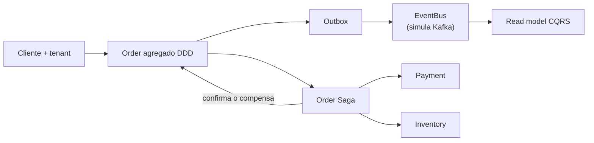

# Módulo 1 – Workshop de fundamentos y arquitectura

> **SOLID · DDD · 12-Factor · CQRS · Outbox · Saga · Multi-tenancy**
>
> Java 21 · código sin frameworks

Este módulo define el sistema que evoluciona durante todo el curso: una plataforma
e-commerce SaaS donde `tienda-deportes`, `libreria-lima` y otros tenants comparten
la aplicación sin compartir sus datos.

Aquí todavía no hay HTTP, bases de datos ni contenedores. El objetivo es ejecutar
el dominio en memoria y entender las decisiones antes de ocultarlas detrás de un
framework.

Al terminar habrás experimentado:

1. SOLID aplicado al checkout.
2. Un agregado `Order` que protege invariantes.
3. Eventos de dominio y Transactional Outbox.
4. Un read model CQRS.
5. Una Saga exitosa y una Saga compensada.
6. Aislamiento por `tenantId`.

## Mapa del workshop



Todo ocurre dentro del proceso Java. En módulos posteriores:

- el `EventBus` se convierte en Kafka;
- los repositorios en memoria se convierten en PostgreSQL/MongoDB/Redis;
- el tenant llega desde el JWT;
- Order, Inventory y Pricing se convierten en microservicios;
- Outbox, Saga y CQRS mantienen el mismo propósito.

## 0. Prerrequisitos

Necesitas:

- JDK 21 o superior;
- Maven 3.9 o superior;
- una terminal.

No necesitas Docker.

### Comprobar herramientas

El comando es igual en Windows PowerShell, macOS, Linux y Git Bash:

```bash
java -version
mvn -version
```

## 1. Compilar el proyecto

Desde la raíz del repositorio:

```bash
cd modulo-01-fundamentos-arquitectura/codigo
mvn -q clean compile
```

Si el comando termina sin errores, el dominio y todos sus ejemplos compilan con
Java 21.

## 2. Ejecutar el workshop completo

Sin salir de `codigo/`:

```bash
mvn -q exec:java
```

El runner [`App.java`](codigo/src/main/java/pe/joedayz/microservicios/modulo01/App.java)
ejecuta tres bloques:

```text
1) SOLID en acción
2) Checkout OK: DDD -> Outbox -> Kafka -> CQRS -> Saga
3) Checkout con fallo de stock: Saga compensa
```

No copies los identificadores de orden de este README: se generan como UUID y
cambian en cada ejecución.

## 3. Experimento SOLID

La primera parte usa el tenant `tienda-deportes` y crea un pedido con zapatillas
y medias.

Busca una salida equivalente a:

```text
Total bruto : PEN 360.00
Descuentos  : PEN 51.00
Precio final: PEN 309.00
[ISP] Storefront ve ... productos publicados
[ISP] Admin ve ... productos
```

### Qué debes comprobar

1. El cálculo de precios no envía notificaciones ni persiste pedidos.
2. `DiscountEngine` recibe reglas; no tiene un `if` por cada tipo de descuento.
3. Storefront usa una interfaz de lectura y Admin una interfaz administrativa.
4. El dominio depende de puertos, no de PostgreSQL, Stripe o Kafka.

### Archivos para abrir mientras observas la consola

- [`OrderPricingService.java`](codigo/src/main/java/pe/joedayz/microservicios/modulo01/solid/srp/OrderPricingService.java):
  una responsabilidad, calcular el precio final.
- [`DiscountEngine.java`](codigo/src/main/java/pe/joedayz/microservicios/modulo01/solid/ocp/DiscountEngine.java):
  abierto a nuevas reglas, cerrado a modificaciones.
- [`CatalogReadApi.java`](codigo/src/main/java/pe/joedayz/microservicios/modulo01/solid/isp/CatalogReadApi.java)
  y [`CatalogAdminApi.java`](codigo/src/main/java/pe/joedayz/microservicios/modulo01/solid/isp/CatalogAdminApi.java):
  clientes distintos no dependen de operaciones que no usan.
- [`InventoryPort.java`](codigo/src/main/java/pe/joedayz/microservicios/modulo01/solid/dip/InventoryPort.java):
  el caso de uso depende de una abstracción.

### Comparar diseño problemático y diseño separado

Abre
[`OrderManager.java`](codigo/src/main/java/pe/joedayz/microservicios/modulo01/solid/srp/OrderManager.java).
Esa clase mezcla cálculo, persistencia y notificación. Compárala con:

- `OrderPricingService`;
- `OrderApplicationService`;
- `OrderNotificationService`.

La separación no busca más clases por sí misma: permite cambiar persistencia,
pricing o mensajería sin modificar el resto.

## 4. Experimento DDD: el agregado Order

En el segundo bloque, `App` ejecuta el checkout sano:

1. Define stock `10` para `ZAP-RUN-42`.
2. Crea una orden del tenant `tienda-deportes`.
3. Agrega 2 unidades.
4. Ejecuta `place()`.
5. Guarda el agregado y sus eventos.

Abre [`Order.java`](codigo/src/main/java/pe/joedayz/microservicios/modulo01/ddd/order/Order.java).

Identifica:

- la raíz del agregado;
- los value objects `Sku`, `Quantity`, `Money`, `TenantId` y `OrderId`;
- los cambios de estado permitidos;
- dónde se emiten `OrderPlaced`, `OrderConfirmed` y `OrderCancelled`;
- las validaciones que impiden construir un pedido inválido.

### Regla importante

El código externo no cambia `status` directamente. Pide al agregado ejecutar una
operación de negocio. El agregado decide si esa transición es válida.

## 5. Experimento Outbox + CQRS

Durante el checkout sano aparecen dos estados del read model:

```text
[CQRS read model] ... estado=PLACED
Resultado Saga: ...
[CQRS read model] ... estado=CONFIRMED
```

Sigue el flujo en este orden:

1. [`OrderApplicationService.java`](codigo/src/main/java/pe/joedayz/microservicios/modulo01/app/OrderApplicationService.java)
   guarda orden y eventos.
2. [`OutboxStore.java`](codigo/src/main/java/pe/joedayz/microservicios/modulo01/patterns/outbox/OutboxStore.java)
   conserva eventos pendientes.
3. [`OutboxRelay.java`](codigo/src/main/java/pe/joedayz/microservicios/modulo01/patterns/outbox/OutboxRelay.java)
   publica los pendientes.
4. [`EventBus.java`](codigo/src/main/java/pe/joedayz/microservicios/modulo01/messaging/EventBus.java)
   simula el broker.
5. [`OrderProjector.java`](codigo/src/main/java/pe/joedayz/microservicios/modulo01/patterns/cqrs/OrderProjector.java)
   actualiza el modelo de lectura.
6. [`OrderQueries.java`](codigo/src/main/java/pe/joedayz/microservicios/modulo01/patterns/cqrs/OrderQueries.java)
   consulta una vista optimizada.

### Pregunta de comprobación

¿Por qué no publicar el evento antes de guardar la orden?

Porque un fallo entre ambas operaciones puede publicar un evento de una orden que
no existe. Outbox guarda el cambio y el mensaje como una sola unidad; el relay
puede reintentar después.

## 6. Experimento Saga: camino feliz

Abre [`OrderSaga.java`](codigo/src/main/java/pe/joedayz/microservicios/modulo01/patterns/saga/OrderSaga.java).

En el checkout sano:

1. cobra el pago;
2. reserva inventory;
3. confirma la orden;
4. publica `OrderConfirmed`;
5. envía la notificación.

El estado final esperado es `CONFIRMED`.

Observa que Saga coordina puertos:

- [`PaymentPort.java`](codigo/src/main/java/pe/joedayz/microservicios/modulo01/patterns/saga/PaymentPort.java);
- [`InventoryPort.java`](codigo/src/main/java/pe/joedayz/microservicios/modulo01/solid/dip/InventoryPort.java).

Las implementaciones actuales son en memoria. En producción serían llamadas a
Payment e Inventory, pero la política de compensación seguiría en la Saga.

## 7. Experimento Saga: compensación

El tercer bloque usa `libreria-lima`:

```text
stock disponible: 1
cantidad solicitada: 5
```

El pago ocurre primero, la reserva falla y la Saga debe compensar:

1. reembolsa el pago;
2. cancela la orden;
3. publica `OrderCancelled`;
4. actualiza el read model.

El estado final esperado es `CANCELLED`, no una excepción sin manejar.

Esta diferencia es esencial:

- una transacción local hace rollback;
- una transacción distribuida compensa operaciones que ya terminaron.

## 8. Experimento multi-tenant

Abre:

- [`TenantId.java`](codigo/src/main/java/pe/joedayz/microservicios/modulo01/tenant/TenantId.java);
- [`TenantContext.java`](codigo/src/main/java/pe/joedayz/microservicios/modulo01/tenant/TenantContext.java);
- [`InMemoryOrderRepository.java`](codigo/src/main/java/pe/joedayz/microservicios/modulo01/infra/InMemoryOrderRepository.java).

Comprueba que:

- una orden no se crea sin tenant;
- la clave del repositorio incluye tenant y order ID;
- `tienda-deportes` y `libreria-lima` no comparten pedidos;
- `TenantContext.clear()` se ejecuta al terminar cada flujo.

En módulos posteriores, `ThreadLocal` será reemplazado o propagado según el
modelo de concurrencia, pero la invariante no cambia: **toda operación lleva el
tenant**.

## 9. Ejecutar ejemplos SOLID aislados

Desde `codigo/` puedes ejecutar runners pequeños.

### Liskov: Stripe, Culqi y FakeGateway

```bash
mvn -q compile exec:java \
  -Dexec.mainClass=pe.joedayz.microservicios.modulo01.solid.liskov.Main
```

### Interface Segregation

```bash
mvn -q compile exec:java \
  -Dexec.mainClass=pe.joedayz.microservicios.modulo01.solid.isp.Main
```

### Dependency Inversion

```bash
mvn -q compile exec:java \
  -Dexec.mainClass=pe.joedayz.microservicios.modulo01.solid.dip.Main
```

En PowerShell los comandos se pueden escribir en una sola línea:

```powershell
mvn -q compile exec:java -Dexec.mainClass=pe.joedayz.microservicios.modulo01.solid.liskov.Main
```

## 10. Retos para experimentar

Haz un cambio por vez, vuelve a ejecutar `mvn -q compile exec:java` y explica la
diferencia.

### Reto A: una nueva regla de descuento

Implementa `DiscountRule` para un descuento fijo. Agrégala a la lista de reglas
en `App.demoSolid()`.

Comprobación: `DiscountEngine` no debería modificarse.

### Reto B: cambiar el stock

En `demoCompensation()`, cambia el stock de `1` a `10`.

Comprobación: la misma Saga debe terminar `CONFIRMED` sin modificar su algoritmo.

### Reto C: intentar una transición inválida

Intenta confirmar una orden antes de `place()`.

Comprobación: el agregado debe rechazarla. La invariante vive en el dominio, no
en la interfaz de usuario.

### Reto D: aislamiento

Crea dos órdenes con el mismo cliente y SKU, una para `tienda-deportes` y otra
para `libreria-lima`.

Comprobación: cada consulta debe devolver únicamente datos de su tenant.

## 11. Versión .NET 10 opcional

Las mismas ideas están portadas a .NET 10 / C# 14 en
[`codigo-dotnet/`](codigo-dotnet/).

```bash
cd modulo-01-fundamentos-arquitectura/codigo-dotnet
dotnet run --project src/Modulo01.Fundamentos
```

Consulta su [README](codigo-dotnet/README.md) para ver equivalencias Java ↔ .NET.

## Solución de problemas

### `release version 21 not supported`

Maven está usando un JDK anterior. Comprueba:

```bash
mvn -version
```

La línea `Java version` debe ser 21 o superior.

### Maven no encuentra `App`

Ejecuta el comando dentro de
`modulo-01-fundamentos-arquitectura/codigo`, donde está `pom.xml`.

### El runner aislado sigue ejecutando App

Coloca `-Dexec.mainClass=...` en el mismo comando y verifica el nombre completo
del paquete.

## Lecturas del módulo

Lee en este orden y repite el experimento asociado:

1. [SOLID para microservicios](docs/01-solid-microservicios.md).
2. [Domain-Driven Design](docs/02-ddd-domain-driven-design.md).
3. [The Twelve-Factor App](docs/03-12-factor-app.md).
4. [Saga, CQRS, Outbox, Gateway, BFF y Strangler](docs/04-patrones-clave.md).
5. [Caso práctico e-commerce multi-tenant](docs/05-caso-practico-ecommerce-multitenant.md).

## Siguiente módulo

En el [módulo 2](../modulo-02-spring-boot-vs-quarkus/) este dominio se convierte
en servicios HTTP reales y se compara Spring Boot con Quarkus.
