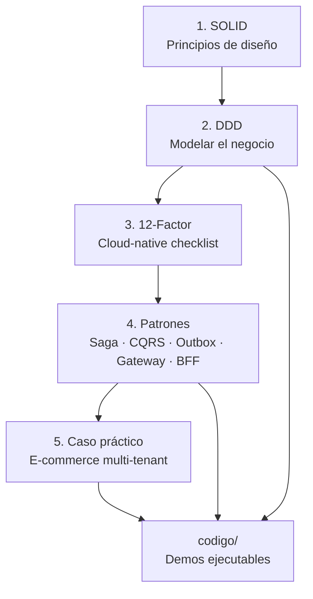

# Módulo 1 – Fundamentos y Arquitectura

> Curso: **Arquitectura de Microservicios Pro: Spring Boot + Quarkus en AWS y Azure**
> JoeDayz.pe · Java 25 / Spring Boot 4 / Quarkus 3

Este módulo sienta las bases conceptuales de todo el curso. Antes de escribir un solo
microservicio productivo necesitamos un lenguaje común: **por qué** partimos un monolito,
**cómo** modelamos el negocio y **qué** patrones nos evitan disparos en el pie.

## Objetivos de aprendizaje

Al terminar este módulo serás capaz de:

1. Aplicar los principios **SOLID** pensando en servicios distribuidos, no solo en clases.
2. Modelar un dominio con **DDD** (bounded contexts, agregados, value objects, domain events).
3. Diseñar servicios que cumplan la metodología **12-Factor App**.
4. Reconocer y aplicar los patrones clave: **Saga, CQRS, Outbox, API Gateway, BFF y Strangler Fig**.
5. Analizar el caso práctico del curso: una **plataforma e-commerce multi-tenant**.

## Contenido

| # | Tema | Documento |
|---|------|-----------|
| 1 | Principios SOLID para microservicios | [docs/01-solid-microservicios.md](docs/01-solid-microservicios.md) |
| 2 | Domain-Driven Design (DDD) | [docs/02-ddd-domain-driven-design.md](docs/02-ddd-domain-driven-design.md) |
| 3 | The Twelve-Factor App | [docs/03-12-factor-app.md](docs/03-12-factor-app.md) |
| 4 | Patrones clave (Saga, CQRS, Outbox, Gateway, BFF, Strangler Fig) | [docs/04-patrones-clave.md](docs/04-patrones-clave.md) |
| 5 | Caso práctico: e-commerce multi-tenant | [docs/05-caso-practico-ecommerce-multitenant.md](docs/05-caso-practico-ecommerce-multitenant.md) |

> Cada documento incluye **diagramas Mermaid** (flujos, secuencias, arquitectura y comparaciones
> antes/después) pensados para estudiar en clase o revisar en GitHub.

### Mapa del módulo



## Ejemplos de código

Todo lo teórico está acompañado de código Java **ejecutable** (sin frameworks, para que
se vean los conceptos puros) en la carpeta [`codigo/`](codigo/). El dominio de todos los
ejemplos es el mismo del caso práctico: **e-commerce multi-tenant**.

```
codigo/src/main/java/pe/joedayz/microservicios/modulo01/
├── App.java                      # runner que ejecuta todas las demos
├── solid/                        # SOLID: antes (mal) y después (bien)
├── ddd/                          # DDD táctico: VO, Entity, Aggregate, Domain Events
├── patterns/
│   ├── cqrs/                     # Command Query Responsibility Segregation
│   ├── outbox/                   # Transactional Outbox
│   └── saga/                     # Saga orquestada con compensaciones
└── tenant/                       # Multi-tenancy (TenantContext)
```

### Cómo ejecutar

Requisitos: **JDK 21+** y **Maven 3.9+**.

```bash
cd codigo
mvn -q compile exec:java
```

Verás en consola cada patrón demostrado paso a paso.

## Cómo estudiar este módulo

1. Lee la teoría de cada documento en orden.
2. Abre el código de la sección correspondiente y léelo junto a la teoría.
3. Ejecuta la demo y observa la salida.
4. Haz los ejercicios propuestos al final de cada documento.

---

*Siguiente módulo:* **Módulo 2 – Spring Boot vs Quarkus**, donde por fin creamos
microservicios reales con ambos frameworks y comparamos startup, memoria y build nativo.
