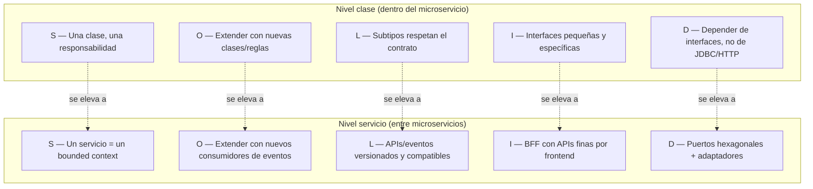
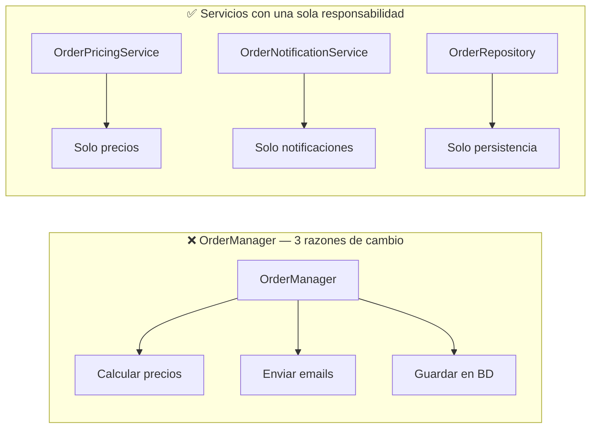
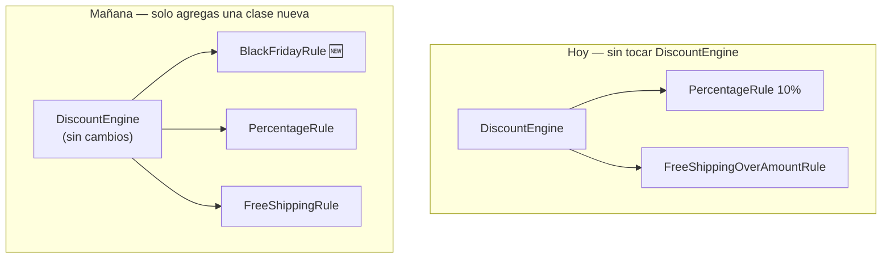
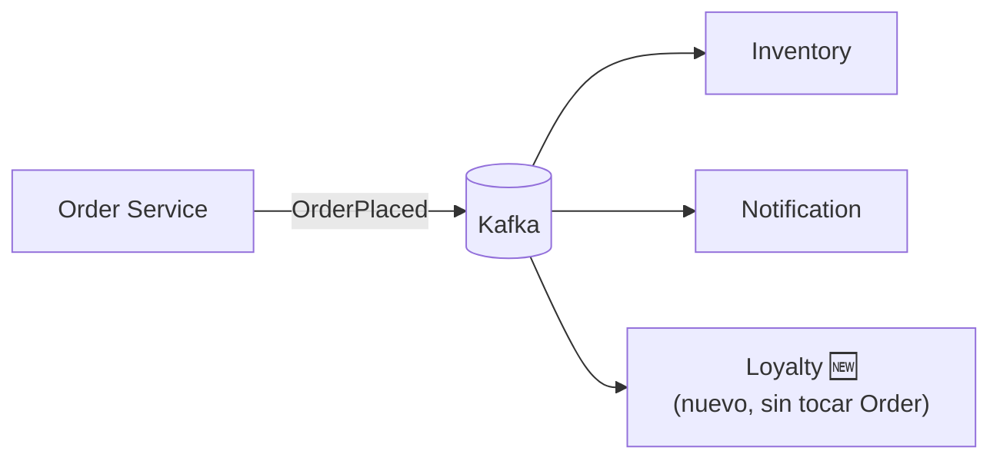
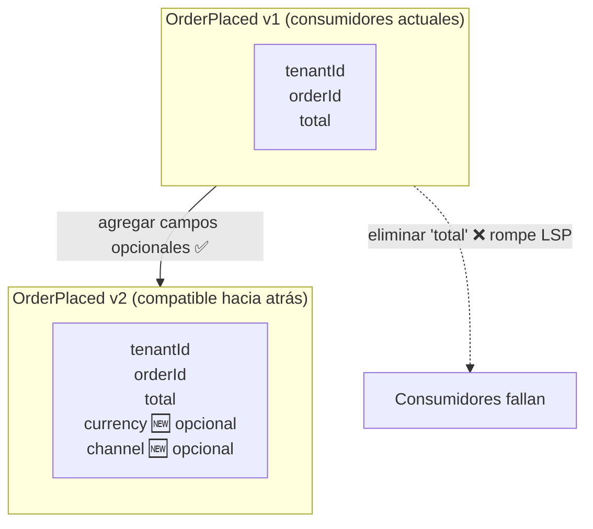
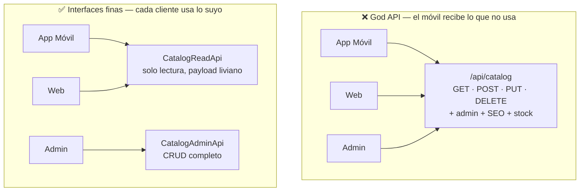
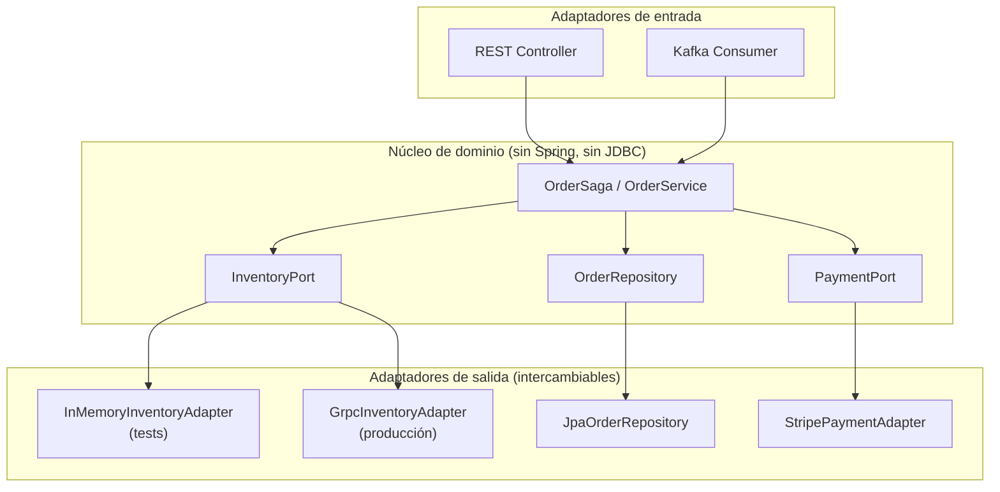
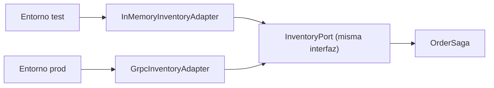

# 1. Principios SOLID para microservicios

Los principios **SOLID** los popularizó Robert C. Martin para el diseño orientado a objetos.
En microservicios siguen siendo válidos a nivel de clase, pero además **se elevan a nivel de
servicio**: cada principio tiene una lectura "en pequeño" (dentro del código) y otra "en grande"
(entre servicios).

| Sigla | Principio | Lectura en microservicios |
|-------|-----------|---------------------------|
| **S** | Single Responsibility | Un servicio = una capability de negocio (un bounded context) |
| **O** | Open/Closed | Extender vía eventos/plugins sin tocar servicios existentes |
| **L** | Liskov Substitution | Un contrato (API/evento) versionado debe seguir siendo sustituible |
| **I** | Interface Segregation | APIs finas y específicas por consumidor (BFF), no un "God API" |
| **D** | Dependency Inversion | Depende de puertos/contratos, no de implementaciones (Hexagonal) |

### Mapa mental: SOLID en dos niveles

---

## S — Single Responsibility Principle (SRP)

> "Una clase debe tener una sola razón para cambiar."

En objetos: una clase no debe mezclar reglas de negocio, persistencia y notificaciones.

En microservicios: **un servicio debe pertenecer a un único bounded context**. Si al cambiar
la política de envíos tienes que redeployar el servicio de pagos, tus responsabilidades están
mal repartidas.

**Síntoma de violación:** el "monolito distribuido" — muchos servicios que siempre se
despliegan juntos porque comparten responsabilidades.

Ver código: `solid/srp/` — separamos `OrderPricingService` (calcula precios) de
`OrderNotificationService` (notifica), en vez de un `OrderManager` que hace todo.

### Antes vs después (SRP)

> **Regla para alumnos:** si al cambiar la lógica de descuentos también tienes que tocar el código
> de emails, estás violando SRP.

---

## O — Open/Closed Principle (OCP)

> "Abierto a extensión, cerrado a modificación."

En microservicios el mejor mecanismo de extensión es la **arquitectura orientada a eventos**:
cuando se crea un pedido, el servicio de pedidos publica `OrderPlaced`. Mañana quieres sumar
un servicio de "programa de puntos": lo suscribes al evento **sin tocar** el servicio de pedidos.

Ver código: `solid/ocp/` — cálculo de descuentos con una lista de `DiscountRule`; añadir una
regla nueva no modifica el motor.

### Extensión sin modificar (OCP)

En microservicios, el equivalente es suscribir un **nuevo consumidor** a `OrderPlaced` sin
modificar el servicio de Pedidos:

---

## L — Liskov Substitution Principle (LSP)

> "Los subtipos deben poder sustituir a su tipo base sin romper el programa."

En microservicios esto es **compatibilidad de contratos**. La versión `v2` de una API o de un
evento debe poder sustituir a `v1` para los consumidores existentes (backward compatibility):
no elimines campos, no cambies semántica, solo agrega opcionales.

**Regla práctica (Tolerant Reader / Postel's Law):** *sé estricto en lo que emites, tolerante
en lo que aceptas.*

Ver código: `solid/lsp/` — un `PaymentGateway` cuyas implementaciones (`StripeGateway`,
`CulqiGateway`) respetan el mismo contrato y post-condiciones.

### Versionado compatible de eventos (LSP)

---

## I — Interface Segregation Principle (ISP)

> "Ningún cliente debería depender de métodos que no usa."

En microservicios: evita el **God API** que sirve a todos. La app móvil, la web y el panel
admin tienen necesidades distintas. En vez de una interfaz gorda, ofrece interfaces finas
(esto justifica el patrón **BFF – Backend For Frontend**).

Ver código: `solid/isp/` — separamos `CatalogReadApi` (lo que necesita el storefront) de
`CatalogAdminApi` (lo que necesita el back-office).

### God API vs interfaces finas (ISP)

---

## D — Dependency Inversion Principle (DIP)

> "Depende de abstracciones, no de concreciones."

Es la base de la **Arquitectura Hexagonal (Ports & Adapters)**: el núcleo de dominio define
**puertos** (interfaces) y los detalles (base de datos, Kafka, REST) son **adaptadores**
enchufables. El dominio no importa Spring ni JDBC.

### Arquitectura Hexagonal (Ports & Adapters)

Ver código: `solid/dip/` — `OrderSaga` depende del puerto `InventoryPort`, no de un cliente
HTTP concreto. En test usamos un adaptador en memoria; en prod, uno que llama al servicio real.

---

## Errores comunes al aplicar SOLID en microservicios

- **Servicios anémicos ultra-pequeños** ("nanoservicios"): tanta SRP que un caso de uso simple
  requiere 6 saltos de red. SRP es sobre *responsabilidad de negocio*, no sobre líneas de código.
- **Compartir base de datos** entre servicios: rompe SRP y DIP a la vez (acoplamiento por datos).
- **Contratos frágiles**: romper LSP al eliminar campos causa incidentes en cascada.

---

## Ejercicios

1. Toma el `OrderManager` de `solid/srp` y detecta sus 3 razones de cambio. Sepáralas.
2. Agrega una nueva `DiscountRule` (ej. "envío gratis > S/200") sin tocar el motor (OCP).
3. Diseña la versión `v2` del evento `OrderPlaced` agregando un campo sin romper `v1` (LSP).
