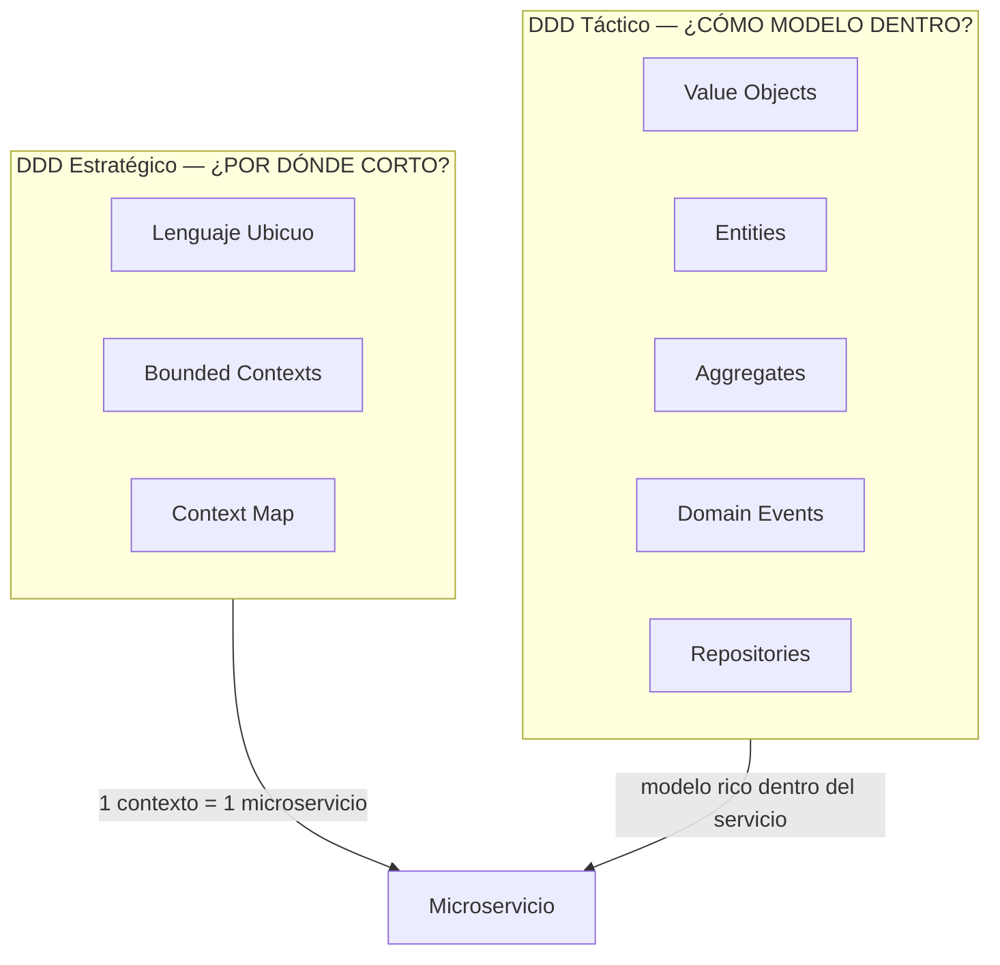
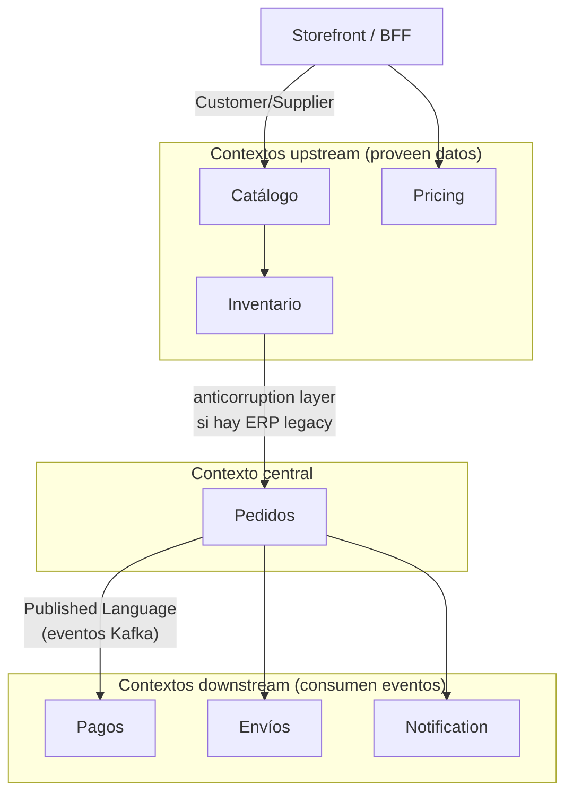
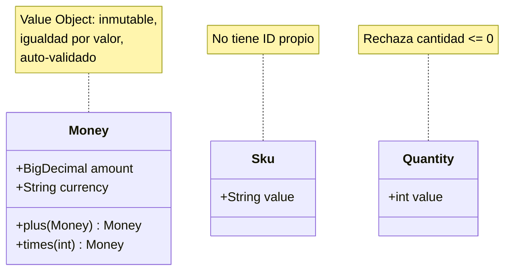
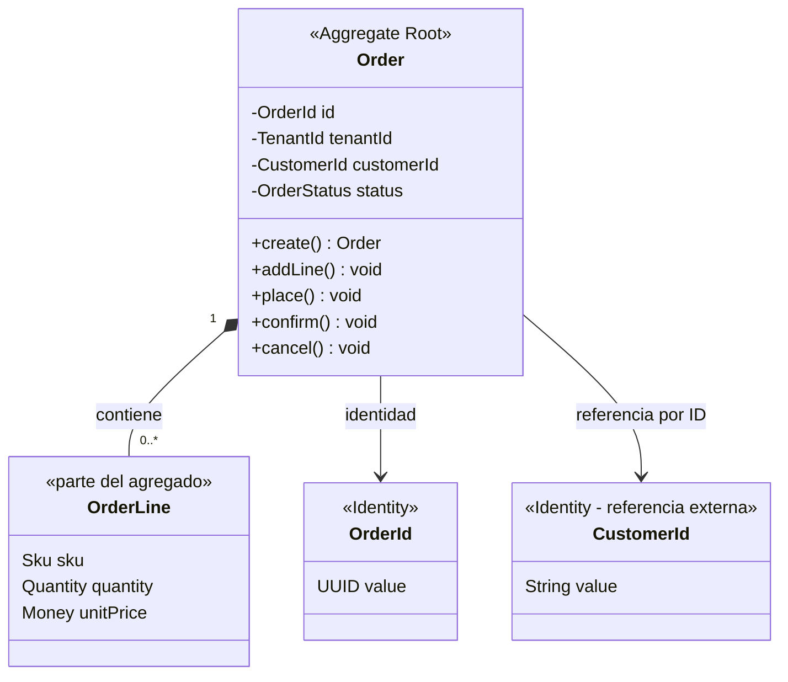
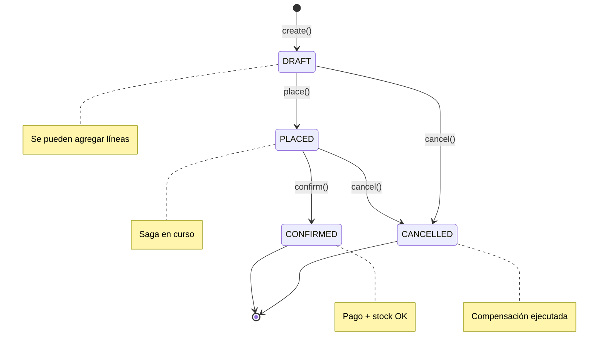
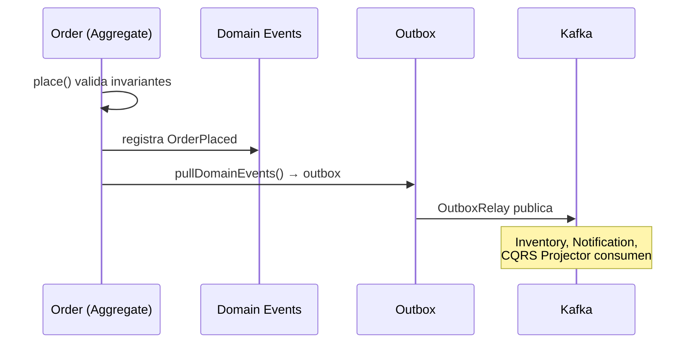
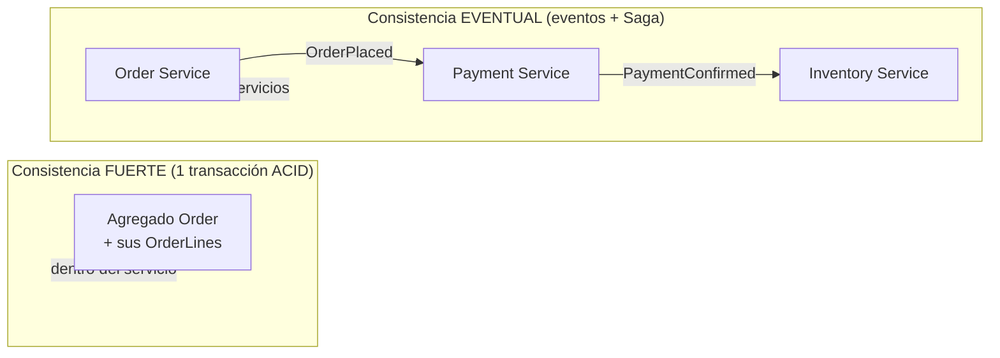

# 2. Domain-Driven Design (DDD)

**DDD** (Eric Evans, 2003) es el enfoque de diseño que mejor se lleva con microservicios,
porque nos da una respuesta rigurosa a la pregunta más difícil: **¿por dónde corto el sistema?**

La respuesta corta: **corta por bounded contexts, no por capas técnicas.**

DDD tiene dos mitades:

- **DDD Estratégico:** cómo dividir el sistema grande (bounded contexts, context maps, lenguaje ubicuo).
- **DDD Táctico:** cómo modelar dentro de cada contexto (entities, value objects, aggregates, domain events, repositories).



---

## 2.1 DDD Estratégico

### Lenguaje Ubicuo (Ubiquitous Language)

El equipo (negocio + devs) usa **las mismas palabras** en las conversaciones y en el código.
Si el negocio dice "Pedido" no lo llames `PurchaseData` en la base de datos. El código es un
modelo del negocio, y el modelo se expresa en el lenguaje del negocio.

### Bounded Context

Un **bounded context** es una frontera dentro de la cual un término tiene un significado único
y consistente. La palabra *"Producto"* significa cosas distintas en cada contexto:

| Contexto | Qué es "Producto" |
|----------|-------------------|
| **Catálogo** | Nombre, descripción, fotos, categoría, atributos SEO |
| **Inventario** | SKU, stock por almacén, punto de reorden |
| **Pricing** | Precio base, listas de precios, promociones |
| **Envíos** | Peso, dimensiones, si es frágil |

Cada uno de estos contextos es **candidato natural a ser un microservicio**. Este es el aporte
más importante de DDD a microservicios: *un microservicio bien dimensionado ≈ un bounded context.*

### Context Map

Describe cómo se relacionan los contextos entre sí:

- **Customer/Supplier**: el upstream provee, el downstream consume (Catálogo → Storefront).
- **Anticorruption Layer (ACL)**: capa que traduce el modelo de otro contexto al tuyo para no
  contaminarte (clave al integrar un sistema legacy — ver *Strangler Fig* en el doc 4).
- **Published Language**: un contrato común (ej. eventos Avro/JSON en Kafka).

### Context Map del e-commerce



> **Para alumnos:** la flecha **Customer/Supplier** indica quién define el contrato (upstream)
> y quién lo consume (downstream). El **Published Language** (eventos en Kafka) evita acoplar
> modelos internos entre equipos.

---

## 2.2 DDD Táctico (lo que verás en el código)

### Value Object (Objeto de Valor)

- **No tiene identidad**: se compara por su valor, no por un id.
- **Es inmutable.**
- **Se auto-valida** en el constructor (nunca puede existir en estado inválido).

Ejemplos en e-commerce: `Money` (monto + moneda), `Sku`, `Email`, `Address`, `Quantity`.

```java
// Un Money de S/100 SIEMPRE es igual a otro Money de S/100
Money a = Money.of("100.00", "PEN");
Money b = Money.of("100.00", "PEN");
a.equals(b); // true
```

En Java 21 los **records** son ideales para value objects (inmutables + `equals`/`hashCode` gratis).

Ver código: `ddd/shared/Money.java`, `Sku.java`, `Quantity.java`.



### Entity (Entidad)

- **Tiene identidad** (`OrderId`, `CustomerId`) que la distingue aunque cambien sus atributos.
- **Tiene ciclo de vida** (se crea, cambia de estado, se archiva).
- Dos entidades con los mismos atributos pero distinto id **son distintas**.

Ver código: `ddd/order/Order.java` (entidad raíz), `OrderLine.java`.

### Aggregate y Aggregate Root

Un **aggregate** es un grupo de objetos que se tratan como una unidad de consistencia. Tiene una
**raíz (aggregate root)** que es la única puerta de entrada: el mundo exterior solo habla con la raíz.

**Reglas de oro:**
1. Toda modificación pasa por la raíz (protege los invariantes).
2. Referencia entre agregados **por id**, nunca por objeto.
3. Una transacción modifica **un solo agregado** (los demás se actualizan por eventos → *eventual consistency*).

En nuestro caso, `Order` es la raíz e `OrderLine` vive dentro. No puedes añadir una línea
"por fuera": lo haces con `order.addLine(...)`, que revalida el invariante (ej. "el pedido no
puede superar S/ 50 000" o "no se puede modificar un pedido ya pagado").

```java
Order order = Order.create(tenantId, customerId);
order.addLine(sku, Quantity.of(2), unitPrice); // pasa por la raíz → valida invariantes
order.place();                                   // publica el domain event OrderPlaced
```

### Estructura del agregado Order



### Máquina de estados del pedido



### Domain Event (Evento de Dominio)

Algo relevante que **ya ocurrió** en el negocio (en pasado): `OrderPlaced`, `PaymentConfirmed`,
`StockReserved`. Es el pegamento entre agregados y entre microservicios (comunicación asíncrona).

Ver código: `ddd/order/events/OrderPlaced.java` y cómo `Order` los acumula para publicarlos.



### Repository (Repositorio)

Abstrae el almacenamiento de **agregados** (no de tablas). Su interfaz vive en el dominio (puerto)
y su implementación es un adaptador (JPA, jOOQ, Mongo...). Esto es DIP aplicado a la persistencia.

```java
public interface OrderRepository {   // puerto, en el dominio
    Optional<Order> findById(TenantId tenant, OrderId id);
    void save(Order order);
}
```

### Domain Service

Lógica de negocio que **no pertenece naturalmente a una sola entidad**. Ej: `PricingService` que
combina reglas de varias fuentes. Se usa con moderación: primero intenta poner la lógica en el agregado.

---

## 2.3 DDD y el tamaño del microservicio

- **1 bounded context → 1 microservicio** es un excelente punto de partida.
- Empieza con **contextos más grandes** (incluso un "monolito modular" bien separado por
  paquetes) y **divide después**, cuando el dominio se estabilice. Dividir mal es carísimo.
- El **aggregate** es la unidad de consistencia transaccional; entre agregados/servicios usas
  **consistencia eventual** (Saga, Outbox — doc 4).



---

## Ejercicios

1. Lista 3 bounded contexts de tu propio dominio y define qué significa "Cliente" en cada uno.
2. Convierte `Email` en un value object que rechace direcciones inválidas en el constructor.
3. Agrega un invariante a `Order`: no permitir `place()` si no tiene líneas. Escribe la prueba.
