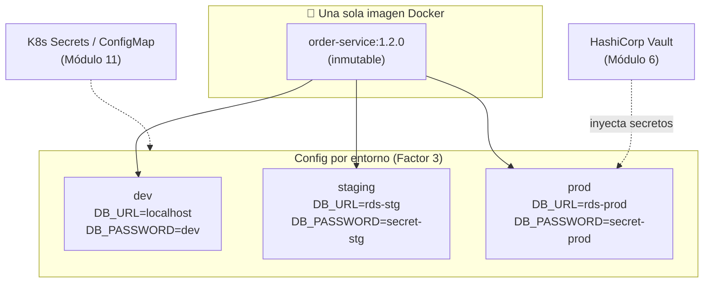
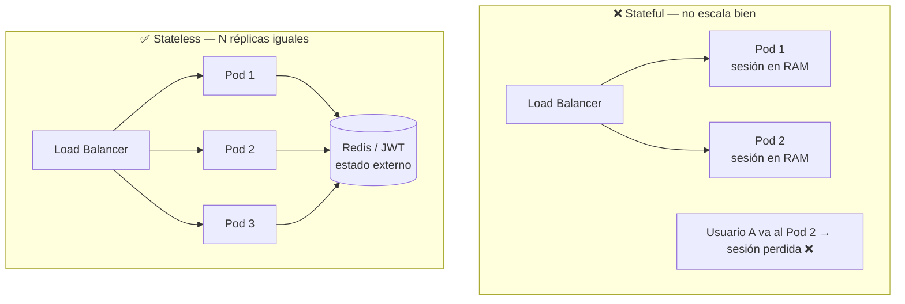
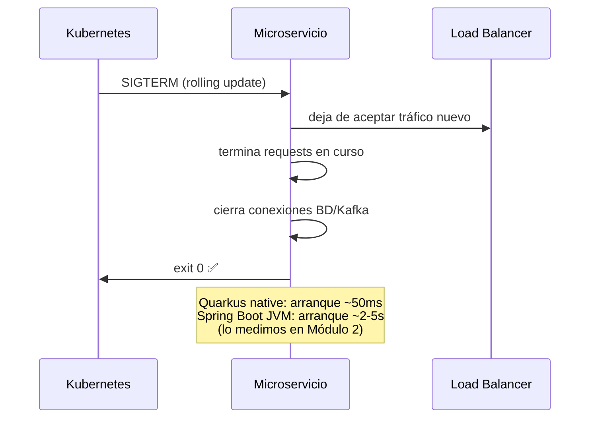
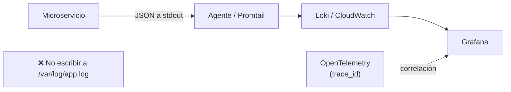

# 3. The Twelve-Factor App

La metodología **12-Factor** (Adam Wiggins / Heroku, 2011) define cómo construir aplicaciones
**cloud-native**: portables, escalables horizontalmente y aptas para entrega continua. Es la
lista de verificación mínima antes de decir "mi servicio está listo para Kubernetes".

| # | Factor | Qué significa | Cómo se ve en Spring Boot / Quarkus |
|---|--------|---------------|-------------------------------------|
| 1 | **Codebase** | Un repo por app, muchos deploys | 1 repo por microservicio, misma imagen a dev/stage/prod |
| 2 | **Dependencies** | Declaradas y aisladas explícitamente | `pom.xml` / `build.gradle`; nada de libs "del sistema" |
| 3 | **Config** | En el entorno, no en el código | Variables de entorno / ConfigMap / Secret, no `application.yml` hardcodeado |
| 4 | **Backing services** | Recursos adjuntos e intercambiables | La BD, Kafka, Redis se configuran por URL; cambiar de local a RDS = cambiar env |
| 5 | **Build, release, run** | Etapas separadas y estrictas | `mvn package` → imagen inmutable + config → `run` |
| 6 | **Processes** | Procesos **stateless**, share-nothing | No guardes sesión en memoria; usa Redis/JWT |
| 7 | **Port binding** | La app expone su propio puerto | Tomcat/Netty embebido; nada de servidor externo |
| 8 | **Concurrency** | Escala por procesos (scale-out) | Réplicas en Kubernetes (HPA), no threads gigantes |
| 9 | **Disposability** | Arranque rápido y apagado graceful | Startup veloz (¡Quarkus/GraalVM!), maneja `SIGTERM` |
| 10 | **Dev/prod parity** | Entornos lo más parecidos posible | Docker en local = Docker en prod; misma versión de BD |
| 11 | **Logs** | Como stream de eventos a stdout | Log a `stdout`; Loki/CloudWatch los recolectan (no archivos locales) |
| 12 | **Admin processes** | Tareas de admin como procesos one-off | Migraciones Flyway como Job de K8s, no a mano |

### Vista general: los 12 factores en el ciclo de vida

```mermaid
flowchart LR
    subgraph DEV["Desarrollo"]
        F1["1 Codebase"]
        F2["2 Dependencies"]
        F13["13 API First"]
    end

    subgraph BUILD["Build & Release"]
        F5["5 Build/Release/Run"]
        F3["3 Config"]
        F4["4 Backing Services"]
    end

    subgraph RUN["Ejecución en Kubernetes"]
        F6["6 Stateless"]
        F7["7 Port Binding"]
        F8["8 Concurrency"]
        F9["9 Disposability"]
        F10["10 Dev/Prod Parity"]
        F11["11 Logs → stdout"]
        F12["12 Admin Jobs"]
    end

    DEV --> BUILD --> RUN
```



---

## Los factores que más duelen si los ignoras

### Factor 3 — Config en el entorno

**La misma imagen** de contenedor debe correr en dev, staging y prod. Lo único que cambia es la
config, que llega por variables de entorno. Nunca hornees credenciales en la imagen.

```yaml
# application.yml — valores por defecto, sobrescribibles por entorno
spring:
  datasource:
    url: ${DB_URL:jdbc:postgresql://localhost:5432/shop}
    username: ${DB_USER:shop}
    password: ${DB_PASSWORD}     # sin default: obliga a inyectarlo (Secret/Vault)
```

> En el curso, los secretos irán a **HashiCorp Vault** (Módulo 6) y como **Secrets** en
> Kubernetes (Módulo 11).



### Factor 6 — Procesos stateless

Si guardas el carrito o la sesión en memoria del proceso, no puedes escalar a N réplicas ni
reiniciar sin perder datos. El estado va a un **backing service** (PostgreSQL, Redis) o al
cliente (JWT). Esto habilita el **Factor 8 (Concurrency)** y el **9 (Disposability)**.



### Factor 9 — Disposability (¡ventaja de Quarkus!)

Kubernetes crea y destruye pods constantemente (autoscaling, rolling updates, spot nodes). Tu
servicio debe:
- **Arrancar rápido**: aquí Quarkus + GraalVM native brillan (arranque en decenas de ms vs
  segundos de un Spring Boot en JVM). Lo mediremos en el Módulo 2.
- **Apagar graceful**: al recibir `SIGTERM`, dejar de aceptar tráfico, terminar los requests
  en curso y cerrar conexiones. Spring Boot lo soporta con `server.shutdown=graceful`.



### Factor 11 — Logs a stdout

En cloud-native **no escribes a archivos**. Emites logs estructurados (JSON) a `stdout` y la
plataforma los recolecta (Loki/CloudWatch/Log Analytics — Módulos 9, 13, 14). Esto permite
correlacionar logs con trazas (OpenTelemetry).



---

## Factores extendidos (15-Factor, Kevin Hoffman)

Complementos modernos muy relevantes para microservicios:

- **API first**: diseña el contrato (OpenAPI/proto) antes que la implementación (Módulo 3).
- **Telemetry**: métricas, trazas y logs como ciudadanos de primera clase (Módulo 9).
- **Authentication & Authorization**: seguridad desde el día uno (Módulo 6).

---

## Checklist rápido para tu microservicio

- [ ] ¿La misma imagen corre en todos los entornos con solo cambiar env vars?
- [ ] ¿No hay ningún secreto en el repositorio ni en la imagen?
- [ ] ¿El proceso es stateless (puedo correr 5 réplicas)?
- [ ] ¿Arranca en < 2s y maneja `SIGTERM`?
- [ ] ¿Loguea a stdout en JSON?
- [ ] ¿Las migraciones de BD corren como job, no manualmente?

---

## Ejercicios

1. Encuentra en un proyecto viejo tuyo una violación del Factor 3 y arréglala con env vars.
2. Explica por qué un servicio con sesión en memoria rompe los factores 6, 8 y 9 a la vez.
3. Escribe el `application.yml` de un servicio de pedidos cumpliendo los factores 3 y 4.
