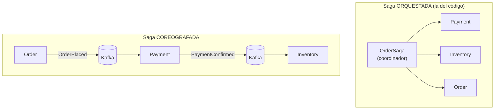
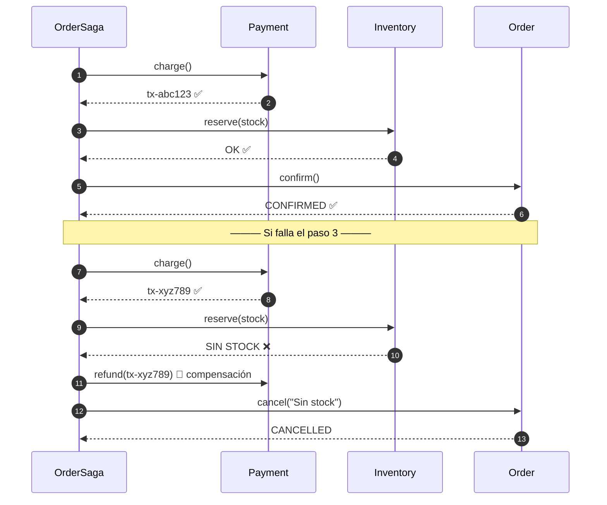
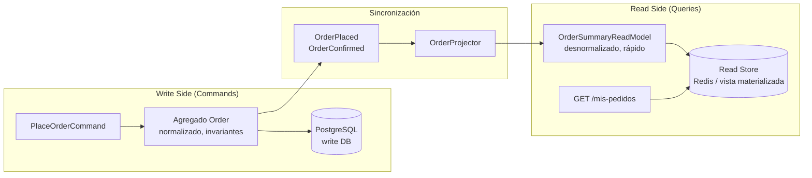
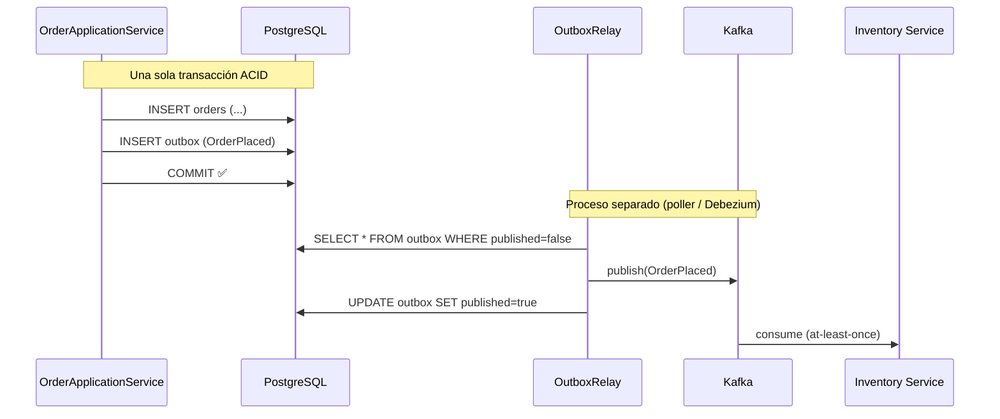
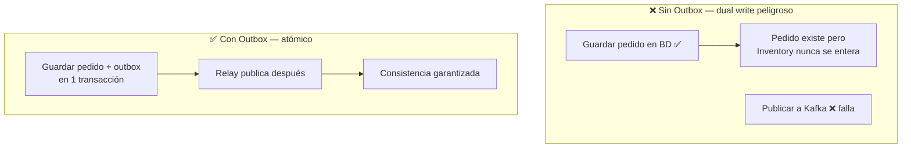
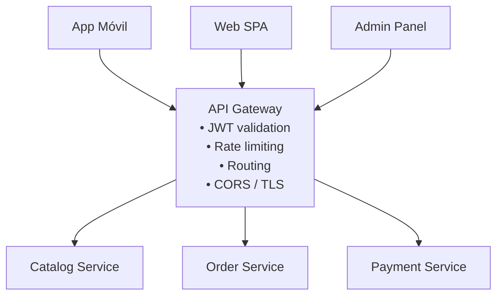
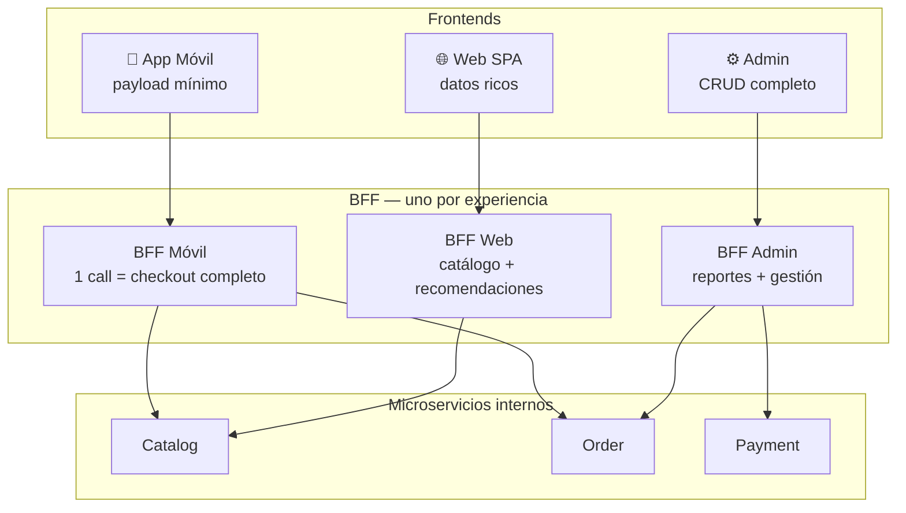
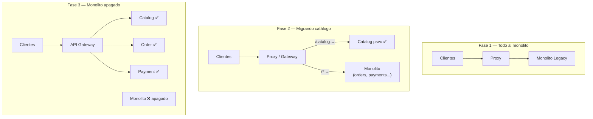
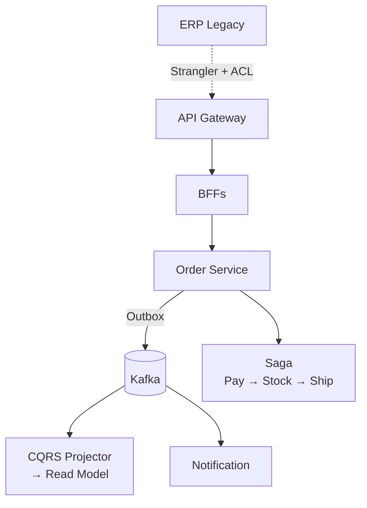

# 4. Patrones clave de microservicios

Estos son los patrones que aparecen una y otra vez en arquitecturas reales. Aquí los presentamos
con el problema que resuelven, un diagrama y la referencia al código de demostración.

- [Saga](#saga) — transacciones distribuidas
- [CQRS](#cqrs) — separar lecturas de escrituras
- [Outbox](#transactional-outbox) — publicar eventos de forma fiable
- [API Gateway](#api-gateway) — puerta de entrada única
- [BFF](#bff--backend-for-frontend) — un backend por tipo de cliente
- [Strangler Fig](#strangler-fig) — migrar un legacy sin big-bang

---

## Saga

**Problema:** en un monolito, "crear pedido → cobrar → reservar stock" ocurre en **una
transacción ACID**. En microservicios cada paso vive en un servicio distinto con su propia BD.
No hay transacción distribuida (y las que hay, como 2PC, no escalan). ¿Cómo mantengo consistencia?

**Solución:** una **Saga** es una secuencia de transacciones locales. Si un paso falla, se
ejecutan **transacciones de compensación** que deshacen los pasos anteriores (undo semántico).

Dos sabores:

- **Orquestada:** un coordinador central (`OrderSaga`) dice a cada servicio qué hacer. Más fácil
  de entender, monitorear y debuggear. *Es la que implementamos en el código.*
- **Coreografada:** cada servicio reacciona a eventos de otros, sin coordinador. Menos
  acoplamiento, pero el flujo global es difícil de seguir.

### Orquestada vs coreografada

### Camino feliz vs compensación

**Clave:** las compensaciones se ejecutan en **orden inverso**. Consistencia **eventual**, no inmediata.

Ver código: `patterns/saga/` — `OrderSaga` orquesta pago → stock → confirmación, y compensa si
el stock no alcanza (reembolsa el pago). Corre el `App` y verás ambos caminos (éxito y compensación).

---

## CQRS

**CQRS** = *Command Query Responsibility Segregation*. Separa el modelo que **escribe**
(commands) del modelo que **lee** (queries).

**Problema:** el modelo rico de DDD (agregados con invariantes) es excelente para escribir, pero
malísimo para leer (una pantalla de "mis pedidos" necesitaría cargar agregados enteros y unir
datos de varios contextos). Además, las lecturas suelen ser 10-100x más frecuentes que las escrituras.

**Solución:** dos modelos.
- **Write model:** agregados DDD, normalizado, enfocado en invariantes.
- **Read model:** vistas desnormalizadas, optimizadas por pantalla (incluso en otra BD: Redis,
  Elasticsearch, una vista materializada).

Se sincronizan con **eventos de dominio** (aquí conecta con Outbox y Event Sourcing).

**No siempre lo necesitas.** CQRS agrega complejidad (consistencia eventual entre lectura y
escritura). Úsalo cuando lecturas y escrituras tengan requisitos muy distintos.

Ver código: `patterns/cqrs/` — `PlaceOrderCommandHandler` escribe; cuando el pedido se coloca,
se proyecta a un `OrderSummaryReadModel` que `OrderQueries` consulta rápido.

---

## Transactional Outbox

**Problema (dual write):** al colocar un pedido necesito **(1) guardar en la BD** y **(2)
publicar un evento en Kafka**. Si guardo y luego Kafka falla, tengo un pedido sin evento
(inventario nunca se entera). Si publico y la BD hace rollback, evento fantasma. No puedes
hacer commit atómico sobre dos sistemas distintos.

**Solución:** en la **misma transacción** de BD, escribe el cambio de negocio **y** una fila en
una tabla `outbox`. Un proceso aparte (poller o CDC con Debezium) lee la tabla `outbox` y publica
a Kafka, marcando cada fila como enviada. Así el evento se publica **at-least-once** garantizado.

### El problema del dual-write (sin Outbox)

**Consecuencia:** entrega *at-least-once* → los consumidores deben ser **idempotentes**.

Ver código: `patterns/outbox/` — `OrderApplicationService` guarda pedido + outbox atómicamente
(simulado en memoria) y un `OutboxRelay` publica los pendientes.

---

## API Gateway

**Problema:** si cada cliente llama directo a 20 microservicios: duplica auth, CORS, rate
limiting, versionado y descubre las direcciones internas.

**Solución:** un único **punto de entrada** que enruta a los servicios internos y centraliza
preocupaciones transversales:
- Enrutamiento y balanceo
- Autenticación/autorización (validar JWT)
- Rate limiting y throttling
- TLS termination, CORS, WAF básico
- Agregación simple de respuestas

En el curso: **Spring Cloud Gateway** y **Kong** (Módulo 7); en cloud, **AWS API Gateway** y
**Azure API Management**.

> Cuidado: el gateway **no** debe contener lógica de negocio (si no, se vuelve un mini-monolito).

---

## BFF — Backend For Frontend

**Problema:** un API Gateway genérico no cubre que la **app móvil** necesita payloads pequeños y
pocas llamadas, mientras la **web** o el **panel admin** necesitan datos más ricos. Un solo API
para todos termina siendo un mal compromiso (viola ISP — doc 1).

**Solución:** un backend **por experiencia de cliente**. Cada BFF agrega/adapta datos de varios
servicios para su frontend específico.

**BFF vs Gateway:** el Gateway es infraestructura genérica (enruta todo); el BFF es *tuyo*,
tiene lógica de agregación específica para *una* UI. A menudo conviven: cliente → Gateway → BFF.

---

## Strangler Fig

**Problema:** tienes un **monolito legacy** en producción. Reescribirlo de cero ("big bang") es
la receta clásica del desastre.

**Solución (Martin Fowler):** como la higuera estranguladora que crece alrededor de un árbol
hasta reemplazarlo, pones un **proxy/gateway delante del monolito** y vas migrando funcionalidad
pieza por pieza a nuevos microservicios. El proxy decide, ruta por ruta, si va al legacy o al
nuevo servicio. Cuando todo migró, apagas el monolito.

Compañeros de viaje: un **Anticorruption Layer (ACL)** para que el modelo del legacy no
contamine a los servicios nuevos (DDD, doc 2).

---

## Cómo se combinan en el caso práctico

En la plataforma e-commerce (doc 5) verás casi todos juntos:

- **API Gateway** al frente → enruta a **BFFs** (web/móvil/admin).
- Colocar un pedido dispara una **Saga** (pago → stock → envío) con **compensaciones**.
- Cada servicio publica eventos vía **Outbox** a Kafka.
- La pantalla "mis pedidos" usa un **read model** (CQRS) alimentado por esos eventos.
- Si integramos un ERP legacy, lo hacemos con **Strangler Fig + ACL**.

---

## Ejercicios

1. Dibuja la Saga de "devolución de pedido" (return) con sus compensaciones.
2. Diseña el read model para la pantalla "detalle de pedido". ¿Qué campos desnormalizas?
3. Explica por qué Outbox obliga a que los consumidores sean idempotentes y cómo lo lograrías.
