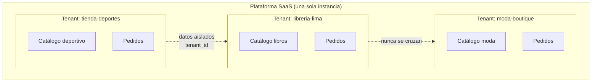
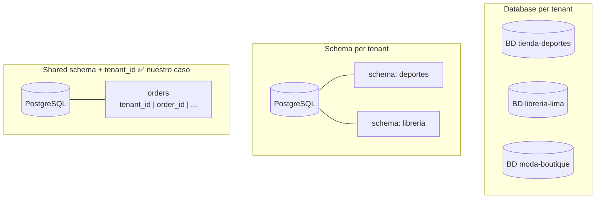
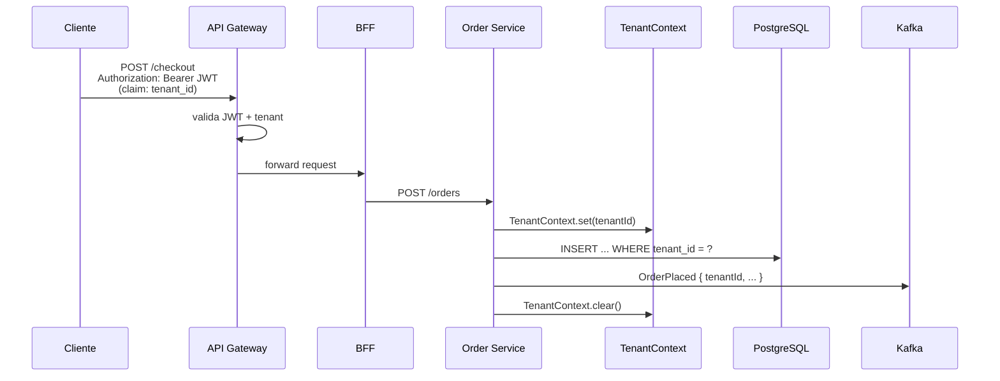
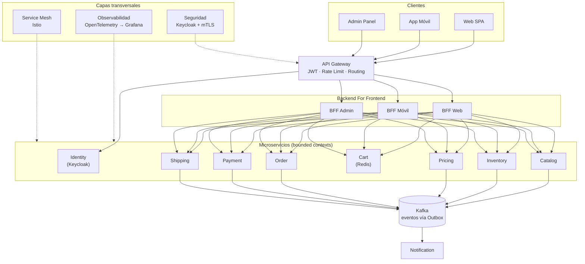
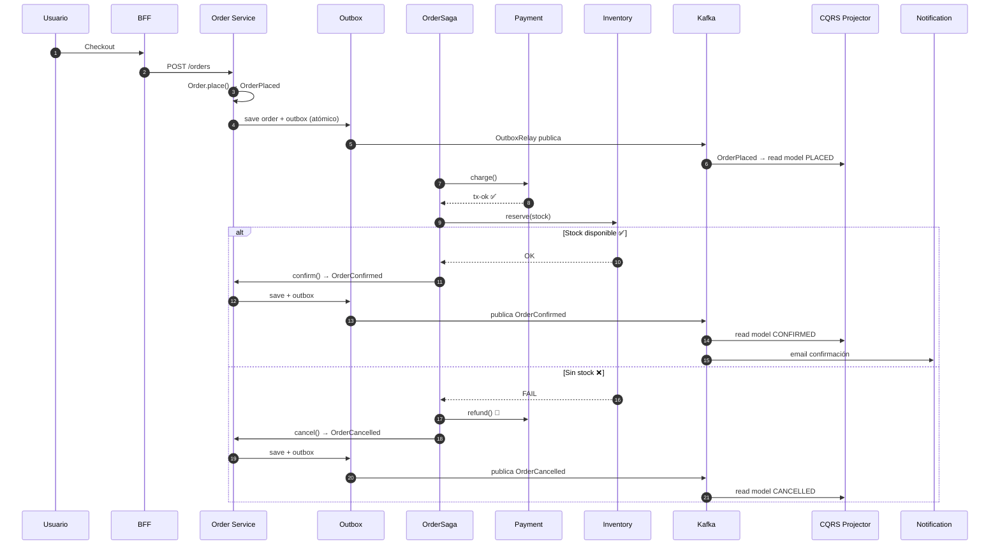
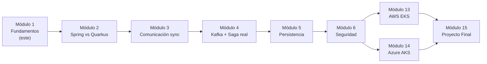
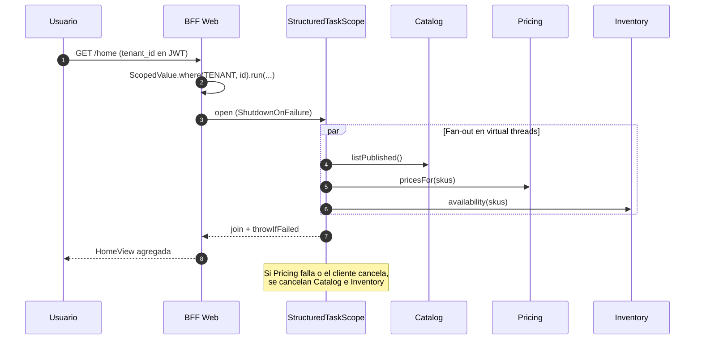
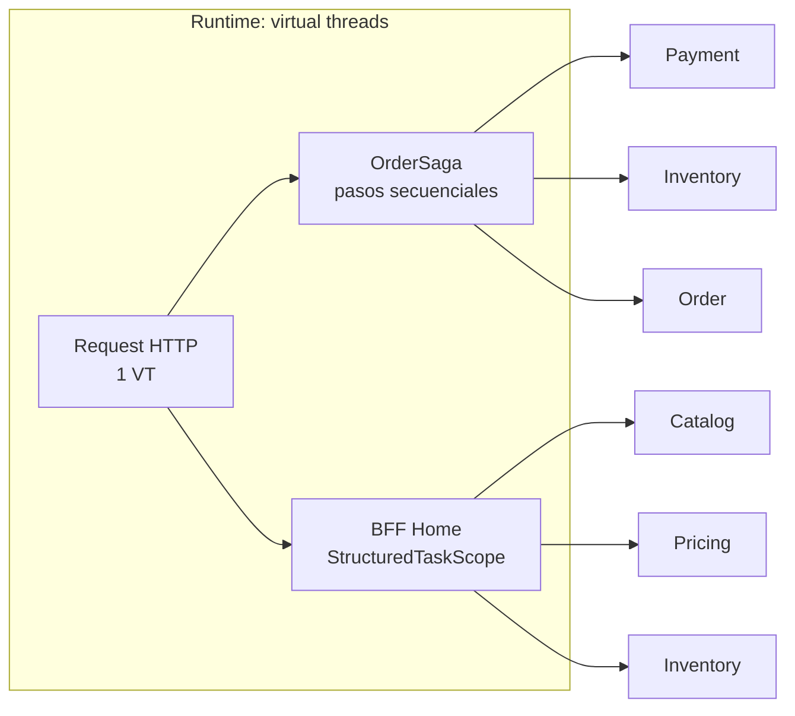

# 5. Caso práctico: plataforma e-commerce multi-tenant

Este es el sistema que construiremos a lo largo de **todo el curso**. En este módulo solo lo
diseñamos (arquitectura, contextos y multi-tenancy); en los siguientes lo implementamos,
aseguramos, observamos y desplegamos en AWS y Azure.

## 5.1 Visión

Una plataforma **SaaS de e-commerce** donde **múltiples tiendas (tenants)** venden sus productos.
Cada tenant tiene su catálogo, sus pedidos y sus clientes, **aislados** de los demás, pero
compartiendo la misma plataforma y despliegue.

Ejemplos de tenant: `tienda-deportes`, `libreria-lima`, `moda-boutique`.



## 5.2 ¿Qué es multi-tenancy?

**Multi-tenancy** = una sola instancia de software sirve a múltiples clientes (tenants) con sus
datos **lógicamente aislados**. Es la base de todo SaaS.

### Estrategias de aislamiento de datos

| Estrategia | Aislamiento | Costo | Cuándo |
|------------|-------------|-------|--------|
| **Database per tenant** | Máximo | Alto | Pocos tenants, requisitos regulatorios fuertes |
| **Schema per tenant** | Alto | Medio | Tenants medianos, aislamiento razonable |
| **Shared schema + `tenant_id`** | Lógico | Bajo | Muchos tenants (nuestro caso por defecto) |

En el curso usamos **shared schema con columna `tenant_id`** por escalabilidad, y mencionamos
schema-per-tenant para clientes enterprise. La regla inviolable:

> **Toda query, todo evento y todo caché lleva el `tenant_id`. Nunca se cruzan datos entre tenants.**

### Comparativa de estrategias multi-tenant



### Propagación del tenant

El `tenant_id` viaja por toda la petición:



Ver código: `tenant/TenantContext.java` — un contexto por hilo que transporta el tenant, y
`ddd/order/Order.java` que **exige** `TenantId` al crearse (no existe pedido sin tenant).

> **Nota Java 25:** en el prototipo de este módulo usamos `ThreadLocal`. En los microservicios
> reales (y en el fan-out con virtual threads) migraremos a **`ScopedValue`** (final desde
> Java 25): se propaga de forma inmutable al alcance estructurado y evita los problemas de
> fuga de contexto típicos de `ThreadLocal` con pools de hilos.

## 5.3 Bounded Contexts

Aplicando DDD estratégico (doc 2), la plataforma se divide en estos contextos → microservicios:

| Contexto (microservicio) | Responsabilidad | Persistencia (Módulo 5) |
|--------------------------|-----------------|--------------------------|
| **Identity** | Tenants, usuarios, auth (Keycloak) | PostgreSQL |
| **Catalog** | Productos, categorías, búsqueda | PostgreSQL + Elasticsearch |
| **Inventory** | Stock por almacén, reservas | PostgreSQL |
| **Pricing** | Precios, listas, promociones | PostgreSQL |
| **Cart** | Carrito de compra | Redis |
| **Order** | Pedidos, ciclo de vida | PostgreSQL |
| **Payment** | Cobros, reembolsos (Stripe/Culqi) | PostgreSQL |
| **Shipping** | Envíos, tracking | PostgreSQL |
| **Notification** | Emails, push, SMS | MongoDB |

## 5.4 Diagrama de arquitectura (alto nivel)



Transversal a todo: **observabilidad** (OpenTelemetry → Grafana Stack, Módulo 9),
**seguridad** (Keycloak + mTLS, Módulo 6) y **service mesh** (Istio, Módulo 10).

## 5.5 Flujo estrella: "Colocar un pedido" (Checkout)

Este flujo toca la mayoría de patrones del doc 4 y es el que demuestra el código de este módulo:

1. El cliente (autenticado, con su `tenant_id` en el JWT) hace checkout desde el **BFF**.
2. **Order** crea el pedido (agregado `Order`, estado `PLACED`) y, vía **Outbox**, publica `OrderPlaced`.
3. Arranca la **Saga** de checkout:
   - **Payment** cobra → `PaymentConfirmed` (o `PaymentFailed`).
   - **Inventory** reserva stock → `StockReserved` (o `StockInsufficient`).
   - **Shipping** agenda el envío → `ShipmentScheduled`.
4. Si todo va bien, el pedido pasa a `CONFIRMED`.
5. Si un paso falla (ej. sin stock), la Saga **compensa** en orden inverso (reembolsa el pago,
   cancela el pedido → `CANCELLED`).
6. Cada evento actualiza el **read model** (CQRS) de "mis pedidos" y dispara **Notification**.

### Diagrama de secuencia: checkout completo



### Mapa del curso: de conceptos a producción



## 5.6 Modelo de concurrencia: Virtual Threads + Structured Concurrency

La plataforma es **I/O-bound**: cada request de tienda espera red (HTTP a otros servicios),
PostgreSQL, Redis o Kafka. Con miles de tenants concurrentes, un pool clásico de platform
threads se agota; con **virtual threads** (Java 21+, estables) cada request bloqueante es barato.

**Decisión del curso:** Spring Boot MVC / Quarkus REST **sobre virtual threads**. No necesitamos
WebFlux solo por throughput: el modelo imperativo + VT escala lo suficiente para este SaaS y
mantiene el código legible (Saga, Outbox, DDD).

### Dónde encaja cada pieza

| Pieza | Rol en la plataforma |
|-------|----------------------|
| **Virtual Threads** | Un VT por request HTTP; llamadas sync a Catalog/Payment/Inventory sin bloquear un OS thread |
| **Structured Concurrency** (`StructuredTaskScope`) | Fan-out del BFF y lecturas paralelas con ciclo de vida claro (cancelación, errores, join) |
| **ScopedValue\<TenantId\>** | Propaga el tenant al alcance del request y a subtareas hijas sin `ThreadLocal` frágil |

### Fan-out del BFF (caso estrella de Structured Concurrency)

La home del storefront necesita **en paralelo** catálogo, precios y stock. Sin SC, un
`CompletableFuture` suelto deja subtareas huérfanas si el cliente cancela. Con
`StructuredTaskScope`, el alcance padre **espera, cancela o propaga fallo** de forma estructurada:



Idea de código (preview en Java 25 — activar `--enable-preview` mientras SC no sea final):

```java
try (var scope = new StructuredTaskScope.ShutdownOnFailure()) {
    Subtask<List<Product>> products = scope.fork(() -> catalog.listPublished());
    Subtask<Map<Sku, Money>> prices  = scope.fork(() -> pricing.pricesFor(skus));
    Subtask<Map<Sku, Integer>> stock = scope.fork(() -> inventory.availability(skus));

    scope.join().throwIfFailed();
    return HomeView.of(products.get(), prices.get(), stock.get());
}
```

### Checkout: sync secuencial vs paralelo

- **Saga de checkout** (pago → stock → confirmación): pasos **secuenciales** con compensaciones;
  no se paralelizan (dependencias de negocio). Siguen corriendo en un virtual thread del request.
- **BFF / lecturas / enriquecimiento**: ahí sí **Structured Concurrency** (fan-out / fan-in).



### Por qué no WebFlux por defecto

| Enfoque | Pros | Contras en este curso |
|---------|------|------------------------|
| **MVC + Virtual Threads** | Código imperativo, DDD/Saga naturales, debug simple | Bloqueo “barato”, no streaming reactivo nativo |
| **WebFlux / Mutiny** | Backpressure, streaming | Modelo mental distinto; mezcla mal con libs bloqueantes |

Regla: **VT + Structured Concurrency primero**; WebFlux solo si el caso exige streaming o APIs
reactivas de punta a punta (lo vemos al comparar en el Módulo 2).

## 5.7 Requisitos no funcionales que guían el diseño

- **Aislamiento por tenant** (seguridad y datos) — no negociable.
- **Escalabilidad horizontal** por servicio (Black Friday escala solo Catalog/Order).
- **Alta concurrencia I/O** con **virtual threads** (muchos tenants, requests bloqueantes baratos).
- **Fan-out seguro** en BFFs con **concurrencia estructurada** (cancelación y errores acotados).
- **Resiliencia**: la caída de Notification no impide comprar (desacople por eventos).
- **Consistencia eventual** entre servicios (Saga + Outbox), fuerte dentro del agregado.
- **Observabilidad** end-to-end con `trace_id` **y** `tenant_id` en cada log/traza.

## 5.8 Qué construimos en el código de este módulo

El código de `codigo/` es un **prototipo en memoria, sin frameworks**, que demuestra los
conceptos de forma pura y ejecutable:

- `TenantContext` + `TenantId` → multi-tenancy (`ThreadLocal` aquí; `ScopedValue` en módulos siguientes).
- Agregado `Order` con value objects (`Money`, `Sku`, `Quantity`) y domain events → DDD.
- `OrderSaga` con compensaciones → Saga.
- `OutboxRelay` → Transactional Outbox.
- `OrderQueries` sobre un read model → CQRS.

En el **Módulo 2** convertimos estos conceptos en microservicios reales con Spring Boot 4 y
Quarkus 3, habilitando **virtual threads**. El fan-out del BFF con **Structured Concurrency**
lo aplicamos cuando armamos la comunicación síncrona entre servicios.

---

## Ejercicios

1. Elige la estrategia de multi-tenancy para un cliente bancario y justifícala.
2. Añade un bounded context de "Reviews/Reseñas". ¿De qué otros contextos depende?
3. Diseña el flujo de "cancelación de pedido ya pagado" como una Saga con compensaciones.
4. La pantalla de detalle de producto del BFF debe llamar a Catalog, Pricing e Inventory.
   Esboza el `StructuredTaskScope` (fork/join) y describe qué ocurre si Pricing tarda de más
   y el cliente cancela la request.
5. ¿Por qué `ScopedValue` encaja mejor que `ThreadLocal` cuando el BFF hace fan-out en
   virtual threads?
