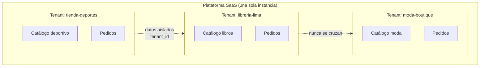
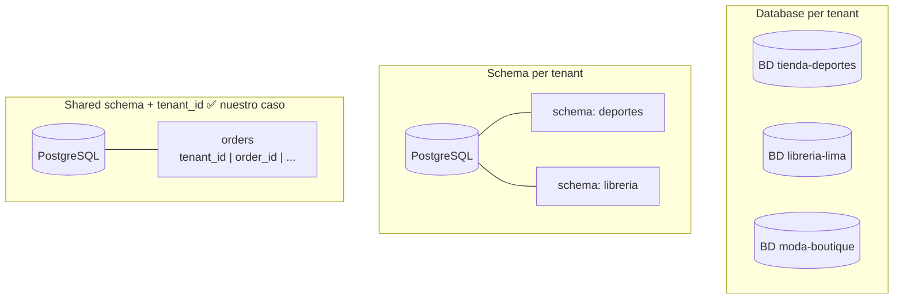
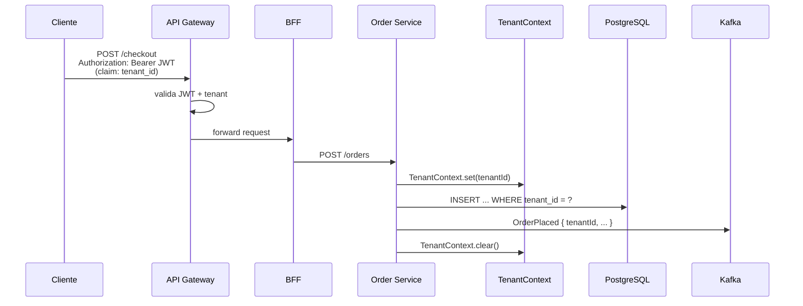
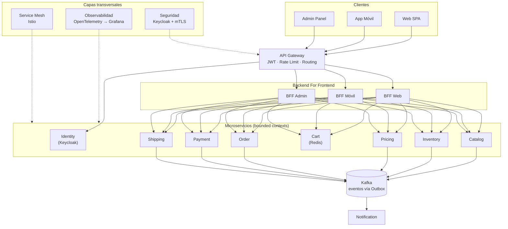
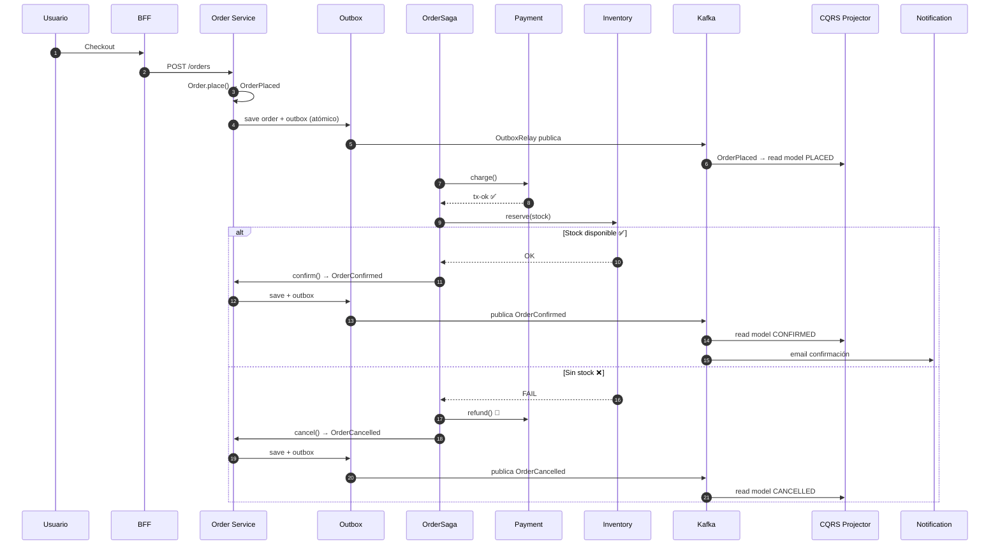
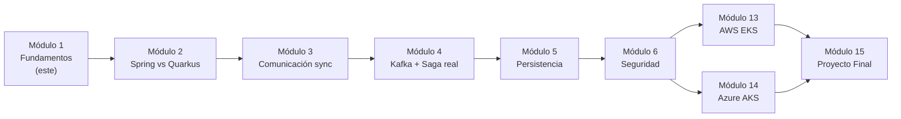

# 5. Caso práctico: plataforma e-commerce multi-tenant

Este es el sistema que construiremos a lo largo de **todo el curso**. En este módulo solo lo
diseñamos (arquitectura, contextos y multi-tenancy); en los siguientes lo implementamos,
aseguramos, observamos y desplegamos en AWS y Azure.

## 5.1 Visión

Una plataforma **SaaS de e-commerce** donde **múltiples tiendas (tenants)** venden sus productos.
Cada tenant tiene su catálogo, sus pedidos y sus clientes, **aislados** de los demás, pero
compartiendo la misma plataforma y despliegue.

Ejemplos de tenant: `tienda-deportes`, `libreria-lima`, `moda-boutique`.

## 5.2 ¿Qué es multi-tenancy?

**Multi-tenancy** = una sola instancia de software sirve a múltiples clientes (tenants) con sus
datos **lógicamente aislados**. Es la base de todo SaaS.

### Estrategias de aislamiento de datos

| Estrategia | Aislamiento | Costo | Cuándo |
|------------|-------------|-------|--------|
| **Database per tenant** | Máximo | Alto | Pocos tenants, requisitos regulatorios fuertes |
| **Schema per tenant** | Alto | Medio | Tenants medianos, aislamiento razonable |
| **Shared schema + `tenant_id`** | Lógico | Bajo | Muchos tenants (nuestro caso por defecto) |

En el curso usamos **shared schema con columna `tenant_id`** por escalabilidad, y mencionamos
schema-per-tenant para clientes enterprise. La regla inviolable:

> **Toda query, todo evento y todo caché lleva el `tenant_id`. Nunca se cruzan datos entre tenants.**

### Comparativa de estrategias multi-tenant

### Propagación del tenant

El `tenant_id` viaja por toda la petición:

Ver código: `tenant/TenantContext.java` — un contexto por hilo (ThreadLocal) que transporta el
tenant, y `ddd/order/Order.java` que **exige** `TenantId` al crearse (no existe pedido sin tenant).

## 5.3 Bounded Contexts

Aplicando DDD estratégico (doc 2), la plataforma se divide en estos contextos → microservicios:

| Contexto (microservicio) | Responsabilidad | Persistencia (Módulo 5) |
|--------------------------|-----------------|--------------------------|
| **Identity** | Tenants, usuarios, auth (Keycloak) | PostgreSQL |
| **Catalog** | Productos, categorías, búsqueda | PostgreSQL + Elasticsearch |
| **Inventory** | Stock por almacén, reservas | PostgreSQL |
| **Pricing** | Precios, listas, promociones | PostgreSQL |
| **Cart** | Carrito de compra | Redis |
| **Order** | Pedidos, ciclo de vida | PostgreSQL |
| **Payment** | Cobros, reembolsos (Stripe/Culqi) | PostgreSQL |
| **Shipping** | Envíos, tracking | PostgreSQL |
| **Notification** | Emails, push, SMS | MongoDB |

## 5.4 Diagrama de arquitectura (alto nivel)

Transversal a todo: **observabilidad** (OpenTelemetry → Grafana Stack, Módulo 9),
**seguridad** (Keycloak + mTLS, Módulo 6) y **service mesh** (Istio, Módulo 10).

## 5.5 Flujo estrella: "Colocar un pedido" (Checkout)

Este flujo toca la mayoría de patrones del doc 4 y es el que demuestra el código de este módulo:

1. El cliente (autenticado, con su `tenant_id` en el JWT) hace checkout desde el **BFF**.
2. **Order** crea el pedido (agregado `Order`, estado `PLACED`) y, vía **Outbox**, publica `OrderPlaced`.
3. Arranca la **Saga** de checkout:
   - **Payment** cobra → `PaymentConfirmed` (o `PaymentFailed`).
   - **Inventory** reserva stock → `StockReserved` (o `StockInsufficient`).
   - **Shipping** agenda el envío → `ShipmentScheduled`.
4. Si todo va bien, el pedido pasa a `CONFIRMED`.
5. Si un paso falla (ej. sin stock), la Saga **compensa** en orden inverso (reembolsa el pago,
   cancela el pedido → `CANCELLED`).
6. Cada evento actualiza el **read model** (CQRS) de "mis pedidos" y dispara **Notification**.

### Diagrama de secuencia: checkout completo

### Mapa del curso: de conceptos a producción

## 5.6 Requisitos no funcionales que guían el diseño

- **Aislamiento por tenant** (seguridad y datos) — no negociable.
- **Escalabilidad horizontal** por servicio (Black Friday escala solo Catalog/Order).
- **Resiliencia**: la caída de Notification no impide comprar (desacople por eventos).
- **Consistencia eventual** entre servicios (Saga + Outbox), fuerte dentro del agregado.
- **Observabilidad** end-to-end con `trace_id` **y** `tenant_id` en cada log/traza.

## 5.7 Qué construimos en el código de este módulo

El código de `codigo/` es un **prototipo en memoria, sin frameworks**, que demuestra los
conceptos de forma pura y ejecutable:

- `TenantContext` + `TenantId` → multi-tenancy.
- Agregado `Order` con value objects (`Money`, `Sku`, `Quantity`) y domain events → DDD.
- `OrderSaga` con compensaciones → Saga.
- `OutboxRelay` → Transactional Outbox.
- `OrderQueries` sobre un read model → CQRS.

En el **Módulo 2** convertimos estos conceptos en microservicios reales con Spring Boot 4 y Quarkus 3.

---

## Ejercicios

1. Elige la estrategia de multi-tenancy para un cliente bancario y justifícala.
2. Añade un bounded context de "Reviews/Reseñas". ¿De qué otros contextos depende?
3. Diseña el flujo de "cancelación de pedido ya pagado" como una Saga con compensaciones.
