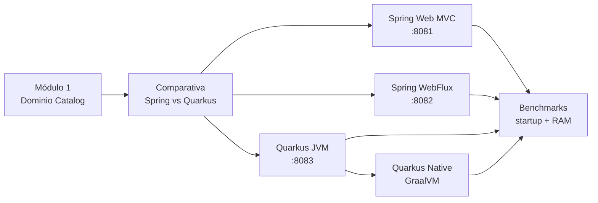

# Módulo 2 – Spring Boot vs Quarkus

> Curso: **Arquitectura de Microservicios Pro: Spring Boot + Quarkus en AWS y Azure**
> JoeDayz.pe · Java 21 / Spring Boot 4 / Quarkus 3

En el Módulo 1 diseñamos el dominio (e-commerce multi-tenant). En este módulo **implementamos
el mismo microservicio de Catálogo** con tres stacks distintos y comparamos startup, memoria
y build nativo con GraalVM.

## Objetivos de aprendizaje

Al terminar este módulo serás capaz de:

1. Comparar **Spring Boot 4** y **Quarkus 3** con criterios reales (ecosistema, rendimiento, DX).
2. Crear un microservicio REST con **Spring Web MVC** (bloqueante) y **WebFlux** (reactivo).
3. Crear el mismo servicio con **Quarkus REST + Hibernate Panache**.
4. Generar un **ejecutable nativo** con GraalVM (`quarkus-maven-plugin`).
5. Medir **startup time** y **memoria RSS** con el script de benchmarks del curso.

## Contenido teórico

| # | Tema | Documento |
|---|------|-----------|
| 1 | Comparativa Spring Boot vs Quarkus | [docs/01-comparativa-spring-vs-quarkus.md](docs/01-comparativa-spring-vs-quarkus.md) |
| 2 | Spring Boot 4: Web MVC + WebFlux | [docs/02-spring-boot-webmvc-webflux.md](docs/02-spring-boot-webmvc-webflux.md) |
| 3 | Quarkus 3: Panache + REST | [docs/03-quarkus-panache-resteasy-reactive.md](docs/03-quarkus-panache-resteasy-reactive.md) |
| 4 | Build nativo GraalVM con Quarkus | [docs/04-graalvm-native-build.md](docs/04-graalvm-native-build.md) |
| 5 | Benchmarks: startup y memoria | [docs/05-benchmarks-startup-memoria.md](docs/05-benchmarks-startup-memoria.md) |

## Microservicios de código (mismo contrato API)

Los tres implementan el **bounded context Catalog** del caso práctico (Módulo 1):

| Proyecto | Stack | Puerto | Health |
|----------|-------|--------|--------|
| [spring-boot-mvc/catalog-service](spring-boot-mvc/catalog-service/) | Spring Boot 4 + Web MVC + JPA | **8081** | `/actuator/health` |
| [spring-boot-webflux/catalog-service](spring-boot-webflux/catalog-service/) | Spring Boot 4 + WebFlux + R2DBC | **8082** | `/actuator/health` |
| [quarkus/catalog-service](quarkus/catalog-service/) | Quarkus 3 + Panache + REST | **8083** (JVM) | `/q/health` |

### API común

```http
GET /api/v1/products
X-Tenant-ID: tienda-deportes

GET /api/v1/products/{sku}
X-Tenant-ID: tienda-deportes
```

Respuesta ejemplo:

```json
[
  {
    "sku": "ZAP-RUN-42",
    "name": "Zapatilla Running Pro",
    "description": "Amortiguacion maxima para corredores",
    "price": 300.00,
    "currency": "PEN"
  }
]
```

### Cómo ejecutar cada servicio

Requisitos: **JDK 21+** (probado con Java 25), **Maven 3.9+**. Para build nativo: **GraalVM 21+** o Docker (container build).

```bash
# Spring Boot MVC (bloqueante)
cd spring-boot-mvc/catalog-service && mvn spring-boot:run

# Spring Boot WebFlux (reactivo)
cd spring-boot-webflux/catalog-service && mvn spring-boot:run

# Quarkus JVM
cd quarkus/catalog-service && mvn quarkus:dev

# Quarkus nativo (tarda varios minutos la primera vez)
cd quarkus/catalog-service
mvn package -Dnative -Dquarkus.native.container-build=true
./target/catalog-service-1.0.0-runner
```

### Benchmarks

```bash
cd benchmarks
./run-benchmarks.sh           # JVM: Spring MVC, WebFlux, Quarkus
./run-benchmarks.sh --native  # incluye Quarkus nativo (requiere build previo)
```

## Mapa del módulo



---

*Siguiente módulo:* **[Módulo 3 – Comunicación Síncrona](../modulo-03-comunicacion-sincrona/)** (OpenAPI, gRPC, WebClient, Feign, versionado).
