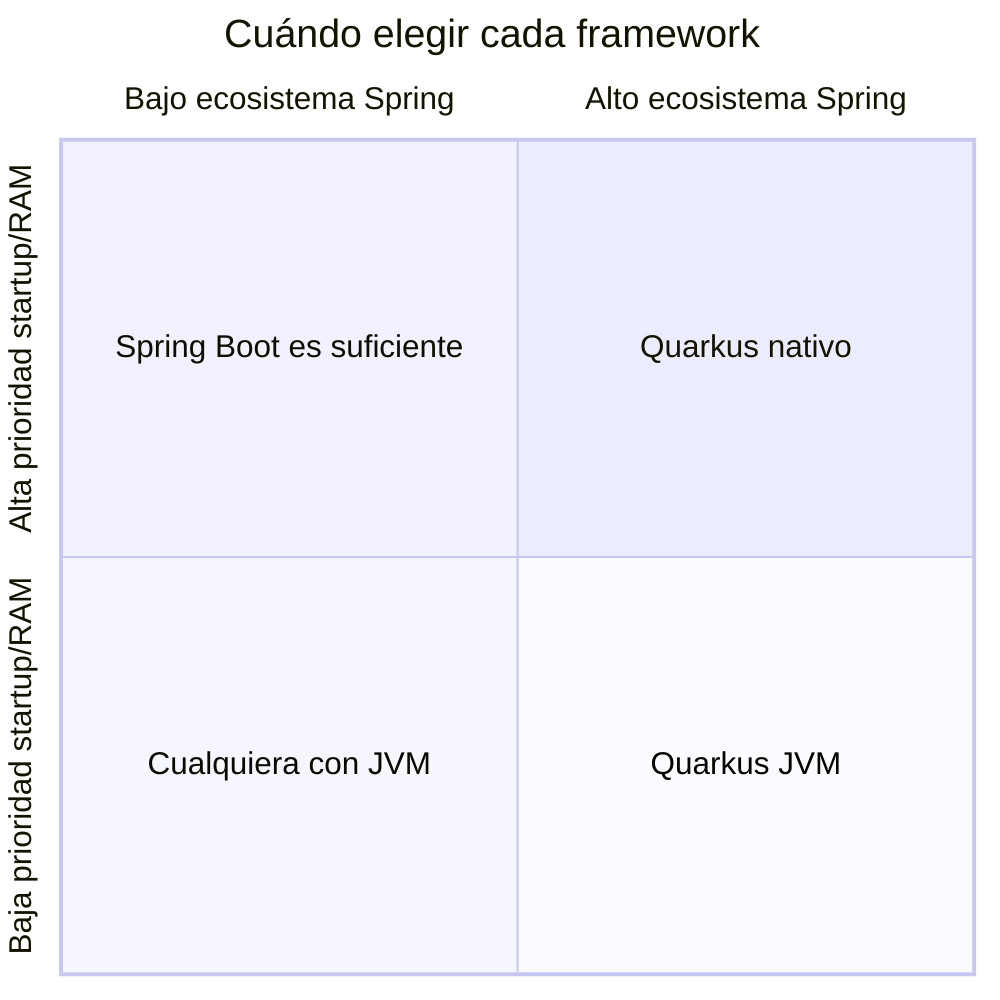
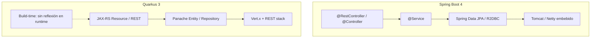
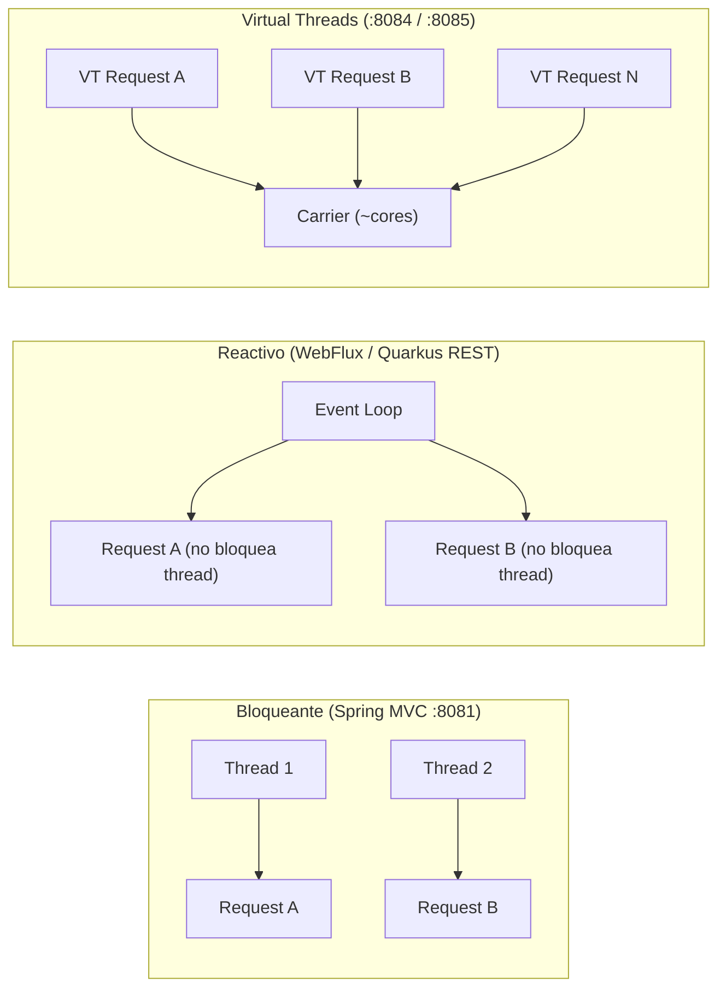

# 1. Comparativa Spring Boot vs Quarkus

Dos frameworks Java para microservicios cloud-native. No hay un "ganador absoluto": la elección
depende del contexto del equipo, el ecosistema y los requisitos de rendimiento.

## Resumen ejecutivo

| Criterio | Spring Boot 4 | Quarkus 3 |
|----------|---------------|-----------|
| **Filosofía** | Convención sobre configuración, ecosistema enorme | Supersonic Subatomic: optimizado para contenedores/K8s |
| **Madurez / ecosistema** | ⭐⭐⭐⭐⭐ (Spring Cloud, Security, Data, Batch...) | ⭐⭐⭐⭐ (crece rápido, integraciones clave) |
| **Modelo de ejecución** | Servlet (MVC) o Reactor (WebFlux) sobre JVM | REST reactivo (Vert.x) + CDI; build-time optimization |
| **Startup JVM** | 2–5 s típico | 0.5–2 s típico |
| **Memoria JVM** | 200–400 MB RSS en reposo | 80–150 MB RSS en reposo |
| **Native (GraalVM)** | Posible (Spring AOT) pero más complejo | **Primera clase**: `mvn package -Dnative` |
| **Curva de aprendizaje** | Baja si ya conoces Spring | Media: CDI, Panache, extensiones |
| **Ideal para** | Equipos Spring, integraciones enterprise, migraciones | K8s/serverless, alta densidad de pods, edge |

## Arquitectura interna (simplificada)

**Diferencia clave:** Quarkus hace mucho trabajo en **tiempo de compilación** (generación de
código, configuración fija, menos reflexión). Spring Boot tradicionalmente resuelve más en
**tiempo de ejecución** (auto-configuración reflexiva). Spring Boot 3+/4 mejora esto con
Spring AOT, pero Quarkus sigue siendo más maduro en native.

## Cuándo elegir Spring Boot 4

- El equipo ya domina **Spring** (Data, Security, Cloud, Batch).
- Necesitas **Spring Cloud** (Gateway, Config, Eureka, OpenFeign) de forma integral.
- Migras un monolito Spring existente (menor fricción).
- Integraciones enterprise: Kafka, JMS, SAML, batch pesado.
- El startup de 3 s no es crítico (pocos despliegues, pods de larga vida).

## Cuándo elegir Quarkus 3

- Despliegue en **Kubernetes** con muchos pods (costo = memoria × réplicas).
- **Serverless** o Knative (cold start importa).
- Quieres **native image** sin pelear con configuración GraalVM.
- Microservicios pequeños y focalizados (un bounded context por servicio).
- Necesitas **dev mode** ultrarrápido (`quarkus:dev` con live reload).

## Modelo de programación: bloqueante vs reactivo vs Virtual Threads

| | Spring Web MVC | Spring MVC + VT | Spring WebFlux | Quarkus + `@RunOnVirtualThread` |
|---|----------------|-----------------|----------------|----------------------------------|
| Threads | 1 thread ≈ 1 request (pool) | Miles de VTs sobre carriers | Pocos threads, muchas conexiones | VTs para I/O bloqueante |
| JDBC bloqueante | ✅ Natural | ✅ Natural + escala mejor | ⚠️ Bloquea el event loop | ✅ Con `@RunOnVirtualThread` |
| Código | Imperativo | Imperativo (igual) | Reactivo | Imperativo |
| Curva | Baja | Baja | Alta | Baja–media |

> **Regla práctica:** no uses WebFlux solo "por moda". Si tu código es JDBC bloqueante,
> **Spring MVC + Virtual Threads** o **Quarkus + `@RunOnVirtualThread`** suelen ser más
> simples y igual de válidos. Ver [docs/06-virtual-threads.md](06-virtual-threads.md).

## En este curso usamos ambos

El microservicio **Catalog** se implementa **cinco veces** con el **mismo contrato REST** y
multi-tenancy (`X-Tenant-ID`), para que compares apples-to-apples en los benchmarks
(incluyendo Virtual Threads en :8084 y :8085).

## Ejercicios

1. ¿Tu empresa actual usaría Spring o Quarkus? Justifica con 3 criterios de la tabla.
2. ¿Por qué WebFlux + JPA bloqueante es un anti-patrón? ¿Qué alternativa con VT usarías?
3. Ejecuta :8081 y :8084, llama `GET /api/v1/products/_thread` y explica la diferencia.
