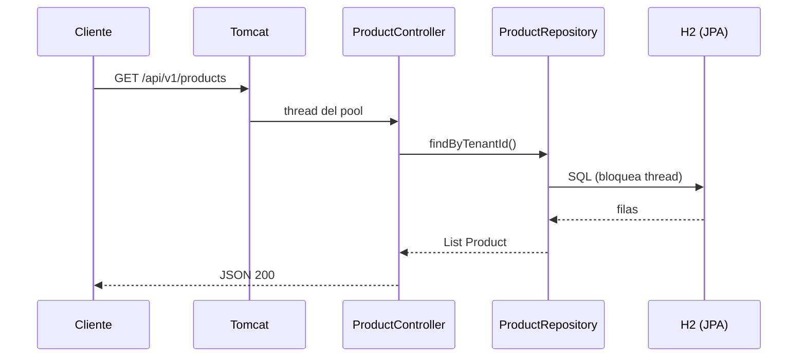
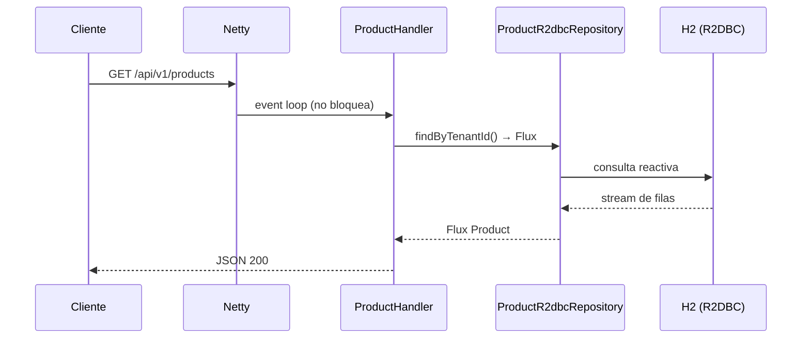
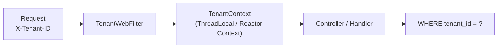

# 2. Spring Boot 4: Web MVC + WebFlux

Implementamos el microservicio **Catalog** dos veces con Spring Boot 4: modelo **bloqueante**
(Web MVC + JPA) y modelo **reactivo** (WebFlux + R2DBC).

## Proyectos del curso

| Proyecto | Puerto | Stack |
|----------|--------|-------|
| `spring-boot-mvc/catalog-service` | 8081 | `spring-boot-starter-web` + JPA + H2 |
| `spring-boot-webflux/catalog-service` | 8082 | `spring-boot-starter-webflux` + R2DBC + H2 |

## Spring Boot 4 — novedades relevantes

- Basado en **Spring Framework 7**.
- **Java 17–25** (usamos Java 21 en el curso).
- **Jackson 3** por defecto (paquetes `tools.jackson.*` en código nuevo).
- Modularización del código Spring Boot en jars más pequeños.
- Mejoras en **AOT** (Ahead-of-Time) para GraalVM native (aunque Quarkus sigue siendo más directo).

## Web MVC — modelo bloqueante



### Piezas clave (MVC)

```
catalog-service/
├── CatalogServiceApplication.java
├── api/ProductController.java          # @RestController
├── domain/Product.java                 # @Entity JPA
├── repository/ProductRepository.java   # JpaRepository
├── tenant/TenantWebFilter.java         # X-Tenant-ID → TenantContext
└── config/DataInitializer.java         # datos de demo
```

```java
@RestController
@RequestMapping("/api/v1/products")
public class ProductController {

    private final ProductRepository repository;

    @GetMapping
    public List<ProductResponse> list() {
        return repository.findByTenantId(TenantContext.require().value())
                .stream().map(ProductResponse::from).toList();
    }
}
```

**Cuándo usar MVC:** CRUD estándar, JDBC/JPA, equipos que prefieren código imperativo lineal.

## WebFlux — modelo reactivo



### Piezas clave (WebFlux)

```
catalog-service/
├── api/ProductHandler.java             # RouterFunction o @RestController reactivo
├── domain/Product.java                 # @Table R2DBC
├── repository/ProductR2dbcRepository   # ReactiveCrudRepository
└── tenant/TenantWebFilter.java         # WebFilter reactivo
```

```java
@GetMapping
public Flux<ProductResponse> list() {
    return repository.findByTenantId(TenantContext.require().value())
            .map(ProductResponse::from);
}
```

**Cuándo usar WebFlux:** alto concurrency I/O-bound, integración con APIs reactivas, streaming.
**No uses WebFlux** si todo tu stack es JDBC bloqueante sin `boundedElastic`.

## Multi-tenancy en Spring

Igual que en el Módulo 1: el header `X-Tenant-ID` se lee al inicio del request.



- **MVC:** `OncePerRequestFilter` + `ThreadLocal`.
- **WebFlux:** `WebFilter` + `contextWrite` en Reactor Context.

## Configuración (12-Factor)

```yaml
# application.yml — Factor 3: config por entorno
server:
  port: ${SERVER_PORT:8081}

spring:
  datasource:
    url: ${DB_URL:jdbc:h2:mem:catalog;MODE=PostgreSQL}
    username: ${DB_USER:sa}
    password: ${DB_PASSWORD:}
```

## Cómo ejecutar

```bash
cd spring-boot-mvc/catalog-service
mvn spring-boot:run

# Otra terminal
curl -H "X-Tenant-ID: tienda-deportes" http://localhost:8081/api/v1/products
```

```bash
cd spring-boot-webflux/catalog-service
mvn spring-boot:run

curl -H "X-Tenant-ID: tienda-deportes" http://localhost:8082/api/v1/products
```

## Ejercicios

1. Agrega `GET /api/v1/products?minPrice=100` en ambos proyectos.
2. ¿Qué pasa si llamas sin `X-Tenant-ID`? Implementa un error 400 claro.
3. Compara el número de threads en Tomcat (MVC) vs Netty (WebFlux) bajo carga con `ab` o `hey`.
