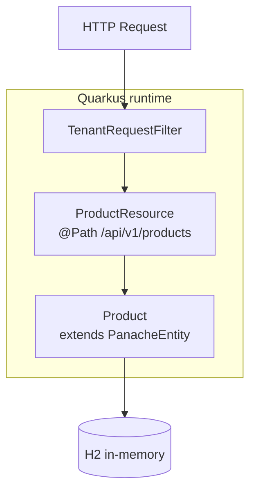
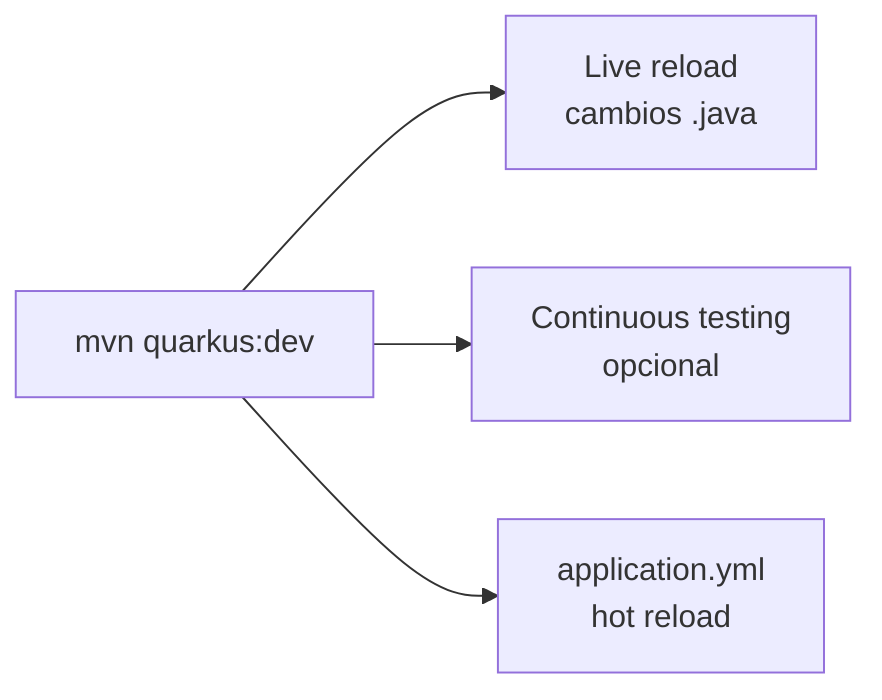

# 3. Quarkus 3: Panache + REST

El mismo microservicio **Catalog** con **Quarkus 3**: stack reactivo por defecto, persistencia
simplificada con **Hibernate Panache** y APIs REST con **Quarkus REST** (evolución de RESTEasy Reactive).

## Proyecto del curso

| Proyecto | Puerto | Stack |
|----------|--------|-------|
| `quarkus/catalog-service` | 8083 | `quarkus-rest-jackson` + `quarkus-hibernate-orm-panache` + H2 |
| `quarkus-virtual-threads/catalog-service` | 8085 | Igual + **`@RunOnVirtualThread`** |

> Ver [06-virtual-threads.md](06-virtual-threads.md) para la versión con Virtual Threads.

## Extensiones Quarkus usadas

| Extensión | Rol |
|-----------|-----|
| `quarkus-rest-jackson` | REST endpoints (JAX-RS), JSON con Jackson |
| `quarkus-hibernate-orm-panache` | ORM simplificado (menos boilerplate que JPA puro) |
| `quarkus-jdbc-h2` | Base de datos en memoria para el curso |
| `quarkus-smallrye-health` | Health checks en `/q/health` |

## Arquitectura del servicio



## Hibernate Panache — menos boilerplate

Panache elimina la mayoría de repositorios explícitos: la entidad **es** el repositorio.

```java
@Entity
@Table(name = "products")
public class Product extends PanacheEntity {

    @Column(name = "sku", nullable = false)
    public String sku;

    @Column(name = "tenant_id", nullable = false)
    public String tenantId;

    public String name;
    public String description;
    public BigDecimal price;
    public String currency;

    public static List<Product> findByTenant(String tenantId) {
        return list("tenantId", tenantId);
    }

    public static Optional<Product> findByTenantAndSku(String tenantId, String sku) {
        return find("tenantId = ?1 and sku = ?2", tenantId, sku).firstResultOptional();
    }
}
```

Comparado con Spring Data JPA:

| Spring Data JPA | Panache |
|-----------------|---------|
| `interface ProductRepository extends JpaRepository` | métodos estáticos en `Product` |
| `@Query` o naming conventions | `list("tenantId", id)` / Panache Query |
| Inyección del repository | `Product.findByTenant(...)` directo |

> En proyectos grandes puedes usar **Panache Repository** (interfaz separada) para mantener SRP.

## REST Resource (JAX-RS)

```java
@Path("/api/v1/products")
@Produces(MediaType.APPLICATION_JSON)
public class ProductResource {

    @GET
    public List<ProductResponse> list() {
        String tenantId = TenantContext.require();
        return Product.findByTenant(tenantId).stream()
                .map(ProductResponse::from)
                .toList();
    }

    @GET
    @Path("/{sku}")
    public ProductResponse get(@PathParam("sku") String sku) {
        return Product.findByTenantAndSku(TenantContext.require(), sku)
                .map(ProductResponse::from)
                .orElseThrow(NotFoundException::new);
    }
}
```

Quarkus REST se apoya en **Vert.x**: las peticiones no bloquean un thread por conexión como Tomcat tradicional.

## Dev mode — experiencia de desarrollo

```bash
cd quarkus/catalog-service
mvn quarkus:dev
```



- Arranque en **subsegundos** en dev mode.
- Cambias un `@Path` o una entidad y Quarkus recompila al vuelo.
- Ideal para workshops en JoeDayz.

## Configuración

```properties
# application.properties
quarkus.http.port=8083
quarkus.datasource.db-kind=h2
quarkus.datasource.jdbc.url=jdbc:h2:mem:catalog;MODE=PostgreSQL;DB_CLOSE_DELAY=-1
quarkus.hibernate-orm.database.generation=drop-and-create
quarkus.hibernate-orm.sql-load-script=import.sql
```

## Cómo ejecutar

```bash
cd quarkus/catalog-service
mvn quarkus:dev

curl -H "X-Tenant-ID: tienda-deportes" http://localhost:8083/api/v1/products
curl http://localhost:8083/q/health
```

## Ejercicios

1. Agrega `POST /api/v1/products` con validación (`@Valid`) en Quarkus.
2. Expón métricas con `quarkus-micrometer-registry-prometheus` en `/q/metrics`.
3. Compara líneas de código: Quarkus Panache vs Spring MVC del mismo endpoint.
