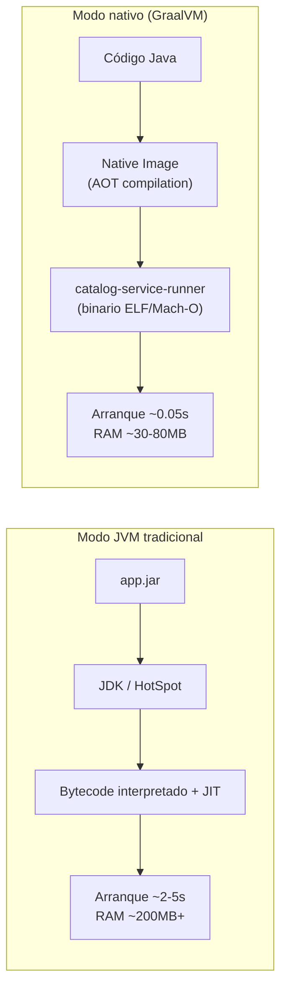
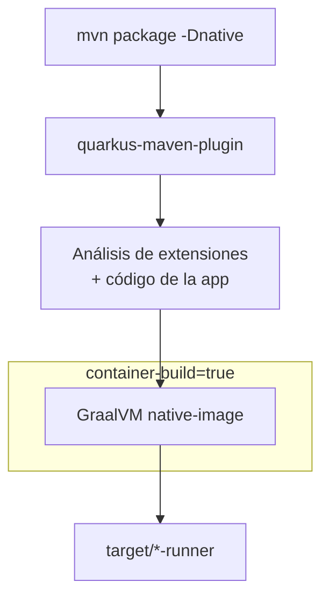
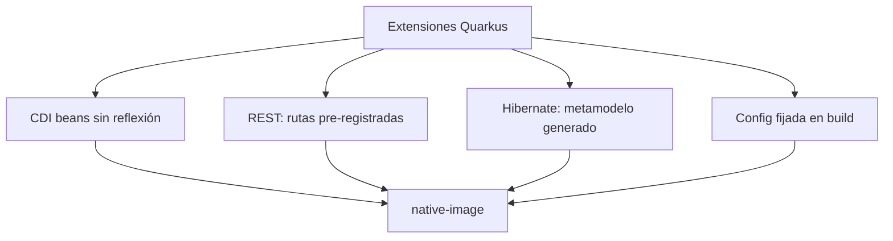

# 4. Build nativo con GraalVM y Quarkus

Una de las ventajas más claras de Quarkus es compilar tu microservicio a un **ejecutable nativo**
con **GraalVM Native Image**: un binario que arranca en milisegundos y consume mucha menos RAM.

## ¿Qué es GraalVM Native Image?



**AOT (Ahead-of-Time):** en tiempo de compilación, GraalVM analiza el código, elimina lo no
usado (closed-world assumption) y genera un ejecutable con solo lo necesario.

## Por qué Quarkus es mejor en native que Spring Boot

| Aspecto | Quarkus | Spring Boot |
|---------|---------|-------------|
| Diseño | Build-time first desde el día 1 | Runtime reflexión; AOT añadido después |
| Configuración GraalVM | Extensiones generan automáticamente `reflect-config.json` | Requiere más hints manuales |
| Comando | `mvn package -Dnative` | `mvn -Pnative native:compile` + más setup |
| Tamaño binario | ~50–80 MB típico | ~80–150 MB típico |

Spring Boot 4 mejora el soporte AOT, pero para el curso priorizamos **Quarkus native** como
camino principal.

## Cómo compilar (curso)

### Opción A — GraalVM local (tienes GraalVM 21 instalado)

```bash
cd quarkus/catalog-service
mvn package -Dnative -DskipTests
./target/catalog-service-1.0.0-runner
```

### Opción B — Container build (recomendado en clase)

No necesitas instalar GraalVM: Quarkus usa Docker para compilar dentro de un contenedor Linux.

```bash
mvn package -Dnative -Dquarkus.native.container-build=true -DskipTests
```



### Perfil Maven `native` (alternativa)

```bash
mvn package -Pnative -DskipTests
```

## Qué hace Quarkus en build-time



Esto es lo opuesto al arranque tradicional de Spring donde muchas decisiones se toman al
escanear el classpath con reflexión.

## Limitaciones del mundo cerrado (closed-world)

Native image **no puede** cargar clases desconocidas en runtime. Cuidado con:

- Reflection dinámica sin registrarla.
- `Class.forName()` arbitrario.
- Serialización de tipos no previstos.
- Algunas librerías legacy no compatibles.

Quarkus extensiones ya registran lo necesario para JPA, REST, Jackson, etc.

## Configuración native en `application.properties`

```properties
# Solo aplica al build nativo
quarkus.native.additional-build-args=--initialize-at-run-time=org.h2.Driver
quarkus.native.container-build=true
quarkus.native.builder-image=quay.io/quarkus/ubi-quarkus-mandrel-builder-image:jdk-21
```

## Verificar que corre nativo

```bash
./target/catalog-service-1.0.0-runner &
curl http://localhost:8083/q/health

# El proceso NO es java -jar, es un binario directo:
ps aux | grep catalog-service
file ./target/catalog-service-1.0.0-runner
```

## Ejercicios

1. Compila nativo con `container-build` y compara el tamaño del binario vs el JAR.
2. Mide startup del runner nativo vs `java -jar` con el script `benchmarks/run-benchmarks.sh --native`.
3. Investiga qué hace `--initialize-at-run-time` y por qué H2 a veces lo necesita.
