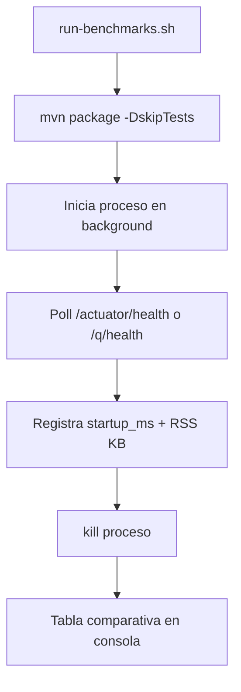
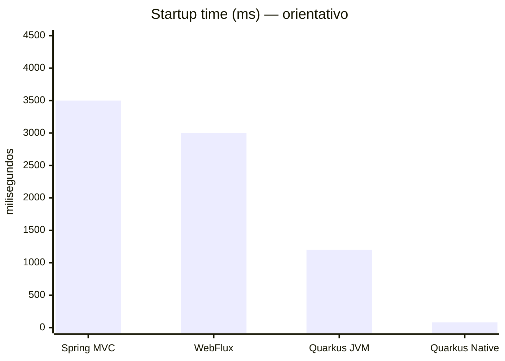
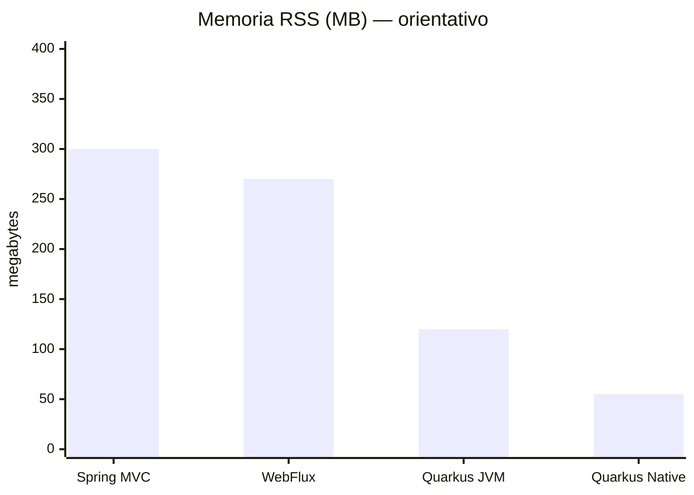
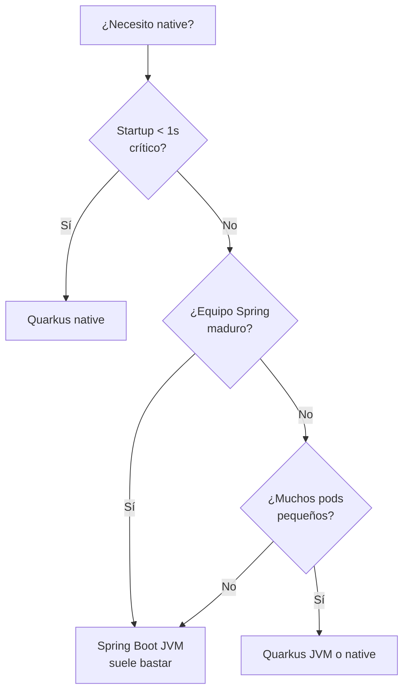

# 5. Benchmarks: startup time y memoria

Medimos lo que importa en Kubernetes: **¿cuánto tarda en estar listo?** y **¿cuánta RAM consume en reposo?**

## Métricas que medimos

| Métrica | Qué es | Por qué importa |
|---------|--------|-----------------|
| **Startup time** | ms desde `java -jar` / `./runner` hasta HTTP 200 en health | Rolling updates, HPA, cold start |
| **RSS memory** | RAM residente del proceso (`ps -o rss`) | Costo en K8s = pods × RAM |
| **JAR / binary size** | Tamaño del artefacto | Tiempo de pull en ECR/ACR |

## Script del curso

```bash
cd modulo-02-spring-boot-vs-quarkus/benchmarks
./run-benchmarks.sh           # Spring MVC, WebFlux, Quarkus JVM
./run-benchmarks.sh --native  # + Quarkus native (si ya compilaste)
```



## Resultados de referencia (Java 21, Mac/Linux, sin carga)

> Son orientativos para clase. Tus números variarán según CPU, OS y versión exacta.
> **Ejecuta el script en tu máquina** — eso es el ejercicio.

| Stack | Modo | Startup típico | RSS reposo típico |
|-------|------|----------------|-------------------|
| Spring Boot MVC | JVM | 2.5 – 4.5 s | 220 – 380 MB |
| Spring Boot WebFlux | JVM | 2.0 – 4.0 s | 200 – 350 MB |
| Quarkus Catalog | JVM | 0.8 – 2.0 s | 90 – 160 MB |
| Quarkus Catalog | **Native** | **0.03 – 0.15 s** | **35 – 80 MB** |





## Cómo interpretar para producción

### Escenario: 50 réplicas en EKS

Si cada pod JVM usa **300 MB** vs native **60 MB**:

- JVM: 50 × 300 MB = **15 GB**
- Native: 50 × 60 MB = **3 GB**

→ Menos nodos, menor factura AWS. Pero el **build nativo** es más lento en CI y el debugging
es más exigente.

### Cuándo el benchmark NO decide solo



## Comandos manuales (sin script)

```bash
# Startup manual con time
time ( java -jar target/catalog-service-*.jar & PID=$!; \
  until curl -sf http://localhost:8081/actuator/health; do sleep 0.1; done; \
  kill $PID )

# Memoria en reposo
ps -o pid,rss,command -p <PID>
# RSS está en KB
```

## Factor 9 (12-Factor) conectado

Un startup rápido y apagado graceful (Módulo 1) permiten que Kubernetes:

- Haga **rolling updates** sin downtime.
- Escale con **HPA** respondiendo rápido a la carga.
- Use **spot instances** con menor riesgo al reiniciar pods.

## Ejercicios

1. Ejecuta `run-benchmarks.sh` 3 veces y promedia. ¿Qué variación ves?
2. Corre 1000 requests con `hey` y vuelve a medir RSS. ¿Qué servicio escala mejor en memoria?
3. Calcula el ahorro mensual en AWS si pasas 30 pods de 300 MB a 80 MB (usa precio de `t3.medium`).
