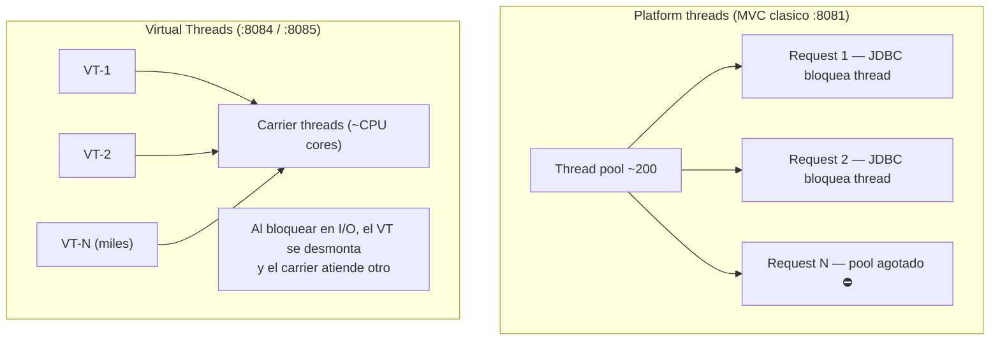
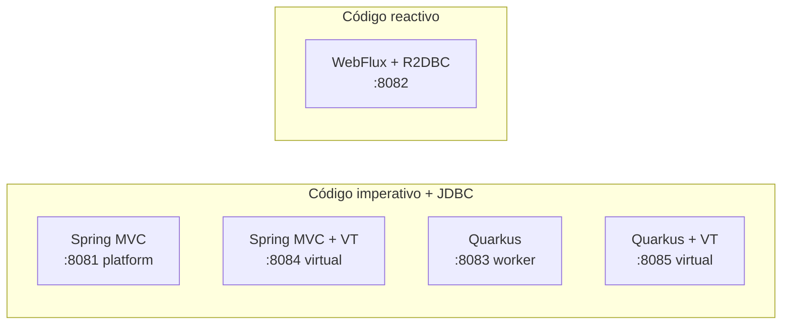

# 6. Virtual Threads (Java 21+): Spring Boot y Quarkus

Los **Virtual Threads** (Project Loom) permiten escribir código **bloqueante e imperativo**
con escalabilidad cercana a la reactiva: miles de requests concurrentes sin saturar el pool
de platform threads.

En este módulo el **mismo Catalog** corre también con Virtual Threads:

| Proyecto | Puerto | Cómo se activa |
|----------|--------|----------------|
| `spring-boot-virtual-threads/catalog-service` | **8084** | `spring.threads.virtual.enabled=true` |
| `quarkus-virtual-threads/catalog-service` | **8085** | `@RunOnVirtualThread` en cada endpoint |

## ¿Qué problema resuelven?



| Modelo | Código | Escalabilidad I/O | Complejidad |
|--------|--------|-------------------|-------------|
| Platform threads (MVC) | Imperativo | Limitada por pool | Baja |
| WebFlux / Mutiny | Reactivo | Alta | Alta |
| **Virtual Threads** | Imperativo | Alta (I/O-bound) | Baja |

> **Regla JoeDayz:** si tu stack es JDBC/JPA y quieres concurrencia alta, prueba **Virtual Threads
> antes** de migrar todo a WebFlux. El código casi no cambia.

## Spring Boot 4 — activación

Una sola propiedad. Tomcat deja el pool de platform threads y usa un
`VirtualThreadPerTaskExecutor`:

```yaml
# application.yml — spring-boot-virtual-threads
spring:
  threads:
    virtual:
      enabled: true
server:
  port: 8084
```

El `@RestController` es **idéntico** al de MVC (:8081). No hay `Mono`/`Flux`.

```java
@GetMapping
public List<ProductResponse> list() {  // mismo código imperativo
    return repository.findByTenantId(TenantContext.require()).stream()
            .map(ProductResponse::from)
            .toList();
}
```

## Quarkus 3 — `@RunOnVirtualThread`

En Quarkus el event loop de Vert.x no debe bloquearse. Si usas Panache/JDBC (bloqueante),
marca el método para que corra en un virtual thread:

```java
@GET
@RunOnVirtualThread   // io.smallrye.common.annotation.RunOnVirtualThread
public List<ProductResponse> list() {
    return Product.findByTenant(TenantContext.require()).stream()
            .map(ProductResponse::from)
            .toList();
}
```

Sin la anotación, Quarkus puede ejecutar el método en un **worker thread** clásico (platform).
Con `@RunOnVirtualThread`, confirmas el modelo Loom.

## Demo en vivo: ¿es virtual?

Los cuatro servicios exponen:

```http
GET /api/v1/products/_thread
X-Tenant-ID: tienda-deportes
```

```bash
# Platform threads → "virtual": false
curl -H "X-Tenant-ID: tienda-deportes" http://localhost:8081/api/v1/products/_thread

# Virtual Threads Spring → "virtual": true
curl -H "X-Tenant-ID: tienda-deportes" http://localhost:8084/api/v1/products/_thread

# Quarkus sin anotación → suele ser false (worker)
curl -H "X-Tenant-ID: tienda-deportes" http://localhost:8083/api/v1/products/_thread

# Quarkus @RunOnVirtualThread → "virtual": true
curl -H "X-Tenant-ID: tienda-deportes" http://localhost:8085/api/v1/products/_thread
```

Respuesta esperada en :8084 / :8085:

```json
{
  "name": "tomcat-handler-...",
  "virtual": true,
  "framework": "Spring Boot Web MVC + Virtual Threads"
}
```

## Comparativa de los 5 stacks del módulo



| Puerto | Stack | Thread model | Ideal cuando… |
|--------|-------|--------------|---------------|
| 8081 | Spring MVC | Platform pool | CRUD simple, baja/media concurrencia |
| 8082 | WebFlux | Event loop | Streaming, I/O reactivo de punta a punta |
| 8083 | Quarkus | Worker / event loop | Startup/RAM, native |
| 8084 | Spring MVC + VT | Virtual threads | JDBC + alta concurrencia, equipo Spring |
| 8085 | Quarkus + VT | Virtual threads | JDBC + alta concurrencia, equipo Quarkus |

## Cuidados con Virtual Threads

1. **No uses pools propios** de platform threads “por costumbre” alrededor de VTs.
2. **Synchronized / pinning:** evita `synchronized` de larga duración y JNI bloqueante
   (en Java 21+ el pinning se redujo; en 24+ mejora más).
3. **ThreadLocal** sigue funcionando, pero con miles de VTs consume más memoria
   (preferir scoped values a largo plazo).
4. **No sustituyen native image:** VT mejoran throughput; native mejora startup/RAM.

## Cómo ejecutar

```bash
# Spring Boot + Virtual Threads
cd spring-boot-virtual-threads/catalog-service
mvn spring-boot:run

# Quarkus + Virtual Threads
cd quarkus-virtual-threads/catalog-service
mvn quarkus:dev

# Probar API
curl -H "X-Tenant-ID: tienda-deportes" http://localhost:8084/api/v1/products
curl -H "X-Tenant-ID: tienda-deportes" http://localhost:8085/api/v1/products/_thread
```

## Ejercicios

1. Arranca :8081 y :8084. Compara `GET /_thread`. ¿Qué cambia en el JSON?
2. Con `hey -n 2000 -c 200`, carga :8081 vs :8084. ¿Cuál sostiene mejor latencia p99?
3. Explica por qué WebFlux (:8082) y Virtual Threads (:8084) resuelven el mismo problema
   con modelos de programación distintos.
