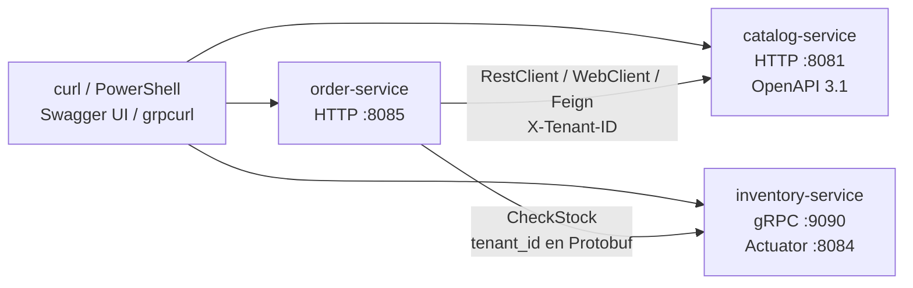

# Módulo 3 – Workshop de comunicación síncrona

> **REST · OpenAPI 3.1 · RestClient · WebClient · OpenFeign · gRPC**
>
> Java 21 · Spring Boot 4 · Spring Cloud 2025.1 · Spring gRPC 1.0

Este workshop construye y prueba un checkout síncrono sobre tres
microservicios reales del módulo:

```text
Cliente
  └─ order-service :8085
       ├─ HTTP → catalog-service :8081
       └─ gRPC → inventory-service :9090
                    └─ Actuator HTTP :8084
```

Order consulta el producto en Catalog con uno de tres clientes HTTP y después
consulta el stock en Inventory mediante gRPC. Al finalizar habrás:

1. recorrido una API REST desde Swagger UI y su documento OpenAPI;
2. comparado RestClient, WebClient y OpenFeign sobre el mismo checkout;
3. invocado directamente un servicio gRPC;
4. probado versionado por URI y por header;
5. seguido el tenant a través de HTTP y del mensaje Protobuf;
6. observado qué ocurre cuando un downstream deja de responder;
7. desplegado opcionalmente el flujo en Kind con balanceo nativo.

## Arquitectura del laboratorio



Catalog carga tres productos para el tenant `tienda-deportes`. Inventory carga
el stock en memoria: 50 unidades de `ZAP-RUN-42`, 20 de `CAM-DRY-M` y 100 de
`MEDIAS-01`.

> `CheckStock` calcula el stock restante, pero no descuenta inventario. Repetir
> un checkout de dos unidades seguirá mostrando `remainingStock: 48`.

## 0. Prerrequisitos

Necesitas:

- JDK 21 o superior;
- Maven 3.9 o superior;
- puertos libres `8081`, `8084`, `8085` y `9090`;
- un navegador para Swagger UI;
- `curl` en macOS/Linux/Git Bash o PowerShell 7+ en Windows;
- opcional: [`grpcurl`](https://github.com/fullstorydev/grpcurl) para invocar
  Inventory sin pasar por Order;
- opcional para la sección Kind: Podman 5+, `kind`, `kubectl`, Bash y `jq`.

Ejecuta los comandos desde la raíz del repositorio
`microservicios-2026`, salvo que el paso indique otra terminal.

### Comprobar herramientas

**macOS / Linux / Git Bash**

```bash
java -version
mvn -version
curl --version
grpcurl -version  # opcional
```

**Windows PowerShell**

```powershell
java -version
mvn -version
curl.exe --version
$PSVersionTable.PSVersion
grpcurl -version  # opcional
```

Si `grpcurl` no está instalado, omite la sección 8. El checkout seguirá
probando gRPC porque Order ya contiene el cliente generado desde el `.proto`.

## 1. Levantar Catalog

Abre la **Terminal 1** y déjala ejecutándose.

**macOS / Linux / Git Bash**

```bash
cd modulo-03-comunicacion-sincrona/catalog-service
mvn spring-boot:run
```

**Windows PowerShell**

```powershell
Set-Location modulo-03-comunicacion-sincrona/catalog-service
mvn spring-boot:run
```

Desde otra terminal comprueba el proceso.

**macOS / Linux / Git Bash**

```bash
curl -sS http://localhost:8081/actuator/health
```

**Windows PowerShell**

```powershell
Invoke-RestMethod http://localhost:8081/actuator/health |
  ConvertTo-Json -Depth 5
```

El resultado debe contener `"status":"UP"`.

## 2. Levantar Inventory

Abre la **Terminal 2** y déjala ejecutándose.

**macOS / Linux / Git Bash**

```bash
cd modulo-03-comunicacion-sincrona/inventory-service
mvn spring-boot:run
```

**Windows PowerShell**

```powershell
Set-Location modulo-03-comunicacion-sincrona/inventory-service
mvn spring-boot:run
```

Inventory escucha gRPC en `9090`; su health check se publica por HTTP en
`8084`.

**macOS / Linux / Git Bash**

```bash
curl -sS http://localhost:8084/actuator/health
```

**Windows PowerShell**

```powershell
Invoke-RestMethod http://localhost:8084/actuator/health |
  ConvertTo-Json -Depth 5
```

El estado esperado es `UP`.

## 3. Levantar Order

Abre la **Terminal 3** y déjala ejecutándose.

**macOS / Linux / Git Bash**

```bash
cd modulo-03-comunicacion-sincrona/order-service
mvn spring-boot:run
```

**Windows PowerShell**

```powershell
Set-Location modulo-03-comunicacion-sincrona/order-service
mvn spring-boot:run
```

Comprueba el servicio:

**macOS / Linux / Git Bash**

```bash
curl -sS http://localhost:8085/actuator/health
```

**Windows PowerShell**

```powershell
Invoke-RestMethod http://localhost:8085/actuator/health |
  ConvertTo-Json -Depth 5
```

El estado esperado es `UP`. Este health check comprueba el proceso de Order,
no la disponibilidad de Catalog ni de Inventory.

## 4. Workshop web: Swagger UI y OpenAPI

### 4.1 Explorar el documento generado

Abre [http://localhost:8081/swagger-ui.html](http://localhost:8081/swagger-ui.html).

1. Confirma que aparecen los grupos **Products v1**, **Products v2** y
   **Products header-versioned**.
2. Expande `GET /api/v1/products`.
3. Pulsa **Try it out**.
4. Escribe `tienda-deportes` en `X-Tenant-ID`.
5. Pulsa **Execute**.
6. Verifica HTTP `200` y los tres productos.
7. Expande `GET /api/v1/products/{sku}` y vuelve a pulsar **Try it out**.
8. Usa `ZAP-RUN-42` como `sku` y `tienda-deportes` como tenant.
9. Pulsa **Execute** y comprueba `price: 300.00` y `currency: PEN`.

Repite una operación sin `X-Tenant-ID`: Catalog responde HTTP `400`, porque
el tenant es obligatorio para las rutas de negocio.

Ahora abre el JSON code-first:

[http://localhost:8081/v3/api-docs](http://localhost:8081/v3/api-docs)

Comprueba `"openapi":"3.1.0"` y busca `/api/v1/products`. El archivo
[`contracts/catalog-api-v1.yaml`](contracts/catalog-api-v1.yaml) es el contrato
contract-first de referencia; no se sirve en una URL y se estudia directamente
en el repositorio.

### 4.2 Verificar Catalog sin Swagger

**macOS / Linux / Git Bash**

```bash
curl -sS http://localhost:8081/api/v1/products \
  -H 'X-Tenant-ID: tienda-deportes'

curl -sS http://localhost:8081/api/v1/products/ZAP-RUN-42 \
  -H 'X-Tenant-ID: tienda-deportes'
```

**Windows PowerShell**

```powershell
$Headers = @{ 'X-Tenant-ID' = 'tienda-deportes' }

Invoke-RestMethod http://localhost:8081/api/v1/products `
  -Headers $Headers | ConvertTo-Json -Depth 5

Invoke-RestMethod http://localhost:8081/api/v1/products/ZAP-RUN-42 `
  -Headers $Headers | ConvertTo-Json -Depth 5
```

## 5. Checkout con RestClient

Order usa `restclient` cuando el header `X-Client-Style` no está presente, pero
en el workshop lo enviaremos explícitamente.

**macOS / Linux / Git Bash**

```bash
curl -sS -X POST http://localhost:8085/api/v1/checkout \
  -H 'Content-Type: application/json' \
  -H 'X-Tenant-ID: tienda-deportes' \
  -H 'X-Client-Style: restclient' \
  -d '{"sku":"ZAP-RUN-42","quantity":2}'
```

**Windows PowerShell**

```powershell
Invoke-RestMethod -Method Post http://localhost:8085/api/v1/checkout `
  -ContentType 'application/json' `
  -Headers @{
    'X-Tenant-ID' = 'tienda-deportes'
    'X-Client-Style' = 'restclient'
  } `
  -Body '{"sku":"ZAP-RUN-42","quantity":2}' |
  ConvertTo-Json -Depth 5
```

Comprueba:

```json
{
  "clientStyle": "restclient",
  "sku": "ZAP-RUN-42",
  "productName": "Zapatilla Running Pro",
  "unitPrice": 300.00,
  "currency": "PEN",
  "quantity": 2,
  "stockAvailable": true,
  "remainingStock": 48,
  "message": "Stock suficiente"
}
```

El flujo fue lineal: Order consultó
`GET /api/v1/products/ZAP-RUN-42` y, al encontrarlo, ejecutó el RPC
`InventoryService/CheckStock`.

## 6. Repetir con WebClient y OpenFeign

### WebClient

**macOS / Linux / Git Bash**

```bash
curl -sS -X POST http://localhost:8085/api/v1/checkout \
  -H 'Content-Type: application/json' \
  -H 'X-Tenant-ID: tienda-deportes' \
  -H 'X-Client-Style: webclient' \
  -d '{"sku":"ZAP-RUN-42","quantity":2}'
```

**Windows PowerShell**

```powershell
$Body = '{"sku":"ZAP-RUN-42","quantity":2}'
$Headers = @{
  'X-Tenant-ID' = 'tienda-deportes'
  'X-Client-Style' = 'webclient'
}
Invoke-RestMethod -Method Post http://localhost:8085/api/v1/checkout `
  -ContentType 'application/json' -Headers $Headers -Body $Body |
  ConvertTo-Json -Depth 5
```

### OpenFeign

**macOS / Linux / Git Bash**

```bash
curl -sS -X POST http://localhost:8085/api/v1/checkout \
  -H 'Content-Type: application/json' \
  -H 'X-Tenant-ID: tienda-deportes' \
  -H 'X-Client-Style: feign' \
  -d '{"sku":"ZAP-RUN-42","quantity":2}'
```

**Windows PowerShell**

```powershell
$Headers['X-Client-Style'] = 'feign'
Invoke-RestMethod -Method Post http://localhost:8085/api/v1/checkout `
  -ContentType 'application/json' -Headers $Headers -Body $Body |
  ConvertTo-Json -Depth 5
```

Las tres respuestas deben tener los mismos datos de producto y stock; solo
cambia `clientStyle`.

- **RestClient** realiza una llamada bloqueante e imperativa.
- **WebClient** ofrece una API reactiva, aunque este laboratorio usa `block()`
  para conservar un único flujo síncrono.
- **OpenFeign** declara la operación como una interfaz y propaga el tenant con
  un interceptor.

Un valor desconocido de `X-Client-Style` cae en el caso por defecto y usa
RestClient; no es un cuarto cliente.

## 7. Stock insuficiente

Solicita más de las 50 unidades disponibles.

**macOS / Linux / Git Bash**

```bash
curl -i -X POST http://localhost:8085/api/v1/checkout \
  -H 'Content-Type: application/json' \
  -H 'X-Tenant-ID: tienda-deportes' \
  -H 'X-Client-Style: restclient' \
  -d '{"sku":"ZAP-RUN-42","quantity":60}'
```

**Windows PowerShell**

```powershell
try {
  Invoke-RestMethod -Method Post http://localhost:8085/api/v1/checkout `
    -ContentType 'application/json' `
    -Headers @{
      'X-Tenant-ID' = 'tienda-deportes'
      'X-Client-Style' = 'restclient'
    } `
    -Body '{"sku":"ZAP-RUN-42","quantity":60}'
} catch {
  [int]$_.Exception.Response.StatusCode
  $_.ErrorDetails.Message
}
```

Order responde HTTP `409 Conflict`, `stockAvailable: false`,
`remainingStock: 50` y el mensaje `Stock insuficiente (disponible=50)`.

## 8. Invocar gRPC directamente

Esta sección requiere `grpcurl`.

**macOS / Linux / Git Bash**

```bash
grpcurl -plaintext \
  -d '{"tenant_id":"tienda-deportes","sku":"ZAP-RUN-42","quantity":2}' \
  localhost:9090 inventory.v1.InventoryService/CheckStock
```

**Windows PowerShell**

```powershell
grpcurl -plaintext `
  -d '{"tenant_id":"tienda-deportes","sku":"ZAP-RUN-42","quantity":2}' `
  localhost:9090 inventory.v1.InventoryService/CheckStock
```

La respuesta debe indicar `available: true`, `remaining: 48` y
`message: "Stock suficiente"`.

Si tu ejecución no expone server reflection, proporciona el contrato
explícitamente desde `modulo-03-comunicacion-sincrona`:

**macOS / Linux / Git Bash**

```bash
grpcurl -plaintext \
  -import-path inventory-service/src/main/proto \
  -proto inventory/v1/inventory.proto \
  -d '{"tenant_id":"tienda-deportes","sku":"ZAP-RUN-42","quantity":2}' \
  localhost:9090 inventory.v1.InventoryService/CheckStock
```

**Windows PowerShell**

```powershell
grpcurl -plaintext `
  -import-path inventory-service/src/main/proto `
  -proto inventory/v1/inventory.proto `
  -d '{"tenant_id":"tienda-deportes","sku":"ZAP-RUN-42","quantity":2}' `
  localhost:9090 inventory.v1.InventoryService/CheckStock
```

El contrato también define `GetAvailability`; no se necesita para el checkout.

## 9. Probar el versionado implementado

Este código implementa dos estrategias reales: URI y header. El versionado por
media type se explica en las lecturas, pero no tiene un endpoint en este
laboratorio.

### 9.1 Versión en la URI

**macOS / Linux / Git Bash**

```bash
curl -sS http://localhost:8081/api/v1/products \
  -H 'X-Tenant-ID: tienda-deportes'

curl -sS http://localhost:8081/api/v2/products \
  -H 'X-Tenant-ID: tienda-deportes'
```

**Windows PowerShell**

```powershell
$Headers = @{ 'X-Tenant-ID' = 'tienda-deportes' }
Invoke-RestMethod http://localhost:8081/api/v1/products `
  -Headers $Headers | ConvertTo-Json -Depth 5
Invoke-RestMethod http://localhost:8081/api/v2/products `
  -Headers $Headers | ConvertTo-Json -Depth 5
```

V1 devuelve `currency`; V2 devuelve `apiVersion: "2"` y renombra ese campo a
`currencyCode`. V1 también permite buscar `/{sku}`; V2 solo implementa el
listado.

### 9.2 Versión en el header

La URI permanece en `/api/products`.

**macOS / Linux / Git Bash**

```bash
curl -sS http://localhost:8081/api/products \
  -H 'X-Tenant-ID: tienda-deportes'

curl -sS http://localhost:8081/api/products \
  -H 'X-Tenant-ID: tienda-deportes' \
  -H 'API-Version: 2'
```

**Windows PowerShell**

```powershell
Invoke-RestMethod http://localhost:8081/api/products `
  -Headers @{ 'X-Tenant-ID' = 'tienda-deportes' } |
  ConvertTo-Json -Depth 5

Invoke-RestMethod http://localhost:8081/api/products `
  -Headers @{
    'X-Tenant-ID' = 'tienda-deportes'
    'API-Version' = '2'
  } | ConvertTo-Json -Depth 5
```

Sin `API-Version`, la respuesta V1 contiene `apiVersion: "1"` y `items`. Con
valor `2`, devuelve directamente la lista de respuestas V2. Cualquier valor
distinto de `2` usa V1.

## 10. Seguir la propagación del tenant

El tenant no es decorativo: separa los productos y el stock.

1. El cliente envía `X-Tenant-ID` a Order.
2. [`TenantWebFilter.java`](order-service/src/main/java/pe/joedayz/microservicios/order/tenant/TenantWebFilter.java)
   valida el header y lo guarda temporalmente en `TenantContext`.
3. RestClient y WebClient escriben el header explícitamente en
   [`CatalogRestClient.java`](order-service/src/main/java/pe/joedayz/microservicios/order/client/CatalogRestClient.java)
   y [`CatalogWebClient.java`](order-service/src/main/java/pe/joedayz/microservicios/order/client/CatalogWebClient.java).
4. Feign lo agrega desde
   [`TenantFeignRequestInterceptor.java`](order-service/src/main/java/pe/joedayz/microservicios/order/client/TenantFeignRequestInterceptor.java).
5. Catalog vuelve a validarlo y consulta por `tenantId + sku`.
6. Para gRPC, Order copia el valor al campo `tenant_id` de
   `CheckStockRequest`; no usa metadata gRPC.
7. Inventory consulta su mapa por `tenant_id + sku`.

Compruébalo usando un tenant que no tiene datos.

**macOS / Linux / Git Bash**

```bash
curl -i -X POST http://localhost:8085/api/v1/checkout \
  -H 'Content-Type: application/json' \
  -H 'X-Tenant-ID: tenant-sin-datos' \
  -H 'X-Client-Style: feign' \
  -d '{"sku":"ZAP-RUN-42","quantity":2}'
```

**Windows PowerShell**

```powershell
try {
  Invoke-RestMethod -Method Post http://localhost:8085/api/v1/checkout `
    -ContentType 'application/json' `
    -Headers @{
      'X-Tenant-ID' = 'tenant-sin-datos'
      'X-Client-Style' = 'feign'
    } `
    -Body '{"sku":"ZAP-RUN-42","quantity":2}'
} catch {
  [int]$_.Exception.Response.StatusCode
}
```

El resultado es HTTP `404`: Catalog no encuentra el producto para ese tenant,
por lo que Order no llega a invocar Inventory.

## 11. Comparar el fallo de un downstream

No hay circuit breaker ni fallback en este módulo. El objetivo es observar el
comportamiento base antes de incorporar resiliencia.

### 11.1 Detener Catalog

Detén Catalog con `Ctrl+C` en la Terminal 1 y deja Order e Inventory activos.

Prueba los tres estilos.

**macOS / Linux / Git Bash**

```bash
for style in restclient webclient feign; do
  printf '%s -> ' "$style"
  curl -sS -o /dev/null -w '%{http_code}\n' \
    -X POST http://localhost:8085/api/v1/checkout \
    -H 'Content-Type: application/json' \
    -H 'X-Tenant-ID: tienda-deportes' \
    -H "X-Client-Style: $style" \
    -d '{"sku":"ZAP-RUN-42","quantity":2}'
done
```

**Windows PowerShell**

```powershell
$Body = '{"sku":"ZAP-RUN-42","quantity":2}'
'restclient', 'webclient', 'feign' | ForEach-Object {
  $Style = $_
  try {
    $Response = Invoke-WebRequest -Method Post `
      http://localhost:8085/api/v1/checkout `
      -ContentType 'application/json' `
      -Headers @{
        'X-Tenant-ID' = 'tienda-deportes'
        'X-Client-Style' = $Style
      } -Body $Body
    "$Style -> $($Response.StatusCode)"
  } catch {
    "$Style -> $([int]$_.Exception.Response.StatusCode)"
  }
}
```

En la implementación actual:

- RestClient captura cualquier excepción al consultar Catalog y la convierte en
  producto ausente; Order responde `404`.
- WebClient solo captura el `404` remoto, no un error de conexión; el fallo
  termina como error `5xx`.
- Feign solo convierte `FeignException.NotFound`; un Catalog inalcanzable
  también termina como `5xx`.
- `/actuator/health` de Order continúa en `UP`, porque no incorpora health
  indicators para sus downstreams.

Reinicia Catalog repitiendo el paso 1 y espera a que su health vuelva a `UP`.

### 11.2 Detener Inventory

Detén Inventory con `Ctrl+C` en la Terminal 2 y repite cualquier checkout.
Catalog responderá, pero el RPC fallará. Los tres estilos terminan como error
`5xx` porque comparten el mismo `InventoryGrpcClient` y no existe fallback.

Reinicia Inventory repitiendo el paso 2. Este contraste separa dos decisiones:
el cliente HTTP cambia cómo se maneja el fallo de Catalog; el fallo gRPC es
común a todo el checkout.

## 12. Kind + Podman (opcional)

Esta sección reemplaza los tres procesos locales. Detén las terminales 1, 2 y 3
antes de comenzar para liberar los puertos.

El laboratorio crea dos réplicas de Catalog, dos de Inventory y una de Order.
Order usa los DNS `catalog-service` e `inventory-service`; Kubernetes distribuye
el tráfico mediante `Service` y EndpointSlices, sin Eureka, Ribbon ni un load
balancer embebido en la aplicación.

### Limitaciones importantes

- Los scripts están escritos en Bash y construyen imágenes con **Podman**; no
  son scripts nativos de PowerShell ni soportan Docker como sustitución directa.
- En Windows ejecútalos desde WSL2 o Git Bash con `podman`, `kind` y `kubectl`
  accesibles en ese entorno. Los mapeos de puertos de la VM de Podman pueden
  requerir configuración adicional; si `localhost` no responde, valida primero
  los NodePorts desde el mismo entorno donde ejecutaste Kind.
- En macOS y Windows, inicia la máquina: `podman machine start`.
- Con Podman 6 y Kind 0.32 o anterior, `kind get clusters` puede fallar con
  `cannot index slice/array with type string`. Los scripts detectan el cluster
  por labels de Podman, pero conviene actualizar Kind. En Homebrew puedes usar
  `brew install --HEAD kind` si la versión estable aún no contiene el fix.
- El smoke test usa `127.0.0.1`, porque el port mapping de Kind/Podman puede
  escuchar solo en IPv4.

### Comprobar herramientas

```bash
podman version
podman info
kind version
kubectl version --client
mvn -version
```

### Crear, desplegar y probar

Desde `modulo-03-comunicacion-sincrona`:

```bash
./scripts/01-kind-create.sh
./scripts/02-deploy.sh
./scripts/03-smoke.sh
```

Los scripts:

1. crean `microservicios-m03` con mapeos para `8081`, `8084`, `8085` y `9090`;
2. empaquetan los tres proyectos con Maven;
3. construyen y cargan las imágenes Podman en el nodo Kind;
4. aplican los manifiestos de [`k8s/`](k8s/);
5. esperan los Deployments y ejecutan los checkouts con los tres clientes;
6. ejecutan `grpcurl` solo si está instalado.

Inspecciona la distribución:

```bash
kubectl get pods -o wide
kubectl get svc
kubectl get endpointslices
kubectl logs deployment/order-service
```

Las mismas URLs locales de las secciones anteriores deben funcionar. Swagger
UI queda en `http://127.0.0.1:8081/swagger-ui.html`.

Para eliminar el cluster:

```bash
./scripts/04-destroy.sh
```

## 13. Detener el workshop

Si trabajaste en local:

1. detén Order con `Ctrl+C` en la Terminal 3;
2. detén Inventory con `Ctrl+C` en la Terminal 2;
3. detén Catalog con `Ctrl+C` en la Terminal 1.

Catalog usa H2 en memoria e Inventory usa un mapa en memoria. Al reiniciarlos,
se restauran los datos iniciales y no se conserva estado del workshop.

Si usaste Kind, ejecuta `./scripts/04-destroy.sh`.

## Solución de problemas

### Un servicio no arranca porque el puerto está ocupado

**macOS / Linux**

```bash
lsof -i :8081
lsof -i :8084
lsof -i :8085
lsof -i :9090
```

**Windows PowerShell**

```powershell
Get-NetTCPConnection -LocalPort 8081,8084,8085,9090 `
  -ErrorAction SilentlyContinue
```

Detén el proceso anterior. No cambies un puerto aislado sin actualizar también
las URLs de Order o los comandos del workshop.

### Todo endpoint de negocio responde 400

Incluye exactamente el header `X-Tenant-ID`. Actuator y la documentación de
Catalog están excluidos de ese filtro; los endpoints de negocio no.

### Checkout responde 404

- Confirma que el tenant sea `tienda-deportes`.
- Usa uno de los SKU precargados.
- Confirma que Catalog responda directamente.
- Con RestClient, un Catalog caído también se presenta como `404` en esta
  implementación.

### Checkout responde 500

- Comprueba Catalog en `8081` e Inventory Actuator en `8084`.
- Revisa las terminales de Order e Inventory.
- Confirma que el canal de Order apunta a `static://localhost:9090`.
- El health de Inventory puede estar `UP` mientras el puerto gRPC no sea
  accesible desde otro entorno o contenedor.

### Swagger UI carga, pero Execute responde 400

La UI y `/v3/api-docs` no requieren tenant, pero la operación ejecutada sí.
Completa `X-Tenant-ID` después de pulsar **Try it out**.

### grpcurl indica que no existe reflection

Usa la variante con `-import-path` y `-proto` de la sección 8. Verifica además
que Inventory siga ejecutándose y que `9090` esté libre.

### Kind deja Pods en ImagePullBackOff

- Ejecuta el despliegue mediante `scripts/02-deploy.sh`; además de construir,
  carga y etiqueta las imágenes dentro del nodo.
- Comprueba `podman images` y `kubectl describe pod`.
- No cambies `imagePullPolicy: Never` si pretendes usar las imágenes locales.

### Kind responde en 127.0.0.1 pero no en localhost

Usa `127.0.0.1`. En algunas instalaciones macOS resuelve `localhost` primero a
IPv6, mientras el port mapping de Podman escucha en IPv4.

## Archivos clave para estudiar

- [`ProductController.java`](catalog-service/src/main/java/pe/joedayz/microservicios/catalog/api/ProductController.java):
  API REST V1 y anotaciones OpenAPI.
- [`ProductV2Controller.java`](catalog-service/src/main/java/pe/joedayz/microservicios/catalog/api/ProductV2Controller.java)
  y [`ProductHeaderVersionController.java`](catalog-service/src/main/java/pe/joedayz/microservicios/catalog/api/ProductHeaderVersionController.java):
  versionado por URI y header.
- [`contracts/catalog-api-v1.yaml`](contracts/catalog-api-v1.yaml):
  contrato OpenAPI 3.1 contract-first.
- [`CheckoutController.java`](order-service/src/main/java/pe/joedayz/microservicios/order/api/CheckoutController.java):
  selección del cliente HTTP y orquestación con gRPC.
- [`HttpClientsConfig.java`](order-service/src/main/java/pe/joedayz/microservicios/order/config/HttpClientsConfig.java):
  construcción de RestClient y WebClient.
- [`CatalogFeignClient.java`](order-service/src/main/java/pe/joedayz/microservicios/order/client/CatalogFeignClient.java):
  cliente HTTP declarativo.
- [`inventory.proto`](inventory-service/src/main/proto/inventory/v1/inventory.proto):
  contrato gRPC y mensajes Protobuf.
- [`InventoryGrpcClient.java`](order-service/src/main/java/pe/joedayz/microservicios/order/client/InventoryGrpcClient.java):
  stub bloqueante usado por Order.
- [`InventoryGrpcService.java`](inventory-service/src/main/java/pe/joedayz/microservicios/inventory/grpc/InventoryGrpcService.java):
  implementación de los RPC.
- [`application.yml`](order-service/src/main/resources/application.yml):
  URLs locales de Catalog e Inventory.
- [`scripts/`](scripts/) y [`k8s/`](k8s/):
  automatización y balanceo Kubernetes-native.

## Lecturas del módulo

- [01 · REST y OpenAPI code-first/contract-first](docs/01-rest-openapi-code-first-contract-first.md)
- [02 · gRPC con Protocol Buffers](docs/02-grpc-protobuf.md)
- [03 · WebClient frente a RestClient](docs/03-webclient-vs-restclient.md)
- [04 · OpenFeign](docs/04-feign-client.md)
- [05 · Load balancing Kubernetes-native](docs/05-load-balancing-k8s-native.md)
- [06 · Versionado de APIs](docs/06-api-versioning.md)

---

*Siguiente módulo:* **Módulo 4 – Comunicación Asíncrona** (Kafka, Outbox y
eventos de dominio).
