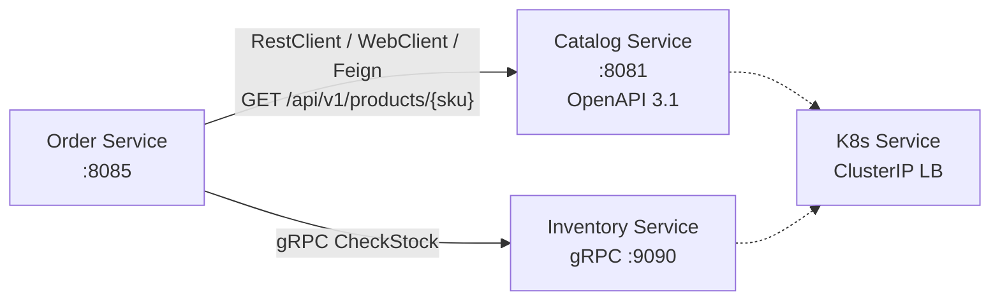

# Módulo 3 – Comunicación Síncrona

> Curso: **Arquitectura de Microservicios Pro: Spring Boot + Quarkus en AWS y Azure**
> JoeDayz.pe · Java 21 / Spring Boot 4 / Spring Cloud 2025.1 / Spring gRPC 1.0

En el Módulo 2 construimos **Catalog**. Aquí los microservicios **hablan entre sí** de forma
síncrona: REST documentado con **OpenAPI 3.1**, **gRPC** con Protocol Buffers, clientes
(**RestClient**, **WebClient**, **OpenFeign**) y **balanceo nativo de Kubernetes**, más
**versionado de APIs**.

## Objetivos de aprendizaje

Al terminar este módulo serás capaz de:

1. Documentar y publicar APIs REST con **OpenAPI 3.1** (code-first con springdoc y contract-first).
2. Exponer y consumir servicios **gRPC** con `.proto` y Spring gRPC.
3. Elegir entre **RestClient** (sync) y **WebClient** (reactivo) según el caso.
4. Declarar clientes HTTP con **OpenFeign**.
5. Entender load balancing **Kubernetes-native** (Service + kube-proxy / EndpointSlice) sin Eureka.
6. Versionar APIs (URI, header, media type) sin romper clientes.

## Contenido teórico

| # | Tema | Documento |
|---|------|-----------|
| 1 | REST + OpenAPI 3.1 (code-first y contract-first) | [docs/01-rest-openapi-code-first-contract-first.md](docs/01-rest-openapi-code-first-contract-first.md) |
| 2 | gRPC con Protocol Buffers | [docs/02-grpc-protobuf.md](docs/02-grpc-protobuf.md) |
| 3 | WebClient reactivo vs RestClient | [docs/03-webclient-vs-restclient.md](docs/03-webclient-vs-restclient.md) |
| 4 | Feign Client (OpenFeign) | [docs/04-feign-client.md](docs/04-feign-client.md) |
| 5 | Load Balancing Kubernetes-native | [docs/05-load-balancing-k8s-native.md](docs/05-load-balancing-k8s-native.md) |
| 6 | Versionado de APIs | [docs/06-api-versioning.md](docs/06-api-versioning.md) |

## Microservicios de código

Flujo demo: **Order** consulta **Catalog** (REST) e **Inventory** (gRPC) para validar un checkout.

| Proyecto | Rol | Puerto(s) |
|----------|-----|-----------|
| [catalog-service](catalog-service/) | Provider REST + OpenAPI 3.1 + versionado | **8081** · Swagger UI `/swagger-ui.html` |
| [inventory-service](inventory-service/) | Provider gRPC (stock) | **9090** (gRPC) · **8084** (actuator) |
| [order-service](order-service/) | Consumer: RestClient, WebClient, Feign + gRPC client | **8085** |

Contrato OpenAPI (contract-first de referencia): [contracts/catalog-api-v1.yaml](contracts/catalog-api-v1.yaml).

### Mapa del módulo



### Cómo ejecutar (local)

Requisitos: **JDK 21+**, **Maven 3.9+**. Opcional: `grpcurl` para probar Inventory.

```bash
# Terminal 1 — Catalog (OpenAPI en http://localhost:8081/swagger-ui.html)
cd catalog-service && mvn spring-boot:run

# Terminal 2 — Inventory (gRPC :9090)
cd inventory-service && mvn spring-boot:run

# Terminal 3 — Order (orquesta los clientes)
cd order-service && mvn spring-boot:run
```

Probar checkout síncrono:

```bash
curl -s -X POST http://localhost:8085/api/v1/checkout \
  -H 'Content-Type: application/json' \
  -H 'X-Tenant-ID: tienda-deportes' \
  -H 'X-Client-Style: restclient' \
  -d '{"sku":"ZAP-RUN-42","quantity":2}'
```

Estilos de cliente HTTP (`X-Client-Style`): `restclient` | `webclient` | `feign`.

Probar gRPC directo:

```bash
grpcurl -plaintext -d '{"tenant_id":"tienda-deportes","sku":"ZAP-RUN-42","quantity":2}' \
  localhost:9090 inventory.v1.InventoryService/CheckStock
```

### Kubernetes (LB nativo)

Manifiestos de ejemplo en [`k8s/`](k8s/): Deployment + Service ClusterIP. El balanceo lo hace
el cluster (no Ribbon/Eureka). Detalle en el doc 5.

---

*Siguiente módulo:* **Módulo 4 – Comunicación Asíncrona** (Kafka, Outbox, eventos de dominio).
