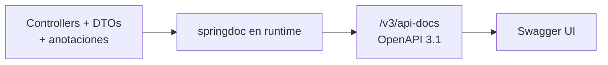
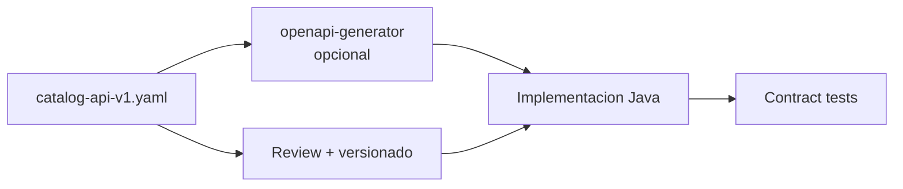

# 1. REST + OpenAPI 3.1: Code-First y Contract-First

Documentar el contrato de tu API no es opcional en microservicios: es lo que permite
que **equipos independientes** evolucionen sin romperse entre sí.

## OpenAPI 3.1 en el curso

Usamos **OpenAPI 3.1** (compatible con JSON Schema 2020-12). Con springdoc 3.x + Spring Boot 4:

```yaml
springdoc:
  api-docs:
    version: OPENAPI_3_1
  swagger-ui:
    path: /swagger-ui.html
```

- Spec JSON: `http://localhost:8081/v3/api-docs`
- UI: `http://localhost:8081/swagger-ui.html`

## Code-First (lo que hace `catalog-service`)

1. Escribes controllers y DTOs en Java.
2. Anotas con `@Operation`, `@Tag`, `@Parameter`, `@OpenAPIDefinition`.
3. springdoc **infiere** el documento OpenAPI en runtime.



**Ventajas:** rápido, el código es la verdad, ideal para prototipos y labs.
**Riesgos:** el contrato “aparece” después; consumidores dependen de que no cambies sin aviso.

## Contract-First (archivo en `contracts/`)

1. Diseñas primero `contracts/catalog-api-v1.yaml`.
2. Generas interfaces/stubs (openapi-generator) o usas el YAML como **fuente de verdad** en revisiones.
3. Implementas el servidor para cumplir el contrato (tests de contrato / Spring Cloud Contract).



**Ventajas:** diseño explícito, mejor para APIs públicas o multi-equipo.
**Costo:** más disciplina y tooling.

## ¿Cuál usar en JoeDayz?

| Contexto | Enfoque |
|----------|---------|
| Spike / lab interno | Code-first (catalog-service) |
| API compartida entre BFF y 3+ equipos | Contract-first + CI que valide el YAML |
| Ambos | Code-first + exportar YAML a `contracts/` en cada release |

## Ejercicio

1. Arranca `catalog-service` y abre Swagger UI.
2. Compara `/v3/api-docs` con `contracts/catalog-api-v1.yaml`.
3. Añade un campo opcional `tags` en v2 y documentalo con `@Schema`.
