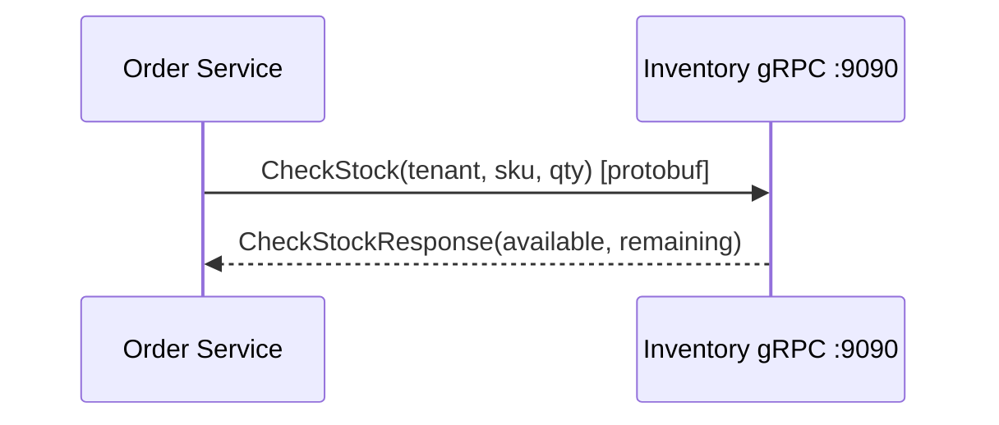

# 2. gRPC con Protocol Buffers

REST/JSON es excelente en el borde (browsers, partners). **Entre microservicios internos**,
gRPC suele ganar en latencia, tipado fuerte y streaming.

## ¿Qué es gRPC?

- RPC sobre **HTTP/2**.
- Mensajes binarios definidos en **Protocol Buffers** (`.proto`).
- Stubs generados para client y server (Java, Go, etc.).



## El contrato del curso

Archivo: `inventory-service/src/main/proto/inventory/v1/inventory.proto`

```protobuf
service InventoryService {
  rpc CheckStock (CheckStockRequest) returns (CheckStockResponse);
  rpc GetAvailability (GetAvailabilityRequest) returns (GetAvailabilityResponse);
}
```

Spring gRPC **1.0.x** (compatible con Spring Boot **4.0.x**) arranca el server en el puerto
configurado (`spring.grpc.server.port=9090`) al detectar un bean `BindableService`
(nuestra clase `InventoryGrpcService`).

## Client en Order

```java
@Bean
InventoryServiceBlockingStub inventoryStub(GrpcChannelFactory channels) {
    return InventoryServiceGrpc.newBlockingStub(channels.createChannel("inventory"));
}
```

```yaml
spring.grpc.client.channels.inventory.address: static://localhost:9090
```

## REST vs gRPC (regla práctica)

| Usa REST cuando… | Usa gRPC cuando… |
|------------------|------------------|
| Clientes externos / browsers | Service-to-service interno |
| Necesitas cache HTTP / CDN | Baja latencia, muchos calls |
| Contratos human-readable (OpenAPI) | Contratos estrictos (.proto) |
| Debugging con curl simple | Tienes grpcurl / BloomRPC |

## Probar con grpcurl

```bash
grpcurl -plaintext localhost:9090 list

grpcurl -plaintext \
  -d '{"tenant_id":"tienda-deportes","sku":"ZAP-RUN-42","quantity":2}' \
  localhost:9090 inventory.v1.InventoryService/CheckStock
```

## Ejercicio

1. Baja el stock de `CAM-DRY-M` a 1 en `StockStore`.
2. Pide quantity=5 desde Order y observa HTTP 409.
3. Añade un RPC `ReserveStock` (solo firma en el proto + stub vacío).
