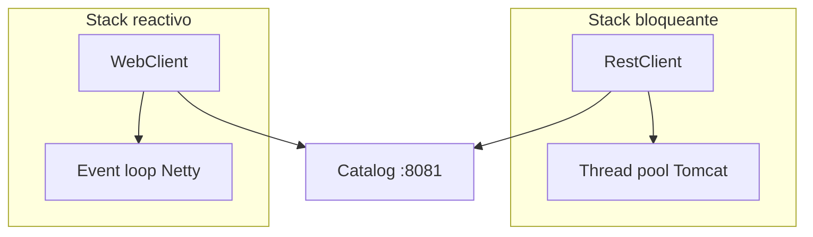

# 3. WebClient reactivo vs RestClient

Spring Framework 6.1+ / Boot 3–4 consolida dos APIs modernas de cliente HTTP:

| | **RestClient** | **WebClient** |
|--|----------------|---------------|
| Modelo | Síncrono / bloqueante | Reactivo (Reactor) |
| Stack típico | `spring-boot-starter-web` | `spring-boot-starter-webflux` |
| API | Fluent, parecida a WebClient | `Mono` / `Flux` |
| Reemplaza a | `RestTemplate` (legacy) | — |

## RestClient (default del lab)

```java
restClient.get()
    .uri("/api/v1/products/{sku}", sku)
    .header("X-Tenant-ID", tenantId)
    .retrieve()
    .body(ProductDto.class);
```

Ideal cuando el hilo del request MVC puede esperar la respuesta (caso Order en este módulo).

## WebClient

```java
webClient.get()
    .uri("/api/v1/products/{sku}", sku)
    .header("X-Tenant-ID", tenantId)
    .retrieve()
    .bodyToMono(ProductDto.class)
    .block(); // solo para comparar estilos en el lab
```

En producción reactiva **no** uses `.block()` dentro de un hilo de event-loop.
Aquí lo usamos a propósito para que el mismo endpoint `/checkout` compare los tres estilos.



## ¿Cuándo elegir qué?

1. **App MVC + llamadas ocasionales a otros servicios** → RestClient.
2. **App WebFlux / alto fan-out no bloqueante** → WebClient sin `block()`.
3. **Necesitas interfaz declarativa + load balancer** → Feign (doc 4) o HTTP Interface + `@HttpExchange`.

## Cómo probar los tres estilos

```bash
# RestClient (default)
curl -s -X POST http://localhost:8085/api/v1/checkout \
  -H 'Content-Type: application/json' \
  -H 'X-Tenant-ID: tienda-deportes' \
  -H 'X-Client-Style: restclient' \
  -d '{"sku":"ZAP-RUN-42","quantity":2}'

# WebClient
curl -s -X POST ... -H 'X-Client-Style: webclient' -d '...'

# Feign
curl -s -X POST ... -H 'X-Client-Style: feign' -d '...'
```

La respuesta incluye `clientStyle` para verificar cuál se usó.
