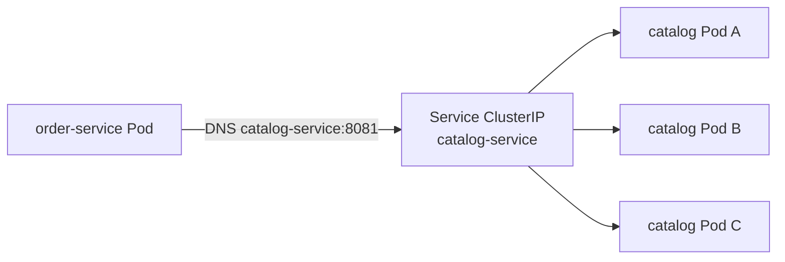

# 5. Load Balancing Kubernetes-native

En clusters modernos **no necesitas Eureka/Consul** para descubrir réplicas del mismo
servicio: Kubernetes ya expone un **Service** con IP virtual y balancea hacia los Pods.



## Piezas

| Recurso | Rol |
|---------|-----|
| **Deployment** | ReplicaSet + Pods de tu app |
| **Service ClusterIP** | VIP + kube-proxy / EndpointSlice → round-robin (aprox.) |
| **DNS** | `catalog-service.default.svc.cluster.local` |

El cliente solo conoce el **nombre DNS** del Service. Si un Pod muere, el EndpointSlice
se actualiza y deja de recibir tráfico.

## Manifiestos del curso

Ver carpeta [`k8s/`](../k8s/):

- `catalog-deployment.yaml` — 2 réplicas + Service
- `inventory-deployment.yaml` — gRPC puerto 9090 + Service
- `order-deployment.yaml` — apunta a DNS internos

## ¿Y Spring Cloud LoadBalancer?

Útil cuando:

- Corres **fuera** de K8s (laptop + varios procesos), o
- Quieres políticas avanzadas (retry, weighted) en el cliente.

Dentro de K8s, la opción por defecto del curso es:

```yaml
clients:
  catalog:
    url: http://catalog-service:8081
spring.grpc.client.channels.inventory.address: static://inventory-service:9090
```

## Anti-patrones

- Hardcodear IPs de Pods.
- Montar Eureka “porque el tutorial de 2018 lo hacía” en un cluster K8s puro.
- Asumir sticky sessions sin documentarlo (el Service no garantiza afinidad por defecto).

## Ejercicio

1. `kubectl apply -f k8s/`
2. Escala catalog a 3 réplicas y observa que Order sigue funcionando.
3. Borra un Pod de catalog y verifica recuperación vía el Service.
