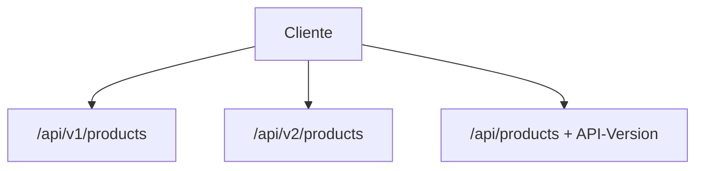

# 6. Versionado de APIs

Los clientes no se actualizan al mismo tiempo que los servidores. El versionado evita
**breaking changes** silenciosos.

## Estrategias (todas demostradas en `catalog-service`)

### 1. URI versioning (la más visible)

```
GET /api/v1/products
GET /api/v2/products
```

- Clara en logs y gateways.
- Contamina el path (muchas URLs).

### 2. Header versioning

```
GET /api/products
API-Version: 2
```

- URI estable.
- Menos descubrible; hay que documentar el header en OpenAPI.

### 3. Media type / content negotiation

```
Accept: application/vnd.joedayz.catalog.v2+json
```

- Muy “HTTP-correcto”.
- Tooling y cache a veces lo complican.



## Reglas del curso

1. **Additive changes** (campos nuevos opcionales) no requieren major version.
2. **Breaking changes** (renombrar/eliminar campo, cambiar semántica) → nueva major (`v2`).
3. Mantén **al menos una versión anterior** mientras existan clientes.
4. Documenta deprecation en OpenAPI (`deprecated: true`) con fecha de retiro.

## Demo rápida

```bash
# v1
curl -s http://localhost:8081/api/v1/products -H 'X-Tenant-ID: tienda-deportes'

# v2 (incluye apiVersion + currencyCode)
curl -s http://localhost:8081/api/v2/products -H 'X-Tenant-ID: tienda-deportes'

# header
curl -s http://localhost:8081/api/products \
  -H 'X-Tenant-ID: tienda-deportes' \
  -H 'API-Version: 2'
```

## Relación con gRPC

En Protobuf el versionado suele ir en el **package** (`inventory.v1`) y en campos con
números estables. Nunca reutilices field numbers para otro significado.

## Ejercicio

1. Marca un campo de v1 como deprecated en OpenAPI.
2. Diseña v3 que paginse resultados (`page`, `size`) sin romper v1/v2.
