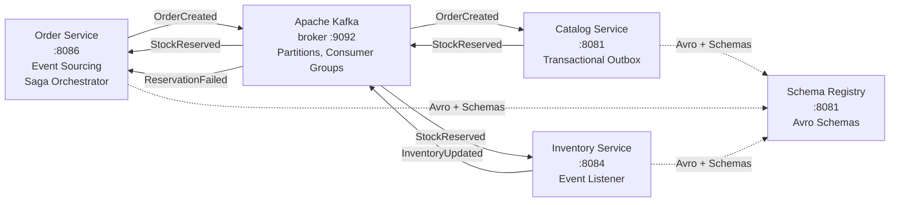

# Módulo 4 – Comunicación Asíncrona y Event-Driven

> Curso: **Arquitectura de Microservicios Pro: Spring Boot + Quarkus en AWS y Azure**
> JoeDayz.pe · Java 21 / Spring Boot 4 / Spring Cloud 2025.1 / Quarkus 3.x

En el Módulo 3 los microservicios se comunicaban de forma **síncrona** (REST, gRPC).
Aquí escalamos a **comunicación asíncrona** con **Apache Kafka** en profundidad:
topics, partitions, consumer groups, compaction. Implementamos patrones críticos:
**Event Sourcing**, **Saga** (coreografada y orquestada), **Transactional Outbox**.
Usamos **Spring Kafka** y **Quarkus Messaging**, y escalamos con **Schema Registry + Avro**.

## Objetivos de aprendizaje

Al terminar este módulo serás capaz de:

1. **Dominar Kafka**: topics, partitions, consumer groups, offsets, rebalancing, compaction.
2. **Implementar Event Sourcing**: almacenar el historial completo de eventos, reproducir estado.
3. **Orquestar transacciones distribuidas** con Saga patterns (coreografada y orquestada).
4. **Garantizar consistencia eventual** con Transactional Outbox y CDC (Change Data Capture).
5. **Serializar con Avro + Schema Registry**: evolución de esquemas sin breaking changes.
6. **Producir y consumir eventos** con **Spring Kafka** (Gradle, templates, listeners).
7. **Producir y consumir eventos** con **Quarkus Messaging** (MicroProfile Reactive).
8. **Desplegar Kafka en Kubernetes** (StatefulSet, ConfigMap, Services).

## Contenido teórico

| # | Tema | Documento |
|---|------|-----------|
| 1 | Apache Kafka en profundidad: topics, partitions, consumer groups | [docs/01-kafka-fundamentals.md](docs/01-kafka-fundamentals.md) |
| 2 | Event Sourcing: diseño e implementación | [docs/02-event-sourcing.md](docs/02-event-sourcing.md) |
| 3 | Saga Choreography y Orchestration | [docs/03-saga-patterns.md](docs/03-saga-patterns.md) |
| 4 | Transactional Outbox y CDC (Change Data Capture) | [docs/04-transactional-outbox.md](docs/04-transactional-outbox.md) |
| 5 | Schema Registry y Avro: evolución de esquemas | [docs/05-schema-registry-avro.md](docs/05-schema-registry-avro.md) |
| 6 | Spring Kafka: producers, consumers, templates | [docs/06-spring-kafka.md](docs/06-spring-kafka.md) |
| 7 | Quarkus Messaging: MicroProfile Reactive, SmallRye | [docs/07-quarkus-messaging.md](docs/07-quarkus-messaging.md) |
| 8 | Operacionalización: Docker, K8s, monitoreo | [docs/08-operacionalizacion.md](docs/08-operacionalizacion.md) |

## Microservicios de código

Flujo demo: **Order** publica `OrderCreated` → **Catalog** ajusta stock → **Inventory** actualiza
estado → **Order** confirma con `OrderConfirmed`. Event Sourcing + Saga Orchestrated.

| Proyecto | Patrón | Framework | Puerto(s) |
|----------|--------|-----------|-----------|
| [order-service-spring](order-service-spring/) | Event Sourcing + Saga Orchestrator | Spring Boot 4 + Kafka | **8086** |
| [catalog-service-spring](catalog-service-spring/) | Transactional Outbox | Spring Boot 4 + Kafka | **8081** |
| [inventory-service-spring](inventory-service-spring/) | Event listener + saga participant | Spring Boot 4 + Kafka | **8084** |
| [order-service-quarkus](order-service-quarkus/) | Event Sourcing + Saga Orchestrator | Quarkus 3 + Messaging | **8086** |
| [catalog-service-quarkus](catalog-service-quarkus/) | Transactional Outbox | Quarkus 3 + Messaging | **8081** |
| [inventory-service-quarkus](inventory-service-quarkus/) | Event listener + saga participant | Quarkus 3 + Messaging | **8084** |

### Mapa del módulo



## Inicio rápido

### Prerrequisitos

- **Java 21+** (GraalVM para native image)
- **Docker & Docker Compose**
- **Kubernetes cluster** (Kind, Minikube, o AKS/EKS)
- **Maven 3.9+** o **Gradle 8.x**

### Levantar Kafka localmente

```bash
cd docker-compose
docker-compose up -d

# Verificar que Kafka está listo
docker-compose logs kafka | grep "started"
```

Kafka disponible en `localhost:9092`, Schema Registry en `localhost:8081`.

### Ejecutar ejemplos Spring Kafka

```bash
# Order Service (Saga Orchestrator + Event Sourcing)
cd order-service-spring
mvn spring-boot:run

# En otra terminal: Catalog Service (Transactional Outbox)
cd catalog-service-spring
mvn spring-boot:run

# En otra terminal: Inventory Service (Event Listener)
cd inventory-service-spring
mvn spring-boot:run
```

Publicar evento de test:
```bash
curl -X POST http://localhost:8086/api/orders \
  -H "Content-Type: application/json" \
  -d '{
    "customerId": "c1",
    "productId": "p1",
    "quantity": 5
  }'
```

### Ejecutar ejemplos Quarkus

```bash
# Order Service (dev mode)
cd order-service-quarkus
quarkus dev

# En otra terminal: Catalog Service
cd catalog-service-quarkus
quarkus dev

# En otra terminal: Inventory Service
cd inventory-service-quarkus
quarkus dev
```

### Desplegar en Kubernetes

```bash
# Crear namespace
kubectl create namespace microservicios

# Desplegar Kafka (StatefulSet + Zookeeper)
kubectl apply -f k8s/kafka-zookeeper.yaml
kubectl apply -f k8s/kafka-broker.yaml

# Verificar
kubectl get statefulsets -n microservicios
kubectl get pods -n microservicios

# Desplegar servicios
kubectl apply -f k8s/
```

## Estructura del repositorio

```
modulo-04-comunicacion-asincrona/
├── README.md (este archivo)
├── docs/
│   ├── 01-kafka-fundamentals.md
│   ├── 02-event-sourcing.md
│   ├── 03-saga-patterns.md
│   ├── 04-transactional-outbox.md
│   ├── 05-schema-registry-avro.md
│   ├── 06-spring-kafka.md
│   ├── 07-quarkus-messaging.md
│   └── 08-operacionalizacion.md
├── docker-compose/
│   ├── docker-compose.yml (Kafka + ZK + Schema Registry)
│   └── healthcheck.sh
├── order-service-spring/
│   ├── pom.xml
│   ├── src/main/java/
│   ├── src/main/resources/ (application.yml, schema/)
│   └── src/test/
├── catalog-service-spring/
├── inventory-service-spring/
├── order-service-quarkus/
│   ├── pom.xml
│   ├── src/main/java/
│   ├── src/main/resources/ (application.properties, schema/)
│   └── src/test/
├── catalog-service-quarkus/
├── inventory-service-quarkus/
├── k8s/
│   ├── kafka-zookeeper.yaml
│   ├── kafka-broker.yaml
│   ├── kafka-service.yaml
│   ├── schema-registry.yaml
│   ├── order-service-deployment.yaml
│   ├── catalog-service-deployment.yaml
│   └── inventory-service-deployment.yaml
├── scripts/
│   ├── 01-setup-kafka.sh
│   ├── 02-deploy-k8s.sh
│   ├── 03-test-flow.sh
│   └── cleanup.sh
└── schemas/
    ├── order-events.avsc
    ├── inventory-events.avsc
    └── common.avsc
```

## Conceptos clave

### Topics y Partitions

Un **topic** en Kafka es como una "cola" persistente. Cada topic se divide en **partitions** para paralelismo:
- Una orden siempre va a la misma partition (basada en `orderIdKey`).
- Múltiples consumers en un **consumer group** se reparten las partitions.
- Si un consumer cae, Kafka **rebalancea** las partitions.

### Event Sourcing

En lugar de almacenar el estado actual, **almacenamos cada cambio como evento**:
- Una orden comienza en `PENDING`.
- Se publica `OrderCreated` → estado = `CREATED`.
- Se publica `StockReserved` → estado = `STOCK_RESERVED`.
- Se publica `OrderConfirmed` → estado = `CONFIRMED`.
- Reproducing el historial de eventos = reproducir el estado exacto.

### Saga Patterns

**Saga Orchestrated**:
- Un **Orchestrator** (Order Service) coordina el flujo.
- Order Service: "Catalog, reserva stock" → publica `ReserveStockCommand`.
- Catalog responde con `StockReserved` o `ReservationFailed`.
- Order Service maneja el siguiente paso.

**Saga Choreographed**:
- No hay orquestador central.
- Order Service publica `OrderCreated`.
- Catalog escucha, valida, publica `StockReserved`.
- Inventory escucha, actualiza, publica `InventoryUpdated`.
- Cada servicio reacciona a eventos de otros.

### Transactional Outbox

Problema: "Cambié BD y publiqué a Kafka, pero se cayó el servidor entre ambos" → inconsistencia.

Solución **Outbox**:
1. Cambiar BD + insertar fila en tabla `outbox` (una transacción ACID).
2. Separadamente, un **CDC poller** lee `outbox` y publica a Kafka.
3. Después de publica, marca como published.
4. **Garantía**: si se cae entre pasos, el CDC lo reintenta.

### Schema Registry + Avro

Sin schema: JSON plano, sin validación, riesgos de evolución.

Con **Avro + Schema Registry**:
- Definir esquemas `.avsc` (Avro Schema).
- Registrar en **Schema Registry** (versionado automático).
- Serializar con `AvroSerializer` (agrega schema ID al payload).
- Deserializar con `AvroDeserializer` (busca schema por ID).
- Evolucionar sin breaking changes (forward, backward, full).

## Recursos externos

- [Apache Kafka Docs](https://kafka.apache.org/documentation/)
- [Spring Kafka](https://spring.io/projects/spring-kafka)
- [Quarkus SmallRye Reactive Messaging](https://quarkus.io/guides/smallrye-reactive-messaging)
- [Confluent Schema Registry](https://docs.confluent.io/platform/current/schema-registry/index.html)
- [Avro Spec](https://avro.apache.org/docs/current/spec.html)
- [Event Sourcing Pattern](https://martinfowler.com/eaaDev/EventSourcing.html)

## Siguientes pasos

- **Módulo 5**: Monitoreo, logging, distributed tracing (ELK, Jaeger).
- **Módulo 6**: Deploy en AWS (MSK, EventBridge) y Azure (Event Hubs).
- **Módulo 7**: Testing (testcontainers, embedded Kafka, chaos engineering).

---

**Última actualización**: 2026-08-11  
**Versión**: 1.0.0  
**Licencia**: MIT
