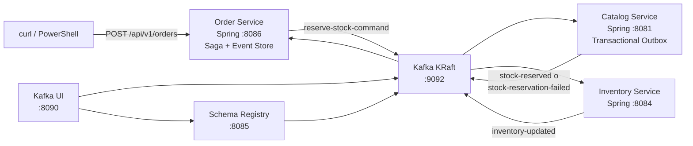

# Módulo 4 – Workshop de comunicación asíncrona
> **Apache Kafka · Event Sourcing · Saga · Transactional Outbox · Eventual Consistency**
>
> Java 21 · Spring Boot 4 · Kafka KRaft · Schema Registry · Kafka UI

En este workshop una orden se acepta por HTTP y continúa en segundo plano:
Order publica un comando, Catalog reserva stock mediante un outbox e Inventory
actualiza su propia vista. El cliente recibe **HTTP 202 Accepted** antes de que
todos los servicios hayan convergido.

Al finalizar habrás:

1. levantado Kafka, Schema Registry y Kafka UI;
2. ejecutado los tres servicios Spring en el orden correcto;
3. seguido un happy path desde `PENDING` hasta `CONFIRMED`;
4. consultado el historial de Event Sourcing y los mensajes en Kafka UI;
5. provocado una reserva fallida y observado el estado `FAILED`;
6. identificado Saga, Outbox y consistencia eventual en el código.

## Arquitectura del laboratorio



Topics reales del código:

- `reserve-stock-command`
- `stock-reserved`
- `stock-reservation-failed`
- `inventory-updated`

`stock-reserved` tiene dos consumer groups independientes: `order-service`
confirma la orden e `inventory-service` actualiza su inventario. No hay una
llamada HTTP entre esos servicios.

> Este módulo contiene proyectos ejecutables **Spring**, no proyectos Quarkus.
> [`docs/07-quarkus-messaging.md`](docs/07-quarkus-messaging.md) es material
> comparativo con ejemplos de SmallRye Reactive Messaging. No ejecutes
> `order-service-quarkus`, `catalog-service-quarkus` ni
> `inventory-service-quarkus`: esos directorios no existen. Una implementación
> Quarkus equivalente sería una alternativa a Spring y, si conserva `8086`,
> `8081` y `8084`, no podría correr a la vez en el mismo host.

## 0. Prerrequisitos

- JDK 21 o superior.
- Maven 3.9 o superior.
- Docker Desktop con Compose, o Podman 5 con Compose.
- macOS/Linux: `curl`; `jq` para capturar valores en los ejercicios.
- Windows: PowerShell 7+.
- Puertos libres: `8081`, `8084`, `8085`, `8086`, `8090`, `9092` y `9101`.
- Opcional para Kind: `kind`, `kubectl`, Podman y una shell Bash.

Ejecuta los comandos desde la raíz del repositorio
`microservicios-2026`, salvo que el paso indique otra terminal.

### Comprobar herramientas

**macOS / Linux**

```bash
java -version
mvn -version
docker version
docker compose version
curl --version
jq --version
```

Si usas Podman:

```bash
podman version
podman compose version
```

**Windows PowerShell**

```powershell
java -version
mvn -version
docker version
docker compose version
$PSVersionTable.PSVersion
```

## 1. Levantar Kafka, Schema Registry y Kafka UI

Abre la **Terminal 1**.

**Docker — Windows, macOS o Linux**

```bash
cd modulo-04-comunicacion-asincrona/docker-compose
docker compose up -d
docker compose ps
```

**Podman — macOS o Linux**

```bash
cd modulo-04-comunicacion-asincrona/docker-compose
podman compose up -d
podman compose ps
```

El compose usa Kafka en modo KRaft, sin ZooKeeper:

| Componente | Dirección desde el host |
|---|---|
| Kafka | `localhost:9092` |
| Schema Registry | `http://localhost:8085` |
| Kafka UI | `http://localhost:8090` |
| JMX de Kafka | `localhost:9101` |

Espera hasta que Kafka y Schema Registry estén sanos.

**macOS / Linux**

```bash
curl -sS http://localhost:8085/subjects | jq
curl -sS http://localhost:8090/actuator/health | jq
```

Con Docker también puedes usar el verificador incluido:

```bash
./healthcheck.sh
```

**Windows PowerShell**

```powershell
Invoke-RestMethod http://localhost:8085/subjects |
  ConvertTo-Json -Depth 5
Invoke-RestMethod http://localhost:8090/actuator/health |
  ConvertTo-Json -Depth 5
```

Al inicio `/subjects` normalmente devuelve `[]`. El Registry está operativo,
pero la demo ejecutable serializa sus mensajes como JSON; los `.avsc` son los
contratos de referencia para el ejercicio de evolución, no están conectados a
los producers Spring actuales.

## 2. Levantar Catalog Service

Catalog debe estar listo antes de enviar órdenes: carga el stock de demostración
para `demo-tenant`, crea los topics de respuesta y consume
`reserve-stock-command`.

Abre la **Terminal 2** y déjala ejecutándose:

```bash
cd modulo-04-comunicacion-asincrona/catalog-service-spring
mvn spring-boot:run
```

Verifica:

**macOS / Linux**

```bash
curl -sS http://localhost:8081/actuator/health | jq
curl -sS http://localhost:8081/api/v1/stock/SKU-001 \
  -H 'X-Tenant-ID: demo-tenant' | jq
```

**Windows PowerShell**

```powershell
Invoke-RestMethod http://localhost:8081/actuator/health |
  ConvertTo-Json -Depth 5
Invoke-RestMethod http://localhost:8081/api/v1/stock/SKU-001 `
  -Headers @{ 'X-Tenant-ID' = 'demo-tenant' } |
  ConvertTo-Json -Depth 5
```

`SKU-001` comienza con 100 unidades; `SKU-003`, con 0.

## 3. Levantar Inventory Service

Abre la **Terminal 3** y déjala ejecutándose:

```bash
cd modulo-04-comunicacion-asincrona/inventory-service-spring
mvn spring-boot:run
```

Verifica:

**macOS / Linux**

```bash
curl -sS http://localhost:8084/actuator/health | jq
curl -sS http://localhost:8084/api/v1/inventory/SKU-001 \
  -H 'X-Tenant-ID: demo-tenant' | jq
```

**Windows PowerShell**

```powershell
Invoke-RestMethod http://localhost:8084/actuator/health |
  ConvertTo-Json -Depth 5
Invoke-RestMethod http://localhost:8084/api/v1/inventory/SKU-001 `
  -Headers @{ 'X-Tenant-ID' = 'demo-tenant' } |
  ConvertTo-Json -Depth 5
```

## 4. Levantar Order Service

Abre la **Terminal 4** y déjala ejecutándose:

```bash
cd modulo-04-comunicacion-asincrona/order-service-spring
mvn spring-boot:run
```

Verifica:

**macOS / Linux**

```bash
curl -sS http://localhost:8086/actuator/health | jq
```

**Windows PowerShell**

```powershell
Invoke-RestMethod http://localhost:8086/actuator/health |
  ConvertTo-Json -Depth 5
```

El orden completo de arranque es: infraestructura → Catalog → Inventory →
Order. Kafka conserva mensajes, pero seguir este orden evita que una orden de
prueba se procese antes de que los datos demo y todos los consumidores estén
listos.

## 5. Happy path: aceptar una orden

El header obligatorio es `X-Tenant-ID`. Captura tanto el código HTTP como el
`orderId`; los necesitarás para observar la consistencia eventual.

### macOS / Linux

```bash
ORDER_RESPONSE=$(mktemp)
HTTP_STATUS=$(curl -sS -o "$ORDER_RESPONSE" -w '%{http_code}' \
  -X POST http://localhost:8086/api/v1/orders \
  -H 'Content-Type: application/json' \
  -H 'X-Tenant-ID: demo-tenant' \
  -d '{"customerId":"customer-001","sku":"SKU-001","quantity":2}')

cat "$ORDER_RESPONSE" | jq
echo "HTTP_STATUS=$HTTP_STATUS"
ORDER_ID=$(jq -r '.orderId' "$ORDER_RESPONSE")
echo "ORDER_ID=$ORDER_ID"
```

### Windows PowerShell

```powershell
$Response = Invoke-WebRequest -Method Post `
  -Uri http://localhost:8086/api/v1/orders `
  -ContentType 'application/json' `
  -Headers @{ 'X-Tenant-ID' = 'demo-tenant' } `
  -Body '{"customerId":"customer-001","sku":"SKU-001","quantity":2}'

$Order = $Response.Content | ConvertFrom-Json
$Order | ConvertTo-Json -Depth 6
$OrderId = $Order.orderId
Write-Host "HTTP_STATUS=$($Response.StatusCode)"
Write-Host "ORDER_ID=$OrderId"
```

El código esperado es **202**, no 200 ni 201. La respuesta inicial puede mostrar
`PENDING` o incluso `CONFIRMED` si Kafka procesa muy rápido; el contrato
importante es que HTTP solo confirma la aceptación, no la convergencia de los
tres servicios.

## 6. Esperar la consistencia eventual

Consulta la orden hasta que llegue a `CONFIRMED`.

**macOS / Linux**

```bash
for attempt in $(seq 1 20); do
  ORDER=$(curl -sS "http://localhost:8086/api/v1/orders/$ORDER_ID" \
    -H 'X-Tenant-ID: demo-tenant')
  STATUS=$(echo "$ORDER" | jq -r '.status')
  echo "intento=$attempt status=$STATUS"
  [ "$STATUS" = "CONFIRMED" ] && break
  sleep 1
done
echo "$ORDER" | jq
```

**Windows PowerShell**

```powershell
for ($Attempt = 1; $Attempt -le 20; $Attempt++) {
  $Order = Invoke-RestMethod `
    "http://localhost:8086/api/v1/orders/$OrderId" `
    -Headers @{ 'X-Tenant-ID' = 'demo-tenant' }
  Write-Host "intento=$Attempt status=$($Order.status)"
  if ($Order.status -eq 'CONFIRMED') { break }
  Start-Sleep -Seconds 1
}
$Order | ConvertTo-Json -Depth 6
```

Después comprueba el historial inmutable de la orden.

**macOS / Linux**

```bash
curl -sS "http://localhost:8086/api/v1/orders/$ORDER_ID/events" \
  -H 'X-Tenant-ID: demo-tenant' | jq
```

**Windows PowerShell**

```powershell
Invoke-RestMethod `
  "http://localhost:8086/api/v1/orders/$OrderId/events" `
  -Headers @{ 'X-Tenant-ID' = 'demo-tenant' } |
  ConvertTo-Json -Depth 8
```

Debes encontrar `OrderCreatedEvent`, `StockReservedEvent` y
`OrderConfirmedEvent`, con versiones crecientes.

También puedes volver a consultar Catalog e Inventory. Ambas vistas deberían
terminar con 98 unidades, aunque pueden converger en instantes diferentes:
Order e Inventory consumen `stock-reserved` en grupos independientes.

## 7. Seguir el flujo en Kafka UI

Abre [http://localhost:8090](http://localhost:8090).

1. Entra al cluster **local**.
2. Abre **Topics**.
3. Confirma los cuatro topics listados al inicio del workshop.
4. Entra a `reserve-stock-command` y abre **Messages**.
5. Selecciona todas las partitions, usa el modo de lectura desde el inicio si
   la pantalla lo solicita y pulsa **Submit** o **Search**.
6. Localiza `ORDER_ID` o `$OrderId` en la key o en el payload.
7. Repite en `stock-reserved`; el mismo `orderId` conecta comando y respuesta.
8. Repite en `inventory-updated` para verificar la actualización física.
9. Abre **Consumer Groups** y revisa `catalog-service`, `order-service` e
   `inventory-service`; observa offsets y lag.
10. En **Schema Registry**, verifica la conexión al Registry. Puede no haber
    subjects porque el flujo ejecutable usa JSON.

Los nombres exactos de botones pueden cambiar entre versiones de Kafka UI,
pero el recorrido es siempre cluster → topic → messages.

## 8. Caso de fallo: stock insuficiente

`SKU-003` existe para `demo-tenant`, pero tiene stock 0. Envía una orden y
captura un segundo identificador.

### macOS / Linux

```bash
FAILED_RESPONSE=$(mktemp)
FAILED_HTTP_STATUS=$(curl -sS -o "$FAILED_RESPONSE" -w '%{http_code}' \
  -X POST http://localhost:8086/api/v1/orders \
  -H 'Content-Type: application/json' \
  -H 'X-Tenant-ID: demo-tenant' \
  -d '{"customerId":"customer-002","sku":"SKU-003","quantity":1}')

cat "$FAILED_RESPONSE" | jq
echo "HTTP_STATUS=$FAILED_HTTP_STATUS"
FAILED_ORDER_ID=$(jq -r '.orderId' "$FAILED_RESPONSE")
echo "FAILED_ORDER_ID=$FAILED_ORDER_ID"

for attempt in $(seq 1 20); do
  FAILED_ORDER=$(curl -sS \
    "http://localhost:8086/api/v1/orders/$FAILED_ORDER_ID" \
    -H 'X-Tenant-ID: demo-tenant')
  FAILED_STATUS=$(echo "$FAILED_ORDER" | jq -r '.status')
  echo "intento=$attempt status=$FAILED_STATUS"
  [ "$FAILED_STATUS" = "FAILED" ] && break
  sleep 1
done
echo "$FAILED_ORDER" | jq

curl -sS \
  "http://localhost:8086/api/v1/orders/$FAILED_ORDER_ID/events" \
  -H 'X-Tenant-ID: demo-tenant' | jq
```

### Windows PowerShell

```powershell
$FailedResponse = Invoke-WebRequest -Method Post `
  -Uri http://localhost:8086/api/v1/orders `
  -ContentType 'application/json' `
  -Headers @{ 'X-Tenant-ID' = 'demo-tenant' } `
  -Body '{"customerId":"customer-002","sku":"SKU-003","quantity":1}'

$FailedOrder = $FailedResponse.Content | ConvertFrom-Json
$FailedOrderId = $FailedOrder.orderId
Write-Host "HTTP_STATUS=$($FailedResponse.StatusCode)"
Write-Host "FAILED_ORDER_ID=$FailedOrderId"

for ($Attempt = 1; $Attempt -le 20; $Attempt++) {
  $FailedOrder = Invoke-RestMethod `
    "http://localhost:8086/api/v1/orders/$FailedOrderId" `
    -Headers @{ 'X-Tenant-ID' = 'demo-tenant' }
  Write-Host "intento=$Attempt status=$($FailedOrder.status)"
  if ($FailedOrder.status -eq 'FAILED') { break }
  Start-Sleep -Seconds 1
}
$FailedOrder | ConvertTo-Json -Depth 6

Invoke-RestMethod `
  "http://localhost:8086/api/v1/orders/$FailedOrderId/events" `
  -Headers @{ 'X-Tenant-ID' = 'demo-tenant' } |
  ConvertTo-Json -Depth 8
```

El POST también devuelve **202**: la falta de stock se descubre de forma
asíncrona. Catalog escribe `stock-reservation-failed` en su outbox, el poller lo
publica y Order termina en `FAILED`. Inventory no recibe `stock-reserved`, por
lo que no descuenta unidades. Confirma el mensaje fallido en Kafka UI.

## 9. Dónde vive cada patrón

### Event Sourcing

Order persiste cada transición en su event store y expone el historial en
`GET /api/v1/orders/{orderId}/events`.

- [`OrderSagaOrchestrator.java`](order-service-spring/src/main/java/pe/joedayz/microservicios/order/saga/OrderSagaOrchestrator.java)
- [`EventStoreService.java`](order-service-spring/src/main/java/pe/joedayz/microservicios/order/eventstore/EventStoreService.java)
- [`StoredEvent.java`](order-service-spring/src/main/java/pe/joedayz/microservicios/order/eventstore/StoredEvent.java)

La demo conserva además una proyección `Order` para consultas. El historial
permite auditoría; el endpoint actual no implementa una operación pública de
replay.

### Saga

[`OrderSagaOrchestrator.java`](order-service-spring/src/main/java/pe/joedayz/microservicios/order/saga/OrderSagaOrchestrator.java)
crea la orden y publica `reserve-stock-command`. Luego reacciona a
`stock-reserved` o `stock-reservation-failed`. Es una saga orquestada de un
paso con coreografía adicional: Inventory también reacciona al evento exitoso.

### Transactional Outbox

[`ReserveStockCommandHandler.java`](catalog-service-spring/src/main/java/pe/joedayz/microservicios/catalog/saga/ReserveStockCommandHandler.java)
reserva stock e inserta la respuesta en el outbox dentro de la misma transacción.
[`OutboxPublisher.java`](catalog-service-spring/src/main/java/pe/joedayz/microservicios/catalog/outbox/OutboxPublisher.java)
publica pendientes cada 500 ms y los marca como publicados.

Si el proceso cae después del envío y antes del commit, el mensaje puede
repetirse: el patrón ofrece entrega **at-least-once**, no exactly-once.

### Eventual Consistency

Cada servicio usa su propia H2 en memoria. `CONFIRMED` en Order y el decremento
en Inventory son reacciones independientes al mismo mensaje; durante un breve
intervalo sus vistas pueden diferir. Los polls del workshop hacen visible esa
ventana de convergencia.

## 10. Schema Registry y Avro

Schema Registry corre en `http://localhost:8085` y Kafka UI está conectado a
él. Inspecciónalo directamente:

**macOS / Linux**

```bash
curl -sS http://localhost:8085/subjects | jq
curl -sS http://localhost:8085/config | jq
```

**Windows PowerShell**

```powershell
Invoke-RestMethod http://localhost:8085/subjects |
  ConvertTo-Json -Depth 5
Invoke-RestMethod http://localhost:8085/config |
  ConvertTo-Json -Depth 5
```

Contratos incluidos:

- [`schemas/order-events.avsc`](schemas/order-events.avsc)
- [`schemas/inventory-events.avsc`](schemas/inventory-events.avsc)
- [`schemas/common.avsc`](schemas/common.avsc)

El flujo runnable **no usa `KafkaAvroSerializer` ni
`KafkaAvroDeserializer`**; usa JSON y por eso no registra subjects
automáticamente. No confundas “Registry levantado” con “serialización Avro
integrada”. La guía para completar esa evolución está en
[`docs/05-schema-registry-avro.md`](docs/05-schema-registry-avro.md).

## 11. Kind opcional

Los scripts de `scripts/` automatizan un laboratorio Kind usando **Podman**.
Son opcionales y están pensados para macOS/Linux o una shell Bash con Kind,
Podman, Maven, `kubectl` y `curl`. No sustituyen el flujo local anterior.

Desde `modulo-04-comunicacion-asincrona`:

```bash
./scripts/01-kind-create.sh
./scripts/02-deploy.sh
./scripts/03-smoke.sh
```

`02-deploy.sh` compila los tres proyectos Spring, construye imágenes Podman,
las carga en Kind, despliega Kafka/Schema Registry/Kafka UI y, después de que
Kafka esté Ready, despliega Catalog, Inventory y Order.

Puertos publicados por la configuración Kind:

| Componente | Dirección |
|---|---|
| Catalog | `http://127.0.0.1:8081` |
| Inventory | `http://127.0.0.1:8084` |
| Order | `http://127.0.0.1:8086` |
| Kafka UI | `http://127.0.0.1:8090` |
| Kafka | `127.0.0.1:9092` |

Schema Registry es `ClusterIP` en Kind. Para abrirlo temporalmente desde el
host:

```bash
kubectl port-forward svc/schema-registry 8085:8085
```

Al terminar:

```bash
./scripts/04-destroy.sh
```

## 12. Detener el workshop

1. Detén Order, Inventory y Catalog con `Ctrl+C` en las terminales 4, 3 y 2.
2. Detén la infraestructura.

**Docker — Windows, macOS o Linux**

```bash
cd modulo-04-comunicacion-asincrona/docker-compose
docker compose down
```

**Podman — macOS o Linux**

```bash
cd modulo-04-comunicacion-asincrona/docker-compose
podman compose down
```

Las bases H2 son volátiles: al reiniciar los servicios se pierden órdenes,
eventos, outbox y cambios de stock. Kafka tampoco declara volúmenes en este
compose; `down` elimina sus datos junto con los contenedores.

## Solución de problemas

### El POST no devuelve 202

- Confirma `http://localhost:8086/actuator/health`.
- Usa exactamente `POST /api/v1/orders`.
- Incluye `Content-Type: application/json` y `X-Tenant-ID: demo-tenant`.
- El body usa `customerId`, `sku` y `quantity`.

### La orden permanece en PENDING

- Confirma que Catalog responde en `8081`.
- Revisa las terminales de Order y Catalog por errores de Kafka.
- En Kafka UI verifica mensajes en `reserve-stock-command` y el lag de
  `catalog-service`.
- Confirma que los servicios apuntan a `localhost:9092`.

### La orden está CONFIRMED pero Inventory aún no cambió

Es una ventana válida de consistencia eventual. Reintenta la consulta de
Inventory y revisa el consumer group `inventory-service`. Order no espera a
`inventory-updated` para confirmar.

### Schema Registry devuelve una lista vacía

Es el comportamiento esperado del demo JSON. El contenedor puede estar sano
aunque `/subjects` devuelva `[]`.

### Kafka UI no muestra mensajes

- Selecciona el cluster `local`, el topic correcto y todas las partitions.
- Cambia el offset de lectura al inicio.
- Genera una orden nueva después de que los tres servicios estén arriba.

### Un puerto ya está ocupado

Detén el proceso que usa `8081`, `8084`, `8085`, `8086`, `8090`, `9092` o
`9101`. No cambies solo el puerto de un componente: actualiza también los
clientes y mappings que lo referencian.

### Podman Compose o Kind no conecta

- En macOS ejecuta `podman machine start`.
- Los scripts Kind requieren Podman; no son scripts Docker genéricos.
- Revisa `kubectl get pods` y `kubectl get svc`.
- Para logs: `kubectl logs deployment/kafka`,
  `kubectl logs deployment/catalog-service`,
  `kubectl logs deployment/inventory-service` o
  `kubectl logs deployment/order-service`.

## Archivos clave

- [`docker-compose/docker-compose.yml`](docker-compose/docker-compose.yml):
  Kafka KRaft, Schema Registry, Kafka UI y puertos locales.
- [`order-service-spring/src/main/resources/application.yml`](order-service-spring/src/main/resources/application.yml):
  puerto `8086`, H2 y configuración Kafka.
- [`catalog-service-spring/src/main/resources/application.yml`](catalog-service-spring/src/main/resources/application.yml):
  puerto `8081` y frecuencia del outbox.
- [`inventory-service-spring/src/main/resources/application.yml`](inventory-service-spring/src/main/resources/application.yml):
  puerto `8084` y consumer de inventario.
- [`KafkaTopicsConfig.java`](order-service-spring/src/main/java/pe/joedayz/microservicios/order/config/KafkaTopicsConfig.java):
  declaración de `reserve-stock-command`.
- [`KafkaTopicsConfig.java`](catalog-service-spring/src/main/java/pe/joedayz/microservicios/catalog/config/KafkaTopicsConfig.java):
  topics de respuesta.
- [`KafkaTopicsConfig.java`](inventory-service-spring/src/main/java/pe/joedayz/microservicios/inventory/config/KafkaTopicsConfig.java):
  declaración de `inventory-updated`.
- [`scripts/`](scripts/): creación, despliegue, smoke test y destrucción de Kind.

## Lecturas del módulo

- [01 · Kafka: topics, partitions y consumer groups](docs/01-kafka-fundamentals.md)
- [02 · Event Sourcing](docs/02-event-sourcing.md)
- [03 · Saga: coreografía y orquestación](docs/03-saga-patterns.md)
- [04 · Transactional Outbox](docs/04-transactional-outbox.md)
- [05 · Schema Registry y Avro](docs/05-schema-registry-avro.md)
- [06 · Eventual Consistency](docs/06-eventual-consistency.md)
- [07 · Spring Kafka](docs/06-spring-kafka.md)
- [08 · Quarkus Messaging (comparativo, no runnable)](docs/07-quarkus-messaging.md)
- [09 · Operacionalización](docs/09-operacionalizacion.md)

## Referencias

- [Apache Kafka](https://kafka.apache.org/documentation/)
- [Spring for Apache Kafka](https://spring.io/projects/spring-kafka)
- [Confluent Schema Registry](https://docs.confluent.io/platform/current/schema-registry/index.html)
- [Apache Avro](https://avro.apache.org/docs/current/specification/)
