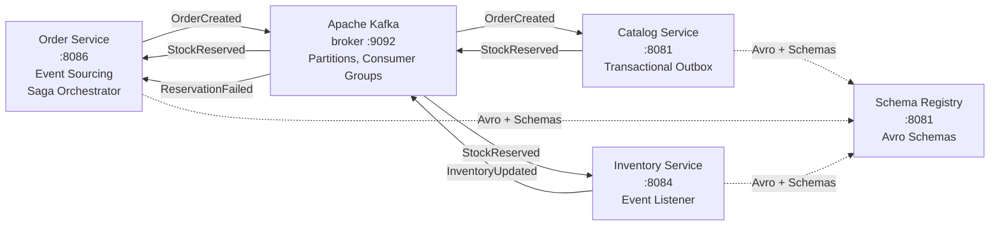
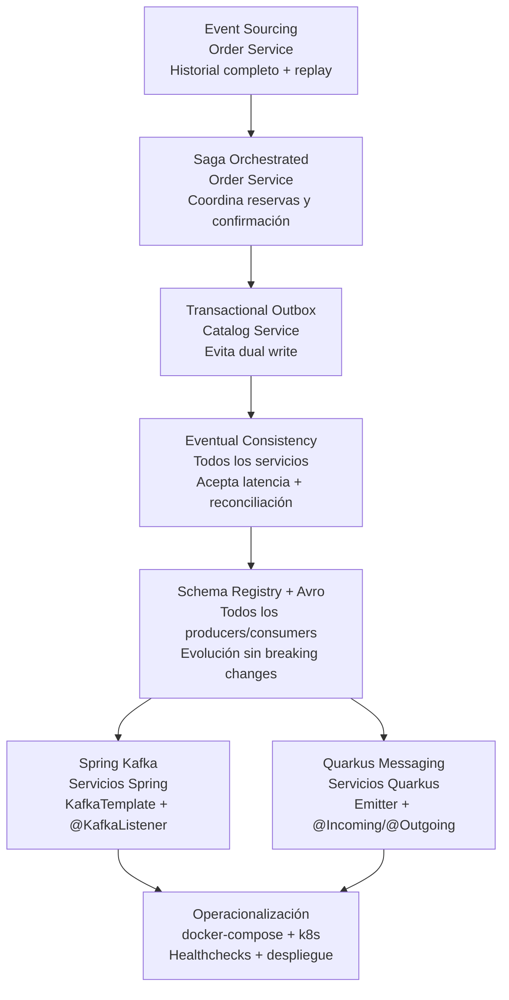

# Módulo 4 – Comunicación Asíncrona y Event-Driven

> Curso: **Arquitectura de Microservicios Pro: Spring Boot + Quarkus en AWS y Azure**
> JoeDayz.pe · Java 21 / Spring Boot 4 / Spring Cloud 2025.1 / Quarkus 3.x

En el Módulo 3 los microservicios se comunicaban de forma **síncrona** (REST, gRPC).
Aquí escalamos a **comunicación asíncrona** con **Apache Kafka** en profundidad:
topics, partitions, consumer groups, compaction. Cubrimos patrones críticos:
**Event Sourcing**, **Saga** (coreografada y orquestada), **Transactional Outbox**,
**Eventual Consistency**, **Schema Registry + Avro** y la operación del stack.

## Objetivos de aprendizaje

Al terminar este módulo serás capaz de:

1. **Dominar Kafka**: topics, partitions, consumer groups, offsets, rebalancing, compaction.
2. **Implementar Event Sourcing**: almacenar el historial completo de eventos, reproducir estado.
3. **Orquestar transacciones distribuidas** con Saga patterns (coreografada y orquestada).
4. **Garantizar consistencia eventual** con Transactional Outbox y CDC (Change Data Capture).
5. **Serializar con Avro + Schema Registry**: evolución de esquemas sin breaking changes.
6. **Entender eventual consistency**: coherencia temporal, reconciliación y monitoreo.
7. **Producir y consumir eventos** con **Spring Kafka** (Gradle, templates, listeners).
8. **Producir y consumir eventos** con **Quarkus Messaging** (MicroProfile Reactive).
9. **Operar Kafka en local y en Kubernetes**: healthchecks, despliegue y observabilidad.

## Contenido teórico

| # | Tema | Documento |
|---|------|-----------|
| 1 | Apache Kafka en profundidad: topics, partitions, consumer groups | [docs/01-kafka-fundamentals.md](docs/01-kafka-fundamentals.md) |
| 2 | Event Sourcing: diseño e implementación | [docs/02-event-sourcing.md](docs/02-event-sourcing.md) |
| 3 | Saga Choreography y Orchestration | [docs/03-saga-patterns.md](docs/03-saga-patterns.md) |
| 4 | Transactional Outbox y CDC (Change Data Capture) | [docs/04-transactional-outbox.md](docs/04-transactional-outbox.md) |
| 5 | Schema Registry y Avro: evolución de esquemas | [docs/05-schema-registry-avro.md](docs/05-schema-registry-avro.md) |
| 6 | Eventual Consistency: coherencia temporal y reconciliación | [docs/06-eventual-consistency.md](docs/06-eventual-consistency.md) |
| 7 | Spring Kafka: producers, consumers, templates | [docs/06-spring-kafka.md](docs/06-spring-kafka.md) |
| 8 | Quarkus Messaging: MicroProfile Reactive, SmallRye | [docs/07-quarkus-messaging.md](docs/07-quarkus-messaging.md) |
| 9 | Operacionalización: Docker, K8s, monitoreo | [docs/09-operacionalizacion.md](docs/09-operacionalizacion.md) |

## Microservicios de código

Flujo demo: **Order** publica `OrderCreated` → **Catalog** ajusta stock → **Inventory** actualiza
estado → **Order** confirma con `OrderConfirmed`. Event Sourcing + Saga Orchestrated.

| Proyecto | Patrón | Framework | Puerto(s) |
|----------|--------|-----------|-----------|
| [order-service-spring](order-service-spring/) | Event Sourcing + Saga Orchestrator | Spring Boot 4 + Kafka | **8086** |
| [catalog-service-spring](catalog-service-spring/) | Transactional Outbox | Spring Boot 4 + Kafka | **8081** |
| [inventory-service-spring](inventory-service-spring/) | Event listener + saga participant | Spring Boot 4 + Kafka | **8084** |
| [order-service-quarkus](order-service-quarkus/) | Event Sourcing + Saga Orchestrator | Quarkus 3 + Messaging | **8086** |
| [catalog-service-quarkus](catalog-service-quarkus/) | Transactional Outbox | Quarkus 3 + Messaging | **8081** |
| [inventory-service-quarkus](inventory-service-quarkus/) | Event listener + saga participant | Quarkus 3 + Messaging | **8084** |

### Mapa del módulo



### Mapa de patrones en la solución



| Patrón | Dónde se aplica | Código de referencia | Cómo aporta |
|--------|------------------|----------------------|-------------|
| Event Sourcing | `order-service-spring`, `order-service-quarkus` | `OrderService.createOrder()`, `Order.fromHistory()` | Guarda historial completo y permite replay/auditoría. |
| Saga Orchestrated | `order-service-spring`, `order-service-quarkus` | `handleStockReserved()`, `handlePaymentFailed()` | Coordina pasos distribuidos y compensaciones. |
| Transactional Outbox | `catalog-service-spring`, `catalog-service-quarkus` | `OutboxRepository`, `OutboxPoller` | Elimina dual write entre BD y Kafka. |
| Eventual Consistency | todo el flujo | `ConsistencyChecker.checkConsistency()`, `ConsistencyMetrics` | Acepta estados temporales y mide convergencia. |
| Schema Registry + Avro | producers/consumers del módulo | `schemas/*.avsc`, `KafkaAvroSerializer` | Versiona contratos sin romper consumidores. |
| Spring Kafka | servicios Spring | `KafkaTemplate`, `@KafkaListener` | Implementa productores/consumidores imperativos. |
| Quarkus Messaging | servicios Quarkus | `Emitter<T>`, `@Incoming`, `@Outgoing` | Implementa mensajería reactiva y simple. |
| Operacionalización | `docker-compose/`, `k8s/` | `healthcheck.sh`, `docker compose`, `kubectl apply` | Hace reproducible el stack y valida su salud. |

### Dónde se ve cada patrón

**Event Sourcing**

```java
Order order = Order.createOrder(orderId, request.getCustomerId(), request.getItems());
eventStore.saveEvents(orderId, order.getUncommittedEvents());
```

**Transactional Outbox**

```java
@Transactional
public String createOrder(CreateOrderRequest request) {
    Order order = new Order(orderId, request.getCustomerId());
    orderRepository.save(order);
    for (OutboxEvent event : order.getOutboxEvents()) {
        outboxRepository.save(event);
    }
    return orderId;
}
```

**Saga Orchestrated**

```java
@KafkaListener(topics = "payment-failed-reply", groupId = "order-group")
public void handlePaymentFailed(PaymentFailedReply reply) {
    kafkaTemplate.send("release-stock-command", new ReleaseStockCommand(...));
}
```

**Eventual Consistency**

```java
@Scheduled(fixedRate = 60000)
public void checkConsistency() {
    for (Order order : orderRepo.findAll()) {
        validateOrderConsistency(order);
    }
}
```

**Schema Registry + Avro**

```java
configProps.put("schema.registry.url", "http://schema-registry:8081");
kafkaTemplate.send("order-events", event.getOrderId(), event);
```

**Spring Kafka**

```java
@KafkaListener(topics = "order-events", groupId = "order-processing")
public void handleOrderCreated(OrderCreatedEvent event) { ... }
```

**Quarkus Messaging**

```java
@Incoming("orders-in")
public void consume(OrderCreatedEvent event) { ... }
```

## Guía didáctica para explicar el módulo 4 (paso a paso)

Esta demo está pensada para que en clase puedas mostrar, en vivo, cómo un evento viaja por Kafka y cómo cada microservicio reacciona a ese evento sin depender de llamadas HTTP síncronas.

### 1) Objetivo de la demostración

En 10 minutos puedes explicar y ejecutar esta secuencia:

1. `Order Service` recibe una orden.
2. Crea el `OrderCreated` event.
3. Publica un comando `ReserveStockCommand` al topic de Kafka.
4. `Catalog Service` reserva stock y publica `StockReserved` o `StockReservationFailed`.
5. `Inventory Service` escucha `StockReserved` y actualiza el stock físico.
6. `Order Service` finaliza la orden como `CONFIRMED` o `FAILED`.

La clave didáctica es mostrar que la respuesta ya no depende del tiempo real del otro servicio: el sistema es asíncrono, tolera latencia y desacopla componentes.

### 2) Requisitos mínimos

- Java 21+
- Maven 3.9+
- Podman 5+ o Docker Desktop
- `kind` opcional si quieres correr la misma idea dentro de un cluster local
- `curl` y `jq` (opcional)

> Si tienes Podman, esta guía funciona con un solo broker Kafka local usando `podman compose` sobre el archivo de [docker-compose/docker-compose.yml](docker-compose/docker-compose.yml).

### 3) Levantar Kafka con un solo broker (reproducible localmente)

Desde la raíz del módulo:

```bash
cd modulo-04-comunicacion-asincrona/docker-compose
podman compose up -d
```

Verifica que los contenedores subieron:

```bash
podman ps
podman logs kafka --tail 50
```

Qué debes ver:
- `kafka` corriendo en `localhost:9092`
- `schema-registry` en `localhost:8085`
- `kafka-ui` en `http://localhost:8090`

También puedes revisar que Schema Registry responde:

```bash
curl http://localhost:8085/subjects
```

> En una clase, esto es ideal para mostrar: “Kafka no es una base de datos, es un sistema de mensajería distribuida”.

### 4) Arrancar los tres microservicios

Abre 3 terminales diferentes y ejecuta cada servicio en su propia ventana:

```bash
cd modulo-04-comunicacion-asincrona/order-service-spring
mvn spring-boot:run
```

```bash
cd modulo-04-comunicacion-asincrona/catalog-service-spring
mvn spring-boot:run
```

```bash
cd modulo-04-comunicacion-asincrona/inventory-service-spring
mvn spring-boot:run
```

Cuando los tres estén arriba, revisa health endpoints:

```bash
curl http://localhost:8086/actuator/health
curl http://localhost:8081/actuator/health
curl http://localhost:8084/actuator/health
```

### 5) Enviar una orden de prueba

La API de Order Service exige el header `X-Tenant-ID` para simular multitenancy. El request real usa `customerId`, `sku` y `quantity`:

```bash
curl -s -X POST http://localhost:8086/api/v1/orders \
  -H 'Content-Type: application/json' \
  -H 'X-Tenant-ID: demo-tenant' \
  -d '{
    "customerId": "customer-001",
    "sku": "SKU-001",
    "quantity": 2
  }'
```

Respuesta esperada: HTTP 202 Accepted, porque la orden se acepta y el flujo continúa en segundo plano.

### 6) Qué exactamente está pasando detrás de escena

Ahora explica el flujo como si fuera la narración de la clase:

1. `OrderService.createOrder()` crea la orden localmente.
2. Guarda la orden en la base de datos del servicio.
3. Inserta un evento en el `event store` (Event Sourcing).
4. Publica el comando `ReserveStockCommand` a Kafka.
5. `Catalog Service` escucha `reserve-stock-command`.
6. Valida stock.
7. Si hay stock, guarda la reserva y publica `stock-reserved`.
8. `Inventory Service` escucha `stock-reserved` y descuenta el stock físico.
9. `Order Service` escucha `stock-reserved` y marca la orden como confirmada.
10. El mismo flujo genera `OrderConfirmedEvent` y deja el historial completo en el event store.

En términos de diseño, esto es una saga orquestada simplificada: el ordenador es `Order Service` y los participantes son `Catalog` e `Inventory`.

### 7) Ver el historial y depurar la demo

Puedes consultar el estado y el historial de eventos:

```bash
curl -s http://localhost:8086/api/v1/orders/<ORDER_ID> \
  -H 'X-Tenant-ID: demo-tenant'

curl -s http://localhost:8086/api/v1/orders/<ORDER_ID>/events \
  -H 'X-Tenant-ID: demo-tenant'
```

Esto te permite mostrar el “event sourcing” en vivo: cada cambio está registrado como evento, y no solo el último estado.

### 8) Ver los eventos en Kafka UI

Abre:

- `http://localhost:8090`

Y revisa los topics:
- `reserve-stock-command`
- `stock-reserved`
- `stock-reservation-failed`
- `inventory-updated`

Esto es perfecto para que expliquen:
- topic
- partition
- consumer group
- offsets
- rebalancing
- at-least-once delivery

### 9) Probar el caso de error

Para demostrar la parte de la saga con fallo, crea un SKU inexistente o un pedido que supere el stock disponible.

```bash
curl -s -X POST http://localhost:8086/api/v1/orders \
  -H 'Content-Type: application/json' \
  -H 'X-Tenant-ID: demo-tenant' \
  -d '{
    "customerId": "customer-002",
    "sku": "SKU-404",
    "quantity": 999
  }'
```

Entonces verás que:
- `Catalog Service` publica `stock-reservation-failed`
- `Order Service` marca la orden como `FAILED`
- `Inventory Service` no decrementa stock porque la reserva nunca fue validada

### 10) Cómo lo explicarías en clase

Puedes contar la historia en este orden:

- “Antes: una llamada HTTP síncrona de Order → Catalog → Inventory”
- “Ahora: Order publica un evento y cada servicio reacciona de forma independiente”
- “Esto protege latencia, desacopla servicios y escala mejor en producción”
- “El costo es la complejidad de manejar consistencia eventual, idempotencia y reintentos”
- “Por eso usamos Outbox, event stores, consumer groups y retries”

### 11) Si quieres correr esto en Kind

El módulo incluye `k8s/` y `scripts/` listos — misma lógica de eventos, mismos consumer groups, sin cambiar una línea de código.

```bash
cd modulo-04-comunicacion-asincrona

# 1. Crear cluster Kind con port-mappings locales
./scripts/01-kind-create.sh

# 2. Build Maven → Podman → kind load → kubectl apply
#    (Kafka arranca primero; los servicios esperan a que esté ready)
./scripts/02-deploy.sh

# 3. Smoke test: happy-path + 2 escenarios de compensación Saga
./scripts/03-smoke.sh

# 4. Limpiar todo
./scripts/04-destroy.sh
```

Puertos disponibles en `localhost` tras el deploy:

| Servicio          | URL                          |
|-------------------|------------------------------|
| order-service     | `http://localhost:8086`      |
| catalog-service   | `http://localhost:8081`      |
| inventory-service | `http://localhost:8084`      |
| Kafka UI          | `http://localhost:8090`      |
| Kafka (externo)   | `localhost:9092`             |

La lógica no cambia: la clave es conservar el mismo flujo de eventos y el mismo patrón de consumer groups. Dentro del cluster los servicios se conectan a Kafka por DNS interno: `kafka:29092`.

### 12) Resumen de la demo

Si alguien te pregunta “¿qué está aprendiendo con esta demo?”, la respuesta corta es:

- Kafka es la diferencia entre un sistema acoplado y un sistema reactivo.
- El broker no reemplaza la base de datos: la base de datos sigue siendo la fuente de verdad.
- El evento es la forma de comunicar cambios de dominio, no de transferir llamadas sincrónicas.
- Un microservicio bien diseñado no necesita esperar a que todos respondan al instante.

---

## Inicio rápido

### Prerrequisitos

- **Java 21+** (GraalVM para native image)
- **Docker & Docker Compose**
- **Kubernetes cluster** (Kind, Minikube, o AKS/EKS)
- **Maven 3.9+** o **Gradle 8.x**

### Levantar Kafka localmente

```bash
cd docker-compose
docker-compose up -d

# Verificar que Kafka está listo
docker-compose logs kafka | grep "started"
```

Kafka disponible en `localhost:9092`, Schema Registry en `localhost:8081`.

### Ejecutar ejemplos Spring Kafka

```bash
# Order Service (Saga Orchestrator + Event Sourcing)
cd order-service-spring
mvn spring-boot:run

# En otra terminal: Catalog Service (Transactional Outbox)
cd catalog-service-spring
mvn spring-boot:run

# En otra terminal: Inventory Service (Event Listener)
cd inventory-service-spring
mvn spring-boot:run
```

Publicar evento de test:
```bash
curl -X POST http://localhost:8086/api/orders \
  -H "Content-Type: application/json" \
  -d '{
    "customerId": "c1",
    "productId": "p1",
    "quantity": 5
  }'
```

### Ejecutar ejemplos Quarkus

```bash
# Order Service (dev mode)
cd order-service-quarkus
quarkus dev

# En otra terminal: Catalog Service
cd catalog-service-quarkus
quarkus dev

# En otra terminal: Inventory Service
cd inventory-service-quarkus
quarkus dev
```

### Desplegar en Kubernetes

```bash
# Crear namespace
kubectl create namespace microservicios

# Desplegar Kafka (StatefulSet + Zookeeper)
kubectl apply -f k8s/kafka-zookeeper.yaml
kubectl apply -f k8s/kafka-broker.yaml

# Verificar
kubectl get statefulsets -n microservicios
kubectl get pods -n microservicios

# Desplegar servicios
kubectl apply -f k8s/
```

## Estructura del repositorio

```
modulo-04-comunicacion-asincrona/
├── README.md (este archivo)
├── docs/
│   ├── 01-kafka-fundamentals.md
│   ├── 02-event-sourcing.md
│   ├── 03-saga-patterns.md
│   ├── 04-transactional-outbox.md
│   ├── 05-schema-registry-avro.md
│   ├── 06-eventual-consistency.md
│   ├── 06-spring-kafka.md
│   ├── 07-quarkus-messaging.md
│   └── 09-operacionalizacion.md
├── docker-compose/
│   ├── docker-compose.yml (Kafka + Schema Registry + Kafka UI)
│   └── healthcheck.sh
├── order-service-spring/
│   ├── pom.xml
│   ├── src/main/java/
│   ├── src/main/resources/ (application.yml, schema/)
│   └── src/test/
├── catalog-service-spring/
├── inventory-service-spring/
├── order-service-quarkus/
│   ├── pom.xml
│   ├── src/main/java/
│   ├── src/main/resources/ (application.properties, schema/)
│   └── src/test/
├── catalog-service-quarkus/
├── inventory-service-quarkus/
└── schemas/
    ├── order-events.avsc
    ├── inventory-events.avsc
    └── common.avsc
```

## Conceptos clave

### Topics y Partitions

Un **topic** en Kafka es como una "cola" persistente. Cada topic se divide en **partitions** para paralelismo:
- Una orden siempre va a la misma partition (basada en `orderIdKey`).
- Múltiples consumers en un **consumer group** se reparten las partitions.
- Si un consumer cae, Kafka **rebalancea** las partitions.

### Event Sourcing

En lugar de almacenar el estado actual, **almacenamos cada cambio como evento**:
- Una orden comienza en `PENDING`.
- Se publica `OrderCreated` → estado = `CREATED`.
- Se publica `StockReserved` → estado = `STOCK_RESERVED`.
- Se publica `OrderConfirmed` → estado = `CONFIRMED`.
- Reproducing el historial de eventos = reproducir el estado exacto.

### Saga Patterns

**Saga Orchestrated**:
- Un **Orchestrator** (Order Service) coordina el flujo.
- Order Service: "Catalog, reserva stock" → publica `ReserveStockCommand`.
- Catalog responde con `StockReserved` o `ReservationFailed`.
- Order Service maneja el siguiente paso.

**Saga Choreographed**:
- No hay orquestador central.
- Order Service publica `OrderCreated`.
- Catalog escucha, valida, publica `StockReserved`.
- Inventory escucha, actualiza, publica `InventoryUpdated`.
- Cada servicio reacciona a eventos de otros.

### Transactional Outbox

Problema: "Cambié BD y publiqué a Kafka, pero se cayó el servidor entre ambos" → inconsistencia.

Solución **Outbox**:
1. Cambiar BD + insertar fila en tabla `outbox` (una transacción ACID).
2. Separadamente, un **CDC poller** lee `outbox` y publica a Kafka.
3. Después de publica, marca como published.
4. **Garantía**: si se cae entre pasos, el CDC lo reintenta.

### Schema Registry + Avro

Sin schema: JSON plano, sin validación, riesgos de evolución.

Con **Avro + Schema Registry**:
- Definir esquemas `.avsc` (Avro Schema).
- Registrar en **Schema Registry** (versionado automático).
- Serializar con `AvroSerializer` (agrega schema ID al payload).
- Deserializar con `AvroDeserializer` (busca schema por ID).
- Evolucionar sin breaking changes (forward, backward, full).

## Recursos externos

- [Apache Kafka Docs](https://kafka.apache.org/documentation/)
- [Spring Kafka](https://spring.io/projects/spring-kafka)
- [Quarkus SmallRye Reactive Messaging](https://quarkus.io/guides/smallrye-reactive-messaging)
- [Confluent Schema Registry](https://docs.confluent.io/platform/current/schema-registry/index.html)
- [Avro Spec](https://avro.apache.org/docs/current/spec.html)
- [Event Sourcing Pattern](https://martinfowler.com/eaaDev/EventSourcing.html)

## Siguientes pasos

- **Módulo 5**: Persistencia políglota con PostgreSQL, MongoDB, Redis y multi-tenancy por base de datos.
- **Módulo 6**: Monitoreo, logging y distributed tracing.
- **Módulo 7**: Deploy en AWS y Azure.

---

**Última actualización**: 2026-08-11  
**Versión**: 1.0.0  
**Licencia**: MIT
