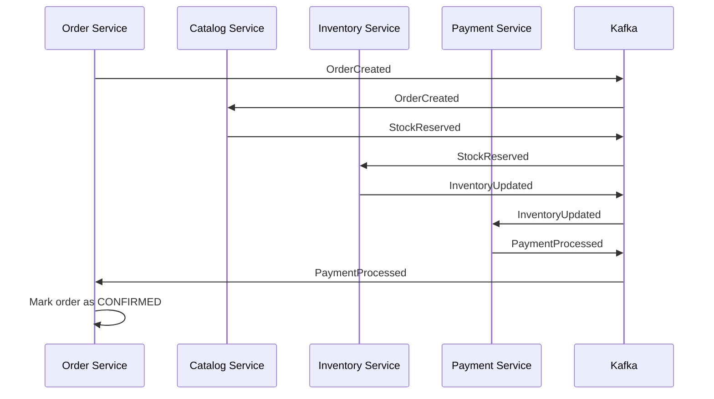
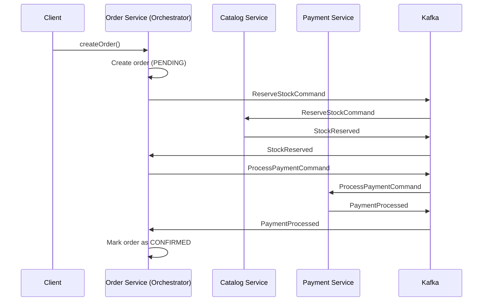

# 3. Saga Patterns: Choreography y Orchestration

## Índice

1. [El problema de transacciones distribuidas](#el-problema-de-transacciones-distribuidas)
2. [Saga Choreography (coreografada)](#saga-choreography)
3. [Saga Orchestration (orquestada)](#saga-orchestration)
4. [Comparación: Choreography vs Orchestration](#comparación)
5. [Compensating Transactions](#compensating-transactions)
6. [Implementación práctica](#implementación-práctica)

---

## El problema de transacciones distribuidas

### ACID en monolito

En una aplicación monolítica con una sola base de datos:

```java
@Transactional  // Una transacción ACID sobre toda la BD
public void checkout(Order order) {
    inventoryTable.decrementStock(order.getProductId(), order.getQuantity());
    orderTable.create(order);
    paymentTable.processPayment(order.getPaymentInfo());
    
    // Si cualquier cosa falla → ROLLBACK automático
    // O todo se confirma o nada.
}
```

**Garantía ACID**: Todo o nada.

### El desastre: microservicios distribuidos

```
Cliente → Order Service → Catalog Service → Inventory Service → Payment Service
```

Cada servicio tiene su propia BD. **No hay transacción ACID global**.

```java
// ❌ PROBLEMA: pueden quedar inconsistentes
orderService.createOrder(order);              // OK ✓
catalogService.reserveStock(product, qty);   // OK ✓
inventoryService.updateInventory(...);       // OK ✓
paymentService.processPayment(...);           // FALLA ✗

// Resultado: orden creada, stock reservado, pero pago falló
// ¿Quién revierte?
```

### ¿Por qué no usar transacciones distribuidas (2PC)?

**Two-Phase Commit (2PC)** intenta simular ACID:

```
Phase 1: Prepare
  ├─ Order Service: "¿puedo crear?"  → Sí, espera lock
  ├─ Catalog Service: "¿puedo reservar?" → Sí, espera lock
  └─ Payment Service: "¿puedo procesar?" → Sí, espera lock

Phase 2: Commit
  ├─ Order Service: Confirmar
  ├─ Catalog Service: Confirmar
  └─ Payment Service: Confirmar
```

**Problemas**:
1. ⏸️ **Bloques recursos** durante toda la transacción (locks).
2. 🔗 **Acoplamiento fuerte** entre servicios.
3. 💥 **Si uno falla**, otros pueden quedarse en limbo.
4. ⛔ **No es tan confiable** como promete.

---

## Saga Choreography

### Concepto: sin orquestador

Una **Saga Choreography** es una secuencia de **eventos locales y respuestas**. No hay coordinador central.

### Flujo

```
1. Order Service publica: OrderCreated
        ↓
2. Catalog Service escucha: OrderCreated
   - Valida stock
   - Publica: StockReserved (o ReservationFailed)
        ↓
3. Inventory Service escucha: StockReserved
   - Decrementa stock en BD
   - Publica: InventoryUpdated
        ↓
4. Payment Service escucha: InventoryUpdated
   - Procesa pago
   - Publica: PaymentProcessed (o PaymentFailed)
        ↓
5. Order Service escucha: PaymentProcessed
   - Actualiza estado de orden a CONFIRMED
```

#### Diagrama



### Implementación

```java
// ============ Order Service ============
@Service
public class OrderServiceChoreography {
    
    @Autowired
    private KafkaTemplate<String, OrderCreatedEvent> kafkaTemplate;
    
    public void createOrder(CreateOrderRequest request) {
        Order order = new Order(
            UUID.randomUUID().toString(),
            request.getCustomerId(),
            request.getProductId(),
            request.getQuantity()
        );
        
        // 1. Guardar orden en BD
        orderRepository.save(order);
        
        // 2. Publicar evento (choreography inicia)
        OrderCreatedEvent event = new OrderCreatedEvent(
            order.getId(),
            order.getCustomerId(),
            order.getProductId(),
            order.getQuantity()
        );
        kafkaTemplate.send("order-created", event);
    }
    
    // Escuchar respuestas posteriores
    @KafkaListener(topics = "payment-processed", groupId = "order-group")
    public void handlePaymentProcessed(PaymentProcessedEvent event) {
        Order order = orderRepository.findById(event.getOrderId()).orElseThrow();
        order.setStatus(OrderStatus.CONFIRMED);
        orderRepository.save(order);
    }
    
    @KafkaListener(topics = "payment-failed", groupId = "order-group")
    public void handlePaymentFailed(PaymentFailedEvent event) {
        Order order = orderRepository.findById(event.getOrderId()).orElseThrow();
        order.setStatus(OrderStatus.FAILED);
        orderRepository.save(order);
        
        // Publicar compensating transaction
        kafkaTemplate.send("order-cancellation", new OrderCancelledEvent(order.getId()));
    }
}

// ============ Catalog Service ============
@Service
public class CatalogServiceChoreography {
    
    @Autowired
    private KafkaTemplate<String, ?> kafkaTemplate;
    
    @KafkaListener(topics = "order-created", groupId = "catalog-group")
    public void handleOrderCreated(OrderCreatedEvent event) {
        try {
            // Validar stock
            int availableStock = getAvailableStock(event.getProductId());
            
            if (availableStock >= event.getQuantity()) {
                // Reservar
                reserveStock(event.getProductId(), event.getQuantity());
                
                // Publicar éxito
                kafkaTemplate.send("stock-reserved", new StockReservedEvent(
                    event.getOrderId(),
                    event.getProductId(),
                    event.getQuantity()
                ));
            } else {
                // Publicar fallo
                kafkaTemplate.send("reservation-failed", new ReservationFailedEvent(
                    event.getOrderId(),
                    "Insufficient stock"
                ));
            }
        } catch (Exception e) {
            kafkaTemplate.send("reservation-failed", new ReservationFailedEvent(
                event.getOrderId(),
                e.getMessage()
            ));
        }
    }
}

// ============ Inventory Service ============
@Service
public class InventoryServiceChoreography {
    
    @Autowired
    private KafkaTemplate<String, ?> kafkaTemplate;
    
    @KafkaListener(topics = "stock-reserved", groupId = "inventory-group")
    public void handleStockReserved(StockReservedEvent event) {
        // Actualizar inventario en BD local
        inventoryRepository.decrementStock(
            event.getProductId(),
            event.getQuantity()
        );
        
        // Publicar confirmación
        kafkaTemplate.send("inventory-updated", new InventoryUpdatedEvent(
            event.getOrderId(),
            event.getProductId()
        ));
    }
}

// ============ Payment Service ============
@Service
public class PaymentServiceChoreography {
    
    @Autowired
    private KafkaTemplate<String, ?> kafkaTemplate;
    
    @KafkaListener(topics = "inventory-updated", groupId = "payment-group")
    public void handleInventoryUpdated(InventoryUpdatedEvent event) {
        try {
            // Procesar pago
            Order order = orderRepository.findById(event.getOrderId()).orElseThrow();
            processPayment(order);
            
            // Publicar éxito
            kafkaTemplate.send("payment-processed", new PaymentProcessedEvent(
                event.getOrderId()
            ));
        } catch (Exception e) {
            // Publicar fallo
            kafkaTemplate.send("payment-failed", new PaymentFailedEvent(
                event.getOrderId(),
                e.getMessage()
            ));
        }
    }
}
```

### Ventajas

✅ **Descentralizado**: No hay punto único de fallo.  
✅ **Simple inicialmente**: Solo escuchar y publicar eventos.

### Desventajas

❌ **Difícil de seguir**: El flujo está distribuido en múltiples servicios.  
❌ **Testing complejo**: Necesitas múltiples servicios para un test.  
❌ **Ciclos de eventos**: Riesgo de loops infinitos.  
❌ **Debugging**: ¿Dónde se estancó la saga?

---

## Saga Orchestration

### Concepto: con orquestador

Una **Saga Orchestration** usa un **Orchestrator Service** central que coordina todos los pasos.

### Flujo

```
1. Cliente → Order Service: createOrder()
        ↓
2. Order Service:
   - Crear orden (PENDING)
   - Publicar: ReserveStockCommand
   - Orchestrator escucha y envía a Catalog
        ↓
3. Catalog Service:
   - Reservar stock
   - Responder: StockReserved
        ↓
4. Orchestrator (Order Service):
   - Recibe StockReserved
   - Publica: ProcessPaymentCommand
   - Envía a Payment Service
        ↓
5. Payment Service:
   - Procesar pago
   - Responder: PaymentProcessed
        ↓
6. Orchestrator:
   - Recibe PaymentProcessed
   - Actualiza orden a CONFIRMED
```

#### Diagrama



### Implementación

```java
// ============ Order Service (Orchestrator) ============
@Service
public class OrderServiceOrchestration {
    
    @Autowired
    private KafkaTemplate<String, ?> kafkaTemplate;
    
    @Autowired
    private OrderRepository orderRepository;
    
    // Iniciar saga
    public String createOrder(CreateOrderRequest request) {
        Order order = new Order(
            UUID.randomUUID().toString(),
            request.getCustomerId(),
            request.getProductId(),
            request.getQuantity(),
            OrderStatus.PENDING
        );
        orderRepository.save(order);
        
        // Iniciar orquestación: enviar ReserveStockCommand
        kafkaTemplate.send("reserve-stock-command", new ReserveStockCommand(
            order.getId(),
            request.getProductId(),
            request.getQuantity()
        ));
        
        return order.getId();
    }
    
    // Paso 2: Escuchar respuesta de Catalog
    @KafkaListener(topics = "stock-reserved-reply", groupId = "order-group")
    public void handleStockReserved(StockReservedReply reply) {
        Order order = orderRepository.findById(reply.getOrderId()).orElseThrow();
        
        // Paso 3: Enviar comando al siguiente paso (Payment)
        kafkaTemplate.send("process-payment-command", new ProcessPaymentCommand(
            reply.getOrderId(),
            order.getCustomerId(),
            order.getTotalAmount()
        ));
    }
    
    // Paso 4: Escuchar respuesta de Payment
    @KafkaListener(topics = "payment-processed-reply", groupId = "order-group")
    public void handlePaymentProcessed(PaymentProcessedReply reply) {
        Order order = orderRepository.findById(reply.getOrderId()).orElseThrow();
        
        // Orden confirmada
        order.setStatus(OrderStatus.CONFIRMED);
        orderRepository.save(order);
    }
    
    // Manejo de fallos
    @KafkaListener(topics = "stock-reservation-failed", groupId = "order-group")
    public void handleStockReservationFailed(StockReservationFailedReply reply) {
        Order order = orderRepository.findById(reply.getOrderId()).orElseThrow();
        order.setStatus(OrderStatus.FAILED);
        orderRepository.save(order);
        // No hay compensating transaction, se canceló al inicio
    }
    
    @KafkaListener(topics = "payment-failed-reply", groupId = "order-group")
    public void handlePaymentFailed(PaymentFailedReply reply) {
        Order order = orderRepository.findById(reply.getOrderId()).orElseThrow();
        
        // Reverter la reserva de stock (compensating transaction)
        kafkaTemplate.send("release-stock-command", new ReleaseStockCommand(
            reply.getOrderId(),
            order.getProductId(),
            order.getQuantity()
        ));
        
        order.setStatus(OrderStatus.FAILED);
        orderRepository.save(order);
    }
}

// ============ Catalog Service (Command Handler) ============
@Service
public class CatalogServiceOrchestrated {
    
    @Autowired
    private KafkaTemplate<String, ?> kafkaTemplate;
    
    @KafkaListener(topics = "reserve-stock-command", groupId = "catalog-group")
    public void handleReserveStockCommand(ReserveStockCommand cmd) {
        try {
            int available = getAvailableStock(cmd.getProductId());
            
            if (available >= cmd.getQuantity()) {
                // Reservar
                reserveStock(cmd.getProductId(), cmd.getQuantity());
                
                // Responder al orchestrator
                kafkaTemplate.send("stock-reserved-reply", new StockReservedReply(
                    cmd.getOrderId(),
                    cmd.getProductId(),
                    cmd.getQuantity()
                ));
            } else {
                kafkaTemplate.send("stock-reservation-failed", new StockReservationFailedReply(
                    cmd.getOrderId(),
                    "Insufficient stock"
                ));
            }
        } catch (Exception e) {
            kafkaTemplate.send("stock-reservation-failed", new StockReservationFailedReply(
                cmd.getOrderId(),
                e.getMessage()
            ));
        }
    }
    
    @KafkaListener(topics = "release-stock-command", groupId = "catalog-group")
    public void handleReleaseStockCommand(ReleaseStockCommand cmd) {
        // Compensating transaction: revertir reserva
        releaseStock(cmd.getProductId(), cmd.getQuantity());
    }
}

// ============ Payment Service (Command Handler) ============
@Service
public class PaymentServiceOrchestrated {
    
    @Autowired
    private KafkaTemplate<String, ?> kafkaTemplate;
    
    @KafkaListener(topics = "process-payment-command", groupId = "payment-group")
    public void handleProcessPaymentCommand(ProcessPaymentCommand cmd) {
        try {
            // Procesar pago
            processPayment(cmd.getCustomerId(), cmd.getAmount());
            
            // Responder al orchestrator
            kafkaTemplate.send("payment-processed-reply", new PaymentProcessedReply(
                cmd.getOrderId()
            ));
        } catch (Exception e) {
            kafkaTemplate.send("payment-failed-reply", new PaymentFailedReply(
                cmd.getOrderId(),
                e.getMessage()
            ));
        }
    }
}
```

### Ventajas

✅ **Flujo claro**: Puedes ver el orchestrator y entender toda la lógica.  
✅ **Debugging fácil**: Revisas el orchestrator.  
✅ **Manejo centralizado de fallos**: Un lugar para compensating transactions.

### Desventajas

❌ **Punto único de fallo**: Si el orchestrator cae, saga se estanca.  
❌ **Más código**: Orchestrator es más complejo.  
❌ **Acoplamiento**: Orchestrator conoce todos los pasos.

---

## Comparación

| Aspecto | Choreography | Orchestration |
|--------|-------------|----------------|
| **Coordinación** | Descentralizada (eventos) | Centralizada (orchestrator) |
| **Complejidad** | Simple inicialmente, compleja con fallos | Compleja pero predecible |
| **Debugging** | Difícil: flujo distribuido | Fácil: todo en orchestrator |
| **Testing** | Requiere todo el sistema | Más fácil mockear servicios |
| **Punto fallo** | Ninguno | Orchestrator |
| **Acoplamiento** | Bajo (eventos) | Alto (orchestrator) |

**Regla de oro**:
- **< 3 pasos**: Choreography (simple).
- **3-5 pasos**: Orchestration (control).
- **> 5 pasos**: Orchestration + timeout handling.

---

## Compensating Transactions

### Concepto: "rollback" distribuido

Si un paso falla, **reversas los pasos anteriores**:

```
Step 1: Create Order         ✓
Step 2: Reserve Stock        ✓
Step 3: Process Payment      ✗ FALLA

Compensating:
Step 2': Release Stock       ✓
Step 1': Cancel Order        ✓
```

### Implementación

```java
public class OrderServiceWithCompensation {
    
    @Transactional
    public void compensateOrder(String orderId) {
        Order order = orderRepository.findById(orderId).orElseThrow();
        
        // 1. Revertar pago
        if (order.getStatus() == OrderStatus.PAYMENT_PROCESSED) {
            paymentService.refund(order.getPaymentId());
        }
        
        // 2. Liberar stock
        if (order.getStatus() != OrderStatus.PENDING) {
            kafkaTemplate.send("release-stock-command", new ReleaseStockCommand(
                orderId,
                order.getProductId(),
                order.getQuantity()
            ));
        }
        
        // 3. Cancelar orden
        order.setStatus(OrderStatus.CANCELLED);
        orderRepository.save(order);
    }
}
```

### Idempotencia

Compensating transactions deben ser **idempotentes** (safe to retry):

```java
public void releaseStock(String productId, int quantity) {
    // ❌ NO IDEMPOTENTE: si se reintenta, resta 2x
    stock.decrementBy(quantity);
    
    // ✅ IDEMPOTENTE: verifica primero
    StockReservation reservation = reservations.findBy(productId);
    if (reservation.isActive()) {
        stock.decrementBy(quantity);
        reservation.mark(ReleaseStatus.RELEASED);
    }
}
```

---

## Resumen

| Patrón | Cuándo usar |
|--------|-----------|
| **Choreography** | Sagas simples, bajo acoplamiento. |
| **Orchestration** | Sagas complejas, lógica centralizada. |
| **Compensating** | Cualquiera, para revertir fallos. |

---

**Siguiente**: [04-transactional-outbox.md](04-transactional-outbox.md)
