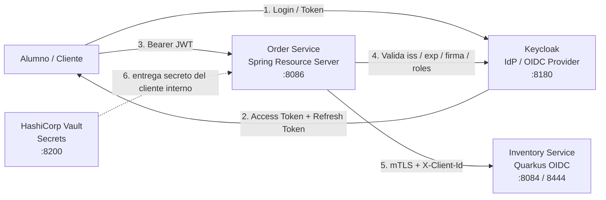
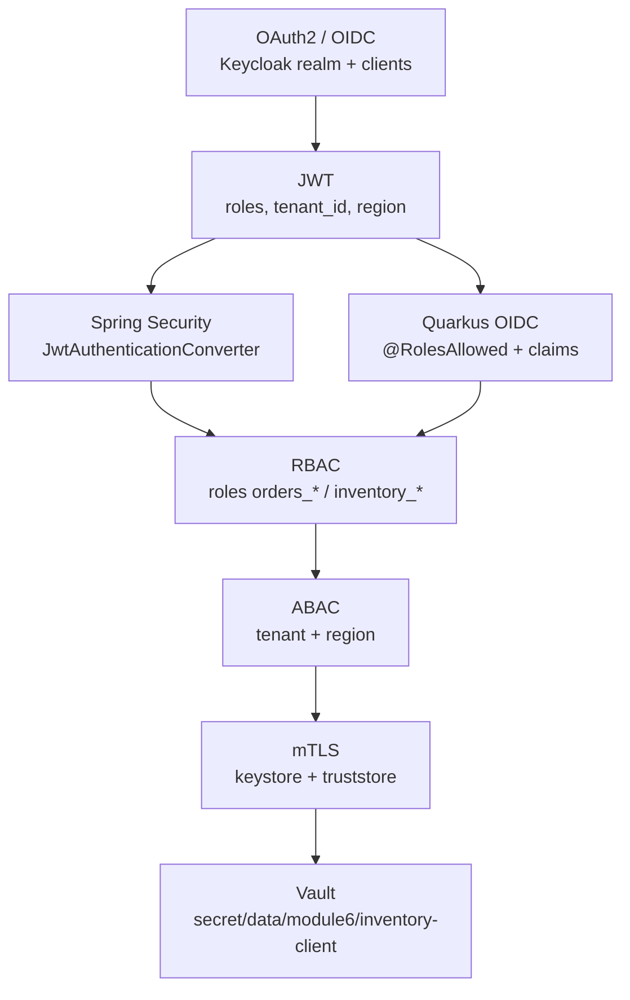

# Módulo 6 – Seguridad de Nivel Enterprise

> Curso: **Arquitectura de Microservicios Pro: Spring Boot + Quarkus en AWS y Azure**  
> JoeDayz.pe · Java 21 / Spring Boot 4 / Quarkus 3 / Keycloak / OAuth2 / OpenID Connect / mTLS / Vault

En este módulo convertimos el e-commerce del curso en una plataforma **segura por diseño**:
**Keycloak** actúa como Identity Provider, **Spring Security** y **Quarkus OIDC** validan
tokens, **RBAC + ABAC** controlan permisos finos, **mTLS** protege tráfico interno y
**HashiCorp Vault** saca los secretos del código.

## Objetivos de aprendizaje

Al terminar este módulo serás capaz de:

1. Explicar **OAuth2** y **OpenID Connect** desde cero usando Authorization Server, Resource Server y tokens.
2. Configurar **Keycloak** como Identity Provider para usuarios, roles, claims y refresh tokens.
3. Entender **JWT** por dentro: header, payload, firma, expiración, issuer y audience.
4. Proteger APIs con **Spring Security OAuth2 Resource Server**.
5. Proteger APIs con **Quarkus OIDC** y extraer claims para reglas de negocio.
6. Aplicar **RBAC** (roles) y **ABAC** (tenant y región) en el mismo flujo.
7. Asegurar llamadas internas entre microservicios con **mTLS**.
8. Externalizar secretos en **HashiCorp Vault**.

## Contenido teórico

| # | Tema | Documento |
|---|------|-----------|
| 1 | Keycloak como Identity Provider | [docs/01-keycloak-identity-provider.md](docs/01-keycloak-identity-provider.md) |
| 2 | OAuth2 y OpenID Connect desde cero | [docs/02-oauth2-openid-connect-desde-cero.md](docs/02-oauth2-openid-connect-desde-cero.md) |
| 3 | JWT: firma, validación y refresh tokens | [docs/03-jwt-firma-validacion-refresh-tokens.md](docs/03-jwt-firma-validacion-refresh-tokens.md) |
| 4 | Spring Security OAuth2 Resource Server | [docs/04-spring-security-resource-server.md](docs/04-spring-security-resource-server.md) |
| 5 | Quarkus OIDC en microservicios | [docs/05-quarkus-oidc.md](docs/05-quarkus-oidc.md) |
| 6 | mTLS + RBAC + ABAC | [docs/06-mtls-rbac-abac.md](docs/06-mtls-rbac-abac.md) |
| 7 | HashiCorp Vault para secretos | [docs/07-hashicorp-vault-secretos.md](docs/07-hashicorp-vault-secretos.md) |
| 8 | Guía didáctica paso a paso | [docs/08-guia-paso-a-paso.md](docs/08-guia-paso-a-paso.md) |

## Microservicios de código

Flujo demo: un usuario autenticado llama a **Order Service** con JWT; Spring valida el token,
aplica **RBAC + ABAC** y prepara una llamada interna por **mTLS** hacia **Inventory Service**,
mientras el identificador del cliente interno se obtiene desde **Vault**.

| Proyecto | Rol | Stack | Puerto |
|----------|-----|-------|--------|
| [order-service-spring](order-service-spring/) | Resource Server, RBAC/ABAC, cliente mTLS, lectura de secreto en Vault | Spring Boot 4 + Spring Security OAuth2 Resource Server | **8086** |
| [inventory-service-quarkus](inventory-service-quarkus/) | API protegida con OIDC, ABAC por tenant/región, endpoint interno para mTLS | Quarkus 3 + OIDC | **8084** / **8444** |

### Mapa del módulo



### Dónde se ve cada concepto



## Requisitos mínimos

- Java 21+
- Maven 3.9+
- **Podman 5+** o **Docker Desktop** (para levantar Keycloak + Vault)
- OpenSSL (lo trae macOS/Linux por defecto) para generar los certificados de mTLS
- `curl` y `jq` (opcional, para los smoke tests)

## Infraestructura local

El stack local vive en [`docker-compose/`](docker-compose/):

| Servicio | Puerto | Uso |
|----------|--------|-----|
| Keycloak | 8180 | Login, emisión y refresh de tokens |
| Vault | 8200 | Secretos para clientes internos |

Levántalo con **una** de estas dos opciones (no hace falta correr ambas):

### Opción A — Podman

```bash
cd modulo-06-seguridad-enterprise/docker-compose

# En macOS, si la VM de Podman no está corriendo:
podman machine start

podman compose up -d
podman ps --filter name=modulo6
```

### Opción B — Docker Desktop

```bash
cd modulo-06-seguridad-enterprise/docker-compose
docker compose up -d
docker ps --filter name=modulo6
```

En ambos casos deberías ver dos contenedores corriendo: `modulo6-keycloak` y `modulo6-vault`.
Verifica que responden antes de continuar:

```bash
curl -s http://localhost:8180/realms/joedayz-microservices | jq '.realm'
curl -s http://localhost:8200/v1/sys/health | jq '.initialized'
```

Para bajar el stack (con Podman o Docker, según lo que hayas usado):

```bash
podman compose down   # o: docker compose down
```

> **Nota:** Vault corre en modo `dev` (`docker-compose/docker-compose.yml`), así que los
> secretos se pierden si el contenedor se reinicia. Vuelve a correr
> `./scripts/02-vault-seed.sh` cada vez que levantes el stack de nuevo.

## Preparar certificados y secretos

Genera el material TLS:

```bash
cd modulo-06-seguridad-enterprise
./scripts/01-generate-certs.sh
```

Carga el secreto demo en Vault:

```bash
cd modulo-06-seguridad-enterprise
./scripts/02-vault-seed.sh
```

## Cómo ejecutar los servicios

```bash
cd modulo-06-seguridad-enterprise/order-service-spring
mvn spring-boot:run
```

```bash
cd modulo-06-seguridad-enterprise/inventory-service-quarkus
mvn quarkus:dev
```

Para demostrar mTLS estricto en Quarkus:

```bash
cd modulo-06-seguridad-enterprise/inventory-service-quarkus
mvn quarkus:dev -Dquarkus.profile=mtls
```

## Smoke test rápido

### 1) Script todo-en-uno: token + lectura + escritura

[`scripts/03-token-demo.sh`](scripts/03-token-demo.sh) pide el access token por vos y llama a
Order Service para mostrar RBAC + ABAC en un solo paso:

```bash
cd modulo-06-seguridad-enterprise
./scripts/03-token-demo.sh ana-reader     # lectura permitida, escritura denegada (403)
./scripts/03-token-demo.sh bruno-manager  # escritura permitida en tienda-deportes/PE
```

El script imprime los claims relevantes del JWT (`realm_access`, `tenant_id`, `region`) y el
`HTTP status` + body de cada llamada. Variables opcionales: `TENANT`, `REGION`,
`ORDER_SERVICE_URL`, `KEYCLOAK_URL`, `REALM`, `CLIENT_ID`.

### 2) Paso a paso manual (equivalente, con curl)

> **Importante:** pedí el token y usalo **en el mismo bloque/terminal**, sin cortar entre pasos.
> El `access_token` expira a los **300 segundos (5 min)**, así que si tarda en usarse o si el
> `export` se corre en una terminal distinta a la del `curl`, `ACCESS_TOKEN` queda vacío y vas
> a recibir `401` con body vacío ("no muestra nada").

Obtener el token y exportarlo en un solo paso:

```bash
export ACCESS_TOKEN=$(curl -s -X POST 'http://localhost:8180/realms/joedayz-microservices/protocol/openid-connect/token' \
  -H 'Content-Type: application/x-www-form-urlencoded' \
  -d 'grant_type=password' \
  -d 'client_id=student-portal' \
  -d 'username=ana-reader' \
  -d 'password=secret123' | jq -r '.access_token')

echo "token length: ${#ACCESS_TOKEN}"   # si da 0, algo falló arriba (revisá username/password)
```

Llamar al Resource Server de Spring (usá `-i` para ver el status aunque el body venga vacío):

```bash
curl -i -H "Authorization: Bearer ${ACCESS_TOKEN}" \
  http://localhost:8086/api/v1/tenants/tienda-deportes/orders
```

Probar RBAC + ABAC:

```bash
curl -i -X POST http://localhost:8086/api/v1/tenants/tienda-deportes/orders \
  -H "Authorization: Bearer ${ACCESS_TOKEN}" \
  -H 'Content-Type: application/json' \
  -d '{
    "sku":"ZAP-RUN-42",
    "quantity":2,
    "shippingRegion":"PE"
  }'
```

Con `ana-reader` (solo `orders_reader`) la demo debe responder `403 Forbidden` **con body vacío**:
es el comportamiento default de Spring Security, no un error. Sin `-i` no vas a ver nada en
pantalla aunque el request sí haya funcionado — por eso conviene usar siempre `-i` o `-w`.
Si en cambio te responde `401`, es que `ACCESS_TOKEN` está vacío o venció: volvé a pedirlo con
el bloque de arriba.

### 3) Explicar la llamada interna por mTLS

Este endpoint es **distinto** a los anteriores: exige `ROLE_orders_admin` (o el scope
`inventory.read`, que ningún usuario demo tiene), así que **solo `carla-admin`** puede
llamarlo. Además su `tenant_id` es `plataforma` y su `region` es `LATAM` (ABAC), así que la URL
tiene que usar esos valores — no `tienda-deportes`/`PE`.

Pedí un token de `carla-admin` y llamá al endpoint:

```bash
export ADMIN_TOKEN=$(curl -s -X POST 'http://localhost:8180/realms/joedayz-microservices/protocol/openid-connect/token' \
  -H 'Content-Type: application/x-www-form-urlencoded' \
  -d 'grant_type=password' -d 'client_id=student-portal' \
  -d 'username=carla-admin' -d 'password=secret123' | jq -r '.access_token')

curl -i -H "Authorization: Bearer ${ADMIN_TOKEN}" \
  'http://localhost:8086/api/v1/tenants/plataforma/orders/inventory-check/ZAP-RUN-42?region=LATAM'
```

Vas a ver un `200` con un **preview didáctico** (no ejecuta el GET real por defecto):

```json
{
  "tenantId": "plataforma",
  "sku": "ZAP-RUN-42",
  "region": "LATAM",
  "transport": "mTLS",
  "targetUri": "https://localhost:8444/internal/v1/tenants/plataforma/inventory/ZAP-RUN-42?region=LATAM",
  "previewMode": true,
  "clientIdSource": "local-config",
  "clientIdValue": "local-order-service",
  "clientCertificate": "../certs/order-service-client.p12",
  "trustStore": "../certs/platform-truststore.p12",
  "responseBody": "Preview didactico: habilita module6.inventory.simulate-call=false para ejecutar el GET real."
}
```

**Cómo explicarlo en clase, campo por campo:**

- `targetUri` (`https://...:8444`): el puerto TLS de Inventory Service — la llamada real
  viajaría por un canal cifrado y autenticado por certificado, no por texto plano.
- `clientCertificate` / `trustStore`: el material que `order-service-spring` usaría para
  presentar su propia identidad (`order-service-client.p12`) y validar la del otro lado
  (`platform-truststore.p12`), generados por `./scripts/01-generate-certs.sh`.
- `clientIdSource: "local-config"`: por defecto el `client-id` interno sale de
  `application.yml`. Si arrancás Order Service con `VAULT_ENABLED=true` (y corriste
  `./scripts/02-vault-seed.sh`), este campo pasa a `"vault"` y `clientIdValue` sale de
  Vault en vez de config local — así se ve la diferencia entre secreto embebido vs externo.
- `previewMode: true`: el request real hacia Inventory nunca sale; es una demo segura para
  clase. Si querés forzar el GET real (con Inventory corriendo en modo mTLS), arrancá Order
  Service con `INVENTORY_SIMULATE_CALL=false`.

> Con `ana-reader` o `bruno-manager` este mismo endpoint responde `403` (no tienen
> `orders_admin` ni el scope `inventory.read`) — es un buen momento para reforzar que RBAC
> sigue aplicando *antes* de llegar a la parte de mTLS.

## Qué demuestra cada servicio

### Order Service (Spring)

- `security/SecurityConfig.java`: activa Resource Server y enchufa el converter de roles.
- `security/RealmRoleConverter.java`: convierte `realm_access.roles` y `scope` a authorities.
- `security/TenantClaimAuthorizer.java`: aplica **ABAC** por `tenant_id`.
- `security/RegionClaimAuthorizer.java`: aplica **ABAC** por `region`.
- `client/InventoryMtlsClient.java`: prepara la llamada interna segura.
- `client/VaultSecretClient.java`: lee `client-id` desde Vault KV v2.

### Inventory Service (Quarkus)

- `api/InventoryResource.java`: protege endpoints públicos con OIDC + roles.
- `security/AccessPolicyService.java`: aplica reglas ABAC con claims del token.
- `api/InternalInventoryResource.java`: representa el endpoint interno para mTLS.
- `security/InternalClientPolicyService.java`: verifica el cliente interno esperado.

## Realm y secretos de ejemplo

- Realm export: [`docker-compose/keycloak/realm-export/joedayz-microservices-realm.json`](docker-compose/keycloak/realm-export/joedayz-microservices-realm.json)
- Política Vault: [`docker-compose/vault/policies/module6-order-service.hcl`](docker-compose/vault/policies/module6-order-service.hcl)

## Siguiente paso didáctico

La explicación completa, con historia de clase, preguntas guía y recorrido archivo por archivo,
está en [docs/08-guia-paso-a-paso.md](docs/08-guia-paso-a-paso.md).
