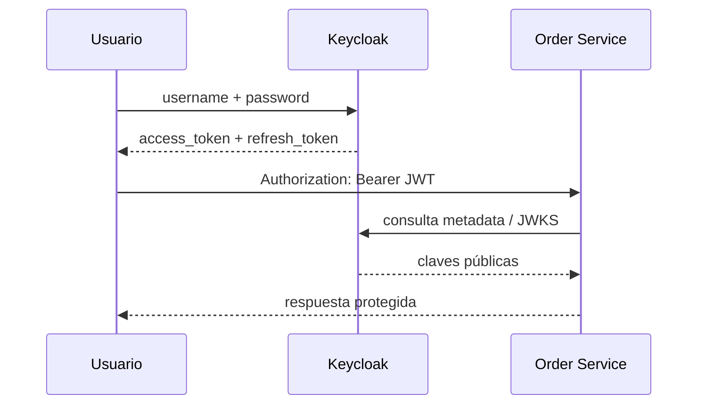

# 01. Keycloak como Identity Provider

Keycloak resuelve tres tareas que un microservicio **no debería reimplementar**:

1. autenticar usuarios;
2. emitir tokens;
3. centralizar roles, claims y sesiones.

## Qué hace en esta demo

## Ideas clave para tus alumnos

- **Identity Provider**: confirma quién es el usuario.
- **Authorization Server**: emite tokens para clientes autorizados.
- **Realm**: frontera lógica que agrupa usuarios, roles, clients y políticas.
- **Client**: aplicación que pide tokens o consume la autenticación.
- **Protocol mapper**: regla para convertir atributos del usuario en claims del token.

## Qué configuramos en el realm del módulo

| Elemento | Valor |
|----------|-------|
| Realm | `joedayz-microservices` |
| Public client | `student-portal` |
| Resource servers | `order-service`, `inventory-service` |
| Claims de negocio | `tenant_id`, `region` |
| Roles | `orders_reader`, `orders_writer`, `orders_admin`, `inventory_viewer`, `inventory_manager`, `inventory_admin` |

## Dónde verlo en el repo

- realm export: `docker-compose/keycloak/realm-export/joedayz-microservices-realm.json`
- endpoints que consumen esos claims: `order-service-spring/.../security/*`

## Mensaje didáctico

> Los microservicios no validan usuarios contra una tabla propia.  
> Confían en un proveedor de identidad estándar y se concentran en el dominio.
