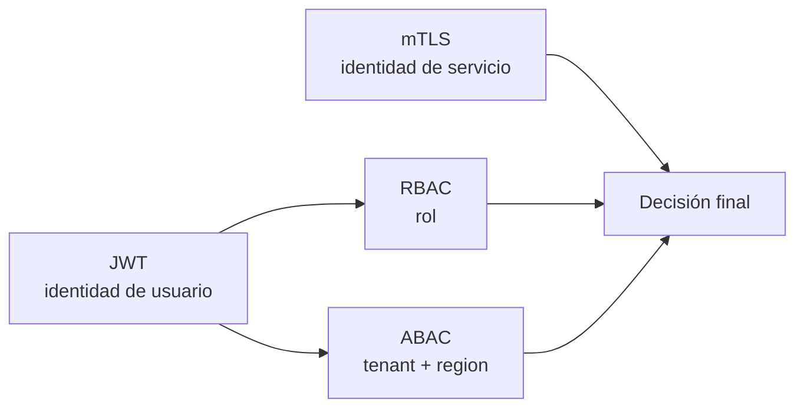

# 06. mTLS + RBAC + ABAC

## Por qué combinarlos

- **RBAC** responde: “¿qué puede hacer este rol?”
- **ABAC** responde: “¿sobre qué tenant, región o recurso puede hacerlo?”
- **mTLS** responde: “¿qué servicio está realmente al otro lado del socket?”

## Lectura correcta

No compiten. Se complementan:

## Dónde se ve en el código

- `order-service-spring/.../client/TlsMaterialLoader.java`
- `order-service-spring/.../client/InventoryMtlsClient.java`
- `inventory-service-quarkus/.../security/InternalClientPolicyService.java`

## Frase para clase

> El JWT protege la identidad del usuario.  
> El mTLS protege la identidad del microservicio.
