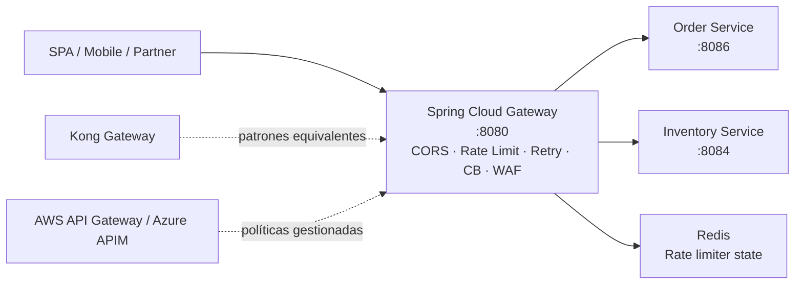

# Módulo 7 – API Gateway y Enrutamiento

> Curso: **Arquitectura de Microservicios Pro: Spring Boot + Quarkus en AWS y Azure**  
> JoeDayz.pe · Java 21 / Spring Boot 4 / Spring Cloud Gateway / Quarkus 3 / Kong / AWS API Gateway / Azure API Management

En este módulo la plataforma gana una **puerta de entrada única** para exponer y proteger los
microservicios. El foco práctico está en **Spring Cloud Gateway** como gateway ejecutable local,
mientras **Kong Gateway**, **AWS API Gateway** y **Azure API Management** quedan modelados como
equivalentes operacionales y de nube.

## Objetivos de aprendizaje

Al terminar este módulo serás capaz de:

1. Implementar **routing** centralizado hacia microservicios downstream.
2. Aplicar **filters** globales y por ruta con **Spring Cloud Gateway**.
3. Configurar **rate limiting**, **retries**, **timeouts** y **circuit breaker**.
4. Explicar **hedging** como estrategia de tráfico para requests sensibles a latencia.
5. Proteger el borde con **CORS**, **throttling** y un **WAF básico**.
6. Comparar cuándo usar **Kong Gateway**, **AWS API Gateway** y **Azure API Management**.

## Proyectos del módulo

| Proyecto | Rol | Stack | Puerto |
|----------|-----|-------|--------|
| [api-gateway-service](api-gateway-service/) | Edge gateway, routing, CORS, throttling, retries, circuit breaker, WAF básico | Spring Boot 4 + Spring Cloud Gateway + Resilience4j + Redis | **8080** |
| [inventory-service-quarkus](inventory-service-quarkus/) | Backend downstream para tráfico de inventario | Quarkus 3 + OIDC | **8084** / **8444** |
| [kong/](kong/) | Kong Gateway equivalente (DB-less) con las mismas rutas y políticas | Kong 3.7 + docker-compose | **8000** / **8001** |
| [aws-api-gateway/](aws-api-gateway/) | REST API desplegable en AWS (SAM + OpenAPI + Lambda authorizer) | AWS SAM + API Gateway + Lambda | cloud |
| [azure-apim/](azure-apim/) | Azure API Management con Bicep + policies XML | Bicep + APIM Developer SKU | cloud |

> El gateway enruta hacia el `order-service-spring` del **módulo 6** en `8086` y hacia el
> `inventory-service-quarkus` de este módulo en `8084`.

## Mapa del módulo



## Infraestructura local

El módulo reutiliza **Keycloak** y **Vault** del módulo 6, y agrega **Redis** para throttling del
gateway.

### 1) Levantar Keycloak y Vault

```bash
cd modulo-07-api-gateway-enrutamiento/docker-compose
docker compose up -d keycloak vault
```

### 2) Levantar Redis

```bash
docker run -d --name modulo7-redis -p 6379:6379 redis:7-alpine
```

## Cómo ejecutar los servicios

1. Backend de pedidos del módulo 6:

```bash
cd modulo-06-seguridad-enterprise/order-service-spring
mvn spring-boot:run
```

2. Backend de inventario del módulo 7:

```bash
cd modulo-07-api-gateway-enrutamiento/inventory-service-quarkus
mvn quarkus:dev
```

3. API Gateway:

```bash
cd modulo-07-api-gateway-enrutamiento/api-gateway-service
mvn spring-boot:run
```

## Endpoints expuestos por el gateway

- `GET /gateway/orders/api/v1/tenants/{tenantId}/orders`
- `POST /gateway/orders/api/v1/tenants/{tenantId}/orders`
- `GET /gateway/inventory/api/v1/tenants/{tenantId}/inventory`
- `GET /gateway/inventory/api/v1/tenants/{tenantId}/inventory/{sku}?region=PE`
- `POST /gateway/inventory/api/v1/tenants/{tenantId}/inventory/{sku}/reserve`
- `GET /gateway/admin/traffic-policies`

Probar las políticas de tráfico del gateway (no requiere token):

```bash
curl -i http://localhost:8080/gateway/admin/traffic-policies
```

## Qué demuestra cada capacidad

### Spring Cloud Gateway

- `application.yml`: rutas, filtros, CORS, retry, circuit breaker, rate limiter.
- `filter/CorrelationIdGatewayFilter.java`: propaga o genera `X-Correlation-Id`.
- `filter/BasicWafFilter.java`: bloquea user agents y patrones básicos de path/query.
- `filter/HedgingTrafficFilter.java`: ilustra una estrategia de **hedging** controlada por header.
- `api/FallbackController.java`: respuestas de degradación cuando abre el circuit breaker.

### Gestión del tráfico

- **Retries**: activos para `GET` con backoff exponencial.
- **Timeouts**: configurados por backend vía `Resilience4j TimeLimiter`.
- **Rate limiting / throttling**: `RequestRateLimiter` con Redis por tenant.
- **Hedging**: se activa enviando `X-Hedge-Request: true`.

### Kong / AWS / Azure

Cada gateway tiene su carpeta con **artefactos desplegables** y una guía `DEPLOY.md` didáctica (qué / por qué / hacer / verificar / troubleshooting).

| Gateway | Dónde corre | Deploy en un comando | Guía |
|---------|-------------|----------------------|------|
| **Kong Gateway** (DB-less) | 🐳 Local (Docker o Podman) | `./demo.sh up` · `.\demo.ps1 up` | [kong/DEPLOY.md](kong/DEPLOY.md) |
| **AWS API Gateway** (SAM) | ☁️ Tu cuenta AWS | `./deploy.sh deploy` · `.\deploy.ps1 deploy` | [aws-api-gateway/DEPLOY.md](aws-api-gateway/DEPLOY.md) |
| **Azure API Management** (Bicep) | ☁️ Tu subscription Azure | `./deploy.sh deploy` · `.\deploy.ps1 deploy` | [azure-apim/DEPLOY.md](azure-apim/DEPLOY.md) |

**Matriz de compatibilidad por sistema:**

| OS del alumno | Kong | AWS | Azure |
|---------------|------|-----|-------|
| macOS + Docker Desktop | `./demo.sh` | `./deploy.sh` | `./deploy.sh` |
| macOS + Podman | `./demo.sh` (auto-detecta) | `./deploy.sh` | `./deploy.sh` |
| Windows + Docker Desktop | `.\demo.ps1` o Git Bash | `.\deploy.ps1` o Git Bash | `.\deploy.ps1` o Git Bash |
| Windows + Podman Desktop | `.\demo.ps1` | `.\deploy.ps1` | `.\deploy.ps1` |
| Linux | `./demo.sh` | `./deploy.sh` | `./deploy.sh` |

Cada implementación reproduce los mismos comportamientos del Spring Cloud Gateway:

- **Kong**: `rate-limiting`, `cors`, `bot-detection`, `proxy-cache`, `correlation-id`, `jwt`.
- **AWS API Gateway**: `UsagePlan` + `Throttle`, request validators, Lambda authorizer JWT, VPC Link, gateway responses `429`/`401`, hook para WAFv2.
- **Azure APIM**: `<validate-jwt>`, `<rate-limit-by-key>`, `<cors>`, `<retry>` + fallback con `<return-response>`, `<cache-lookup>/<cache-store>`, `<rewrite-uri>`.

El endpoint `GET /gateway/admin/traffic-policies` del gateway Spring resume el mapeo en runtime.

## Smoke test rápido

Obtener un token de Keycloak para `bruno-manager` (tenant `tienda-deportes`, región `PE`):

```bash
ACCESS_TOKEN=$(curl --fail --silent --show-error \
  -X POST 'http://localhost:8180/realms/joedayz-microservices/protocol/openid-connect/token' \
  -H 'Content-Type: application/x-www-form-urlencoded' \
  -d 'grant_type=password' \
  -d 'client_id=student-portal' \
  -d 'username=bruno-manager' \
  -d 'password=secret123' | jq -r '.access_token')

test -n "$ACCESS_TOKEN" && test "$ACCESS_TOKEN" != "null" && echo "Token obtenido"
```

El comando requiere `jq`. Con `ACCESS_TOKEN` definido en la misma terminal:

```bash
curl -i -H "Authorization: Bearer $ACCESS_TOKEN" \
  http://localhost:8080/gateway/orders/api/v1/tenants/tienda-deportes/orders
```

```bash
curl -i -H "Authorization: Bearer $ACCESS_TOKEN" \
  'http://localhost:8080/gateway/inventory/api/v1/tenants/tienda-deportes/inventory/ZAP-RUN-42?region=PE'
```

Forzar hedging:

```bash
curl -i -H "Authorization: Bearer $ACCESS_TOKEN" \
  -H 'X-Hedge-Request: true' \
  'http://localhost:8080/gateway/inventory/api/v1/tenants/tienda-deportes/inventory/ZAP-RUN-42?region=PE'
```

Disparar WAF básico:

```bash
curl -i -H 'User-Agent: sqlmap/1.8' \
  http://localhost:8080/gateway/orders/api/v1/tenants/tienda-deportes/orders
```

## Demo rápida (recomendado para clase)

Para mostrar los 3 gateways en la misma sesión sin tiempos muertos:

```bash
# 1. Backends (order + inventory)
cd modulo-06-seguridad-enterprise/order-service-spring && mvn spring-boot:run &
cd modulo-07-api-gateway-enrutamiento/inventory-service-quarkus && mvn quarkus:dev &

# 2. Spring Cloud Gateway (local, :8080)
cd modulo-07-api-gateway-enrutamiento/api-gateway-service && mvn spring-boot:run &

# 3. Kong (local, :8000) - < 60s
cd modulo-07-api-gateway-enrutamiento/kong && ./demo.sh up && ./demo.sh smoke

# 4. AWS API Gateway - ~3-5 min
cd ../aws-api-gateway && ./deploy.sh deploy && ./deploy.sh test

# 5. Azure APIM - pre-aprovisionar antes (30-45 min la primera vez)
cd ../azure-apim && ./deploy.sh deploy   # solo actualiza policies si el APIM ya existe
```

## Siguiente referencia

El stack tiene ahora los 3 gateways desplegables (Kong local, AWS y Azure en la nube) más
el Spring Cloud Gateway como referencia local. Próximos pasos sugeridos: agregar
observabilidad end-to-end (OpenTelemetry) y contract testing con Pact en el borde.
