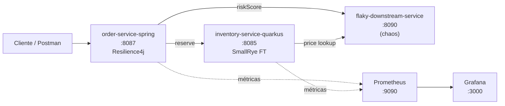

# Módulo 8 – Resiliencia: Resilience4j, Circuit Breaker y Health Checks

> Curso: **Arquitectura de Microservicios Pro: Spring Boot + Quarkus en AWS y Azure**
> JoeDayz.pe · Java 21 / Spring Boot 4 / Resilience4j / Quarkus 3 / SmallRye Fault Tolerance

En este módulo la plataforma aprende a **fallar bien**. En vez de propagar errores de un
servicio caído hacia todos los llamantes, introducimos **Circuit Breaker**, **Retry**,
**TimeLimiter**, **Bulkhead** y **Fallbacks** para contener el radio de impacto y devolver
respuestas degradadas. Además exponemos **health checks** (liveness / readiness / startup)
listos para las probes de Kubernetes.

## Objetivos de aprendizaje

Al terminar este módulo serás capaz de:

1. Explicar cuándo aplicar **Circuit Breaker** y su ciclo `CLOSED → OPEN → HALF_OPEN`.
2. Combinar **Retry + TimeLimiter + Bulkhead + CircuitBreaker + Fallback** en el orden correcto.
3. Configurar **Resilience4j** en **Spring Boot 4** con anotaciones y Actuator.
4. Configurar **SmallRye Fault Tolerance** (MicroProfile) en **Quarkus 3**.
5. Exponer **liveness**, **readiness** y **startup** probes en ambos stacks.
6. Simular fallos con un **downstream caótico** y observar la transición del CB.
7. Instrumentar métricas de resiliencia con **Micrometer / Prometheus**.

## Proyectos del módulo

| Proyecto | Rol | Stack | Puerto |
|----------|-----|-------|--------|
| [order-service-spring](order-service-spring/) | Orquesta reservas llamando a inventory y al servicio caótico. Aplica CB + Retry + TimeLimiter + Bulkhead + Fallback. | Spring Boot 4 + Resilience4j + Actuator | **8087** |
| [inventory-service-quarkus](inventory-service-quarkus/) | Valida stock y consulta precios al servicio caótico. Aplica `@CircuitBreaker`, `@Retry`, `@Timeout`, `@Bulkhead`, `@Fallback`. | Quarkus 3 + SmallRye Fault Tolerance + SmallRye Health | **8085** |
| [flaky-downstream-service](flaky-downstream-service/) | Servicio caótico configurable (fail-rate, latencia, timeout). Se usa como *pricing* y *stock-provider*. | Spring Boot 4 | **8090** |
| [docker-compose/](docker-compose/) | Prometheus + Grafana + flaky-downstream containerizado. | Docker Compose | **9090** / **3000** |
| [k8s/](k8s/) | Deployments con probes `liveness`, `readiness` y `startup`. | Kubernetes | — |
| [scripts/](scripts/) | Smoke test y escenarios de chaos. | Bash (`.sh`) + PowerShell (`.ps1`) | — |

## Mapa del módulo



## Infraestructura local

### Matriz de compatibilidad por sistema

| OS del alumno | Motor de contenedores | Comando compose | Scripts de prueba |
|---------------|----------------------|-----------------|-------------------|
| Windows + Docker Desktop | Docker | `docker compose up -d` | `.\scripts\smoke-resilience.ps1` · `.\scripts\chaos-scenarios.ps1` |
| Windows + Git Bash | Docker | `docker compose up -d` | `./scripts/smoke-resilience.sh` (requiere `jq`) |
| macOS + Docker Desktop | Docker | `docker compose up -d` | `./scripts/smoke-resilience.sh` |
| macOS + Podman | Podman | `podman compose up -d` | `./scripts/smoke-resilience.sh` |
| Linux | Docker o Podman | `docker compose` / `podman compose` | `./scripts/smoke-resilience.sh` |

> Los scripts `.sh` requieren `curl` y `jq`. Los `.ps1` solo requieren PowerShell 7+
> (`Invoke-RestMethod` incluido). En Windows: `winget install jq` si prefieres Git Bash.

### 1) Levantar el downstream caótico + observabilidad

**Windows / macOS con Docker Desktop:**

```bash
cd modulo-08-resiliencia/docker-compose
docker compose up -d
```

**macOS / Linux con Podman:**

```bash
cd modulo-08-resiliencia/docker-compose
podman compose up -d
```

> **Nota Podman:** Prometheus scrapea los servicios que corren en tu host mediante
> `host.docker.internal`. En Podman 4.7+ ese alias funciona out-of-the-box en la
> podman machine. Si tu versión no lo resuelve, edita `prometheus.yml` y reemplaza
> `host.docker.internal` por `host.containers.internal`.

Esto levanta:

- `flaky-downstream-service` en `http://localhost:8090`
- Prometheus en `http://localhost:9090`
- Grafana en `http://localhost:3000` (admin / admin)

> Alternativa sin contenedores: arrancar `flaky-downstream-service` con `mvn spring-boot:run`
> (no tendrás Prometheus/Grafana, pero todos los escenarios de CB funcionan igual).

### 2) Levantar Quarkus (`inventory-service-quarkus`)

```bash
cd modulo-08-resiliencia/inventory-service-quarkus
mvn quarkus:dev
```

### 3) Levantar Spring Boot 4 (`order-service-spring`)

```bash
cd modulo-08-resiliencia/order-service-spring
mvn spring-boot:run
```

## Endpoints clave

### order-service-spring (`:8087`)

- `POST /api/v1/orders` — crea una orden y llama a inventory + flaky.
- `GET /actuator/health/liveness`
- `GET /actuator/health/readiness`
- `GET /actuator/circuitbreakers`
- `GET /actuator/circuitbreakerevents`
- `GET /actuator/prometheus`

### inventory-service-quarkus (`:8085`)

- `POST /api/v1/inventory/reserve` — reserva stock y consulta precio al flaky.
- `GET /q/health/live`
- `GET /q/health/ready`
- `GET /q/health/started`
- `GET /q/metrics`

### flaky-downstream-service (`:8090`)

- `GET /flaky/price/{sku}` — puede fallar según config.
- `GET /flaky/risk/{orderId}` — puede fallar según config.
- `POST /flaky/config` — cambia dinámicamente el modo caótico:
  ```json
  { "failRate": 0.7, "latencyMs": 1200, "mode": "SLOW" }
  ```
- `GET /actuator/health`

## Smoke test rápido

**macOS / Linux / Git Bash (requiere `jq`):**

```bash
# Estado inicial (todo verde)
curl -s http://localhost:8087/actuator/health/readiness | jq

# Configurar el flaky para fallar 70%
curl -s -X POST http://localhost:8090/flaky/config \
  -H 'Content-Type: application/json' \
  -d '{"failRate":0.7,"latencyMs":200,"mode":"FAIL"}' | jq

# Disparar 30 requests: el CB debe abrir
for i in {1..30}; do
  curl -s -o /dev/null -w "%{http_code} " \
    -X POST http://localhost:8087/api/v1/orders \
    -H 'Content-Type: application/json' \
    -d "{\"sku\":\"ZAP-RUN-42\",\"qty\":1,\"orderId\":\"O-$i\"}"
done
echo

# Ver estado del Circuit Breaker
curl -s http://localhost:8087/actuator/circuitbreakers | jq
curl -s http://localhost:8087/actuator/health/readiness | jq

# Restaurar
curl -s -X POST http://localhost:8090/flaky/config \
  -H 'Content-Type: application/json' \
  -d '{"failRate":0.0,"latencyMs":50,"mode":"OK"}' | jq
```

**Windows (PowerShell 7+):**

```powershell
# Estado inicial (todo verde)
Invoke-RestMethod http://localhost:8087/actuator/health/readiness | ConvertTo-Json -Depth 5

# Configurar el flaky para fallar 70%
Invoke-RestMethod -Method Post http://localhost:8090/flaky/config `
  -ContentType 'application/json' `
  -Body '{"failRate":0.7,"latencyMs":200,"mode":"FAIL"}'

# Disparar 30 requests: el CB debe abrir
1..30 | ForEach-Object {
  $r = Invoke-WebRequest -Method Post http://localhost:8087/api/v1/orders `
    -ContentType 'application/json' `
    -Body ("{{`"orderId`":`"O-{0}`",`"sku`":`"ZAP-RUN-42`",`"qty`":1}}" -f $_) `
    -SkipHttpErrorCheck
  Write-Host -NoNewline "$($r.StatusCode) "
}

# Ver estado del Circuit Breaker
Invoke-RestMethod http://localhost:8087/actuator/circuitbreakers | ConvertTo-Json -Depth 6

# Restaurar
Invoke-RestMethod -Method Post http://localhost:8090/flaky/config `
  -ContentType 'application/json' `
  -Body '{"failRate":0.0,"latencyMs":50,"mode":"OK"}'
```

### Scripts automatizados

| Script | macOS / Linux / Git Bash | Windows PowerShell |
|--------|--------------------------|--------------------|
| Demo completa del ciclo `CLOSED → OPEN → HALF_OPEN → CLOSED` | [`scripts/smoke-resilience.sh`](scripts/smoke-resilience.sh) | [`scripts/smoke-resilience.ps1`](scripts/smoke-resilience.ps1) |
| Cambiar escenario de chaos (`ok`, `fail30`, `fail70`, `slow`, `timeout`, `status`) | [`scripts/chaos-scenarios.sh`](scripts/chaos-scenarios.sh) | [`scripts/chaos-scenarios.ps1`](scripts/chaos-scenarios.ps1) |

```bash
# macOS / Linux
./scripts/smoke-resilience.sh
./scripts/chaos-scenarios.sh fail70
```

```powershell
# Windows
.\scripts\smoke-resilience.ps1
.\scripts\chaos-scenarios.ps1 fail70
```

> Si PowerShell bloquea la ejecución: `Set-ExecutionPolicy -Scope Process Bypass` y reintentar.

## Documentación teórica

- [01-fundamentos-resiliencia.md](docs/01-fundamentos-resiliencia.md)
- [02-resilience4j-core.md](docs/02-resilience4j-core.md)
- [03-circuit-breaker-patterns.md](docs/03-circuit-breaker-patterns.md)
- [04-health-checks-k8s.md](docs/04-health-checks-k8s.md)
- [05-quarkus-smallrye-fault-tolerance.md](docs/05-quarkus-smallrye-fault-tolerance.md)
- [06-spring-boot4-resilience4j.md](docs/06-spring-boot4-resilience4j.md)
- [07-observabilidad-resiliencia.md](docs/07-observabilidad-resiliencia.md)

## Siguiente referencia

Con la plataforma ya resistente a fallos, el [módulo 9](../modulo-09-observabilidad/)
instrumenta **este mismo checkout** con OpenTelemetry, Prometheus, Grafana, Tempo y Loki.

