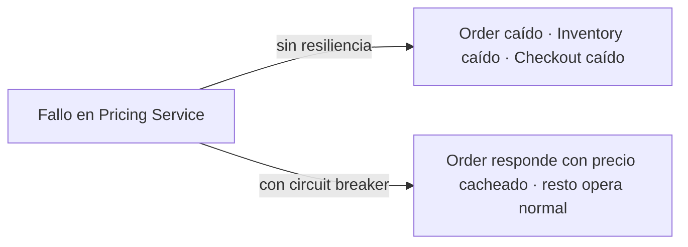

# 01 · Fundamentos de resiliencia en sistemas distribuidos

> "Todo lo que puede fallar, fallará. Y en un microservicio, muchas cosas pueden fallar."

## Por qué necesitamos resiliencia

En un monolito, una llamada a un método es prácticamente infalible: mismo proceso, misma memoria, mismo hilo. En una arquitectura de microservicios cada llamada cruza:

- una **red** (paquetes perdidos, latencia variable, particiones),
- un **kernel** (buffers, TCP resets),
- un **proceso remoto** (GC pauses, deadlocks, OOM),
- una **base de datos** compartida,
- infraestructura de nube (nodos que se reciclan, DNS que tarda).

Cada uno de esos eslabones puede fallar de forma independiente. Sin resiliencia, un único servicio caído propaga fallos en cascada hasta tirar toda la plataforma.

## Las 8 falacias de la computación distribuida

Peter Deutsch y James Gosling las formularon hace más de 30 años y siguen vigentes:

1. La red es confiable.
2. La latencia es cero.
3. El ancho de banda es infinito.
4. La red es segura.
5. La topología no cambia.
6. Hay un solo administrador.
7. El costo del transporte es cero.
8. La red es homogénea.

Cada patrón de resiliencia que verás en este módulo (timeouts, retries, circuit breakers, bulkheads) es una respuesta directa a alguna de estas falacias.

## Disponibilidad vs resiliencia

| Concepto | Definición | Ejemplo |
|---------|-----------|---------|
| **Disponibilidad** | % de tiempo que el sistema responde correctamente. | 99.95% SLA |
| **Resiliencia** | Capacidad de **degradarse con gracia** cuando algo falla. | Devolver un precio cacheado si el pricing service muere. |

Un sistema puede tener 99.9% de disponibilidad y ser **frágil** (una caída lo tira 12 horas) o 99.5% y ser **resiliente** (falla parcial durante 5 minutos, se recupera solo).

## Blast radius y aislamiento

El **radio de impacto** (blast radius) es cuánto de tu sistema se ve afectado por un fallo. Los patrones de resiliencia buscan **reducir** ese radio:

## Presupuesto de latencia (latency budget)

Cada endpoint público tiene un **budget** total (por ejemplo, 500 ms para POST `/orders`). Ese budget se reparte entre todos los downstreams. Si `pricing` puede tardar hasta 200 ms, el `TimeLimiter` debe cortarlo a 200 ms, no a 5 s.

Regla práctica: **el timeout de un cliente siempre menor que el timeout del llamante upstream**.

## Los 5 patrones fundamentales

| Patrón | Problema que resuelve |
|--------|-----------------------|
| **Timeout** | El downstream no responde. |
| **Retry** | Fallo transitorio (paquete perdido, nodo reiniciando). |
| **Circuit Breaker** | El downstream está caído: dejo de gastar recursos en él. |
| **Bulkhead** | Un downstream lento consume todos mis hilos. |
| **Fallback** | Necesito una respuesta degradada pero válida. |

En este módulo los implementaremos con:

- **Spring Boot 4** → Resilience4j
- **Quarkus 3** → SmallRye Fault Tolerance (implementación de MicroProfile)

## Antipatrones frecuentes

- **Retry sin backoff**: cuando el downstream está estresado, retries amplifican el problema (retry storm).
- **Timeout > timeout del llamante**: garantiza thread starvation.
- **CircuitBreaker sin fallback**: convierte 5xx en 5xx. No agrega valor.
- **Liveness probe que depende de la base de datos**: reinicia el pod cuando la BD tiene un blip → sube toda la plataforma a la vez.
- **Retry sobre operaciones no idempotentes** (POST que crea recurso): duplica cargos, órdenes, envíos.

## Siguiente lectura

→ [02-resilience4j-core.md](02-resilience4j-core.md) — la librería que cubre estos patrones para el ecosistema Spring/Java.

