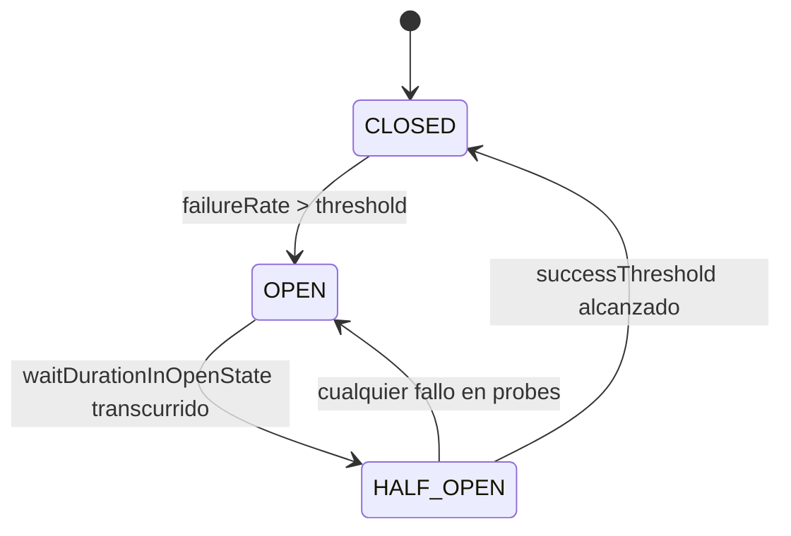

# 03 · Circuit Breaker: estados, transiciones y tuning

## Los tres estados canónicos



| Estado | Comportamiento |
|--------|----------------|
| `CLOSED` | Tráfico normal. Se registran resultados en la sliding window. |
| `OPEN` | **Rechaza inmediatamente** con `CallNotPermittedException`. No gasta recursos. |
| `HALF_OPEN` | Deja pasar un número limitado de "probes" para ver si el downstream se recuperó. |

Resilience4j añade dos estados adicionales:

- `DISABLED`: se ignoran los resultados, todo pasa.
- `FORCED_OPEN`: rechaza todo, ignora resultados. Útil para mantenimiento.

## Cuándo abre el circuit breaker

Solo cuando se cumplen **todas** estas condiciones:

1. `slidingWindow` tiene al menos `minimumNumberOfCalls` registradas.
2. `failureRateThreshold` o `slowCallRateThreshold` fue superado.

Antes de eso, todas las llamadas son permitidas aunque estén fallando (el CB necesita datos para decidir).

## Tuning: valores de partida

| Parámetro | Servicio crítico | Servicio no crítico |
|-----------|------------------|---------------------|
| `failureRateThreshold` | 50% | 30% |
| `slowCallRateThreshold` | 60% | 40% |
| `slowCallDurationThreshold` | 800 ms | 500 ms |
| `waitDurationInOpenState` | 10 s | 30 s |
| `permittedNumberOfCallsInHalfOpenState` | 5 | 3 |
| `slidingWindowSize` | 20 (count) o 10 s (time) | 50 |

**Regla de oro**: `waitDurationInOpenState` debe ser mayor que el tiempo típico de recuperación del downstream. Si abres en 10 s y el downstream reinicia en 30 s, entrarás en un ciclo de `OPEN → HALF_OPEN → OPEN` permanente.

## Automatic transition to HALF_OPEN

```yaml
automaticTransitionFromOpenToHalfOpenEnabled: true
```

Sin este flag, el CB solo evalúa si pasó al estado `HALF_OPEN` **cuando llega una request**. En servicios de bajo tráfico esto puede dejar el CB en `OPEN` para siempre. Con el flag, un scheduler interno hace la transición.

Trade-off: consume un hilo scheduler por instancia. Aceptable salvo que tengas cientos de CBs.

## Qué exceptions deberían abrir el CB

**Sí** cuentan como fallo:
- `IOException`, `SocketTimeoutException`, `TimeoutException`
- `WebClientResponseException.ServiceUnavailable` (503), `.GatewayTimeout` (504)
- `RestClientResponseException` con status 5xx

**No** cuentan como fallo:
- `HttpClientErrorException` con status 4xx (culpa del cliente, no del downstream)
- `IllegalArgumentException`, `IllegalStateException` (bugs propios)

Se controla con:

```yaml
recordExceptions:
  - java.io.IOException
  - java.util.concurrent.TimeoutException
ignoreExceptions:
  - org.springframework.web.client.HttpClientErrorException
```

## Cuándo NO usar Circuit Breaker

- **Operaciones idempotentes en caché local**: el CB agrega latencia y complejidad sin beneficio.
- **Batch jobs offline**: no hay usuario esperando; deja que reintentos naturales resuelvan.
- **Downstream que ya tiene rate limiting robusto**: el rate limiter ya te protege.
- **Servicios internos en el mismo pod**: si están juntos, o ambos viven o ambos mueren.

## Antipatrones

### 1. Un CB global compartido

```java
@CircuitBreaker(name = "external", fallbackMethod = "fallback")
public X callInventory() {...}

@CircuitBreaker(name = "external", fallbackMethod = "fallback")
public Y callPricing() {...}
```

Si `pricing` cae, también corta `inventory`. **Un CB por downstream**.

### 2. Fallback que llama a otro downstream

Si el fallback también puede fallar y no tiene su propio CB, replicaste el problema.

### 3. Fallback que lanza excepción

El propósito del fallback es devolver algo válido. Si lanza, el llamante ve un 5xx y el CB perdió su valor.

### 4. Circuit Breaker sin métricas

Sin visibilidad (`/actuator/circuitbreakers` + Prometheus), no sabes cuándo abrió, cuánto tiempo estuvo abierto, ni si tu tuning es correcto.

## Siguiente lectura

→ [04-health-checks-k8s.md](04-health-checks-k8s.md)

