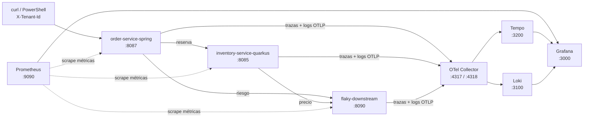

# Módulo 9 – Workshop de observabilidad

> **OpenTelemetry · Prometheus · Grafana · Tempo · Loki**
>
> Java 21 · Spring Boot 4 · Quarkus 3

Este workshop observa la misma plataforma e-commerce multi-tenant que construimos
desde el módulo 1. No es una aplicación nueva:

```text
Cliente
  └─ order-service-spring :8087
       ├─ inventory-service-quarkus :8085
       │    └─ flaky-downstream :8090 (pricing)
       └─ flaky-downstream :8090 (risk)
```

Al finalizar habrás seguido una orden por los tres pilares:

1. **Métricas:** Prometheus y el dashboard de Grafana.
2. **Trazas:** OpenTelemetry y Tempo.
3. **Logs:** OpenTelemetry y Loki.

Después provocarás un fallo en pricing/risk y compararás la orden sana con una
orden degradada por los circuit breakers del módulo 8.

## Arquitectura del laboratorio



El `flaky-downstream`, OpenTelemetry Collector, Prometheus, Tempo, Loki y
Grafana corren en contenedores. Order e inventory corren con Maven en el host,
para poder inspeccionar y modificar su código durante el workshop.

## 0. Prerrequisitos

Necesitas:

- JDK 21 o superior: `java -version`.
- Maven 3.9 o superior: `mvn -version`.
- Docker Desktop en Windows/macOS, o Docker/Podman en Linux.
- Puertos libres: `3000`, `3100`, `3200`, `4317`, `4318`, `8085`, `8087`,
  `8090` y `9090`.
- En macOS/Linux/Git Bash: `curl` y `jq`.
- En Windows: PowerShell 7+ (`pwsh`).

Ejecuta todos los comandos desde la raíz del repositorio
`microservicios-2026`, salvo que el paso indique otra terminal.

### Comprobar herramientas

**macOS / Linux / Git Bash**

```bash
java -version
mvn -version
docker version
docker compose version
curl --version
jq --version
```

**Windows PowerShell**

```powershell
java -version
mvn -version
docker version
docker compose version
$PSVersionTable.PSVersion
```

> Con Podman sustituye `docker compose` por `podman compose`. Si Prometheus no
> puede alcanzar los servicios del host, cambia `host.docker.internal` por
> `host.containers.internal` en
> [`docker-compose/prometheus.yml`](docker-compose/prometheus.yml).

## 1. Levantar la infraestructura

Abre la **Terminal 1**.

**Windows, macOS y Linux con Docker**

```bash
cd modulo-09-observabilidad/docker-compose
docker compose up -d --build
docker compose ps
```

**macOS o Linux con Podman**

```bash
cd modulo-09-observabilidad/docker-compose
podman compose up -d --build
podman compose ps
```

Debes ver estos contenedores:

- `modulo9-flaky`
- `modulo9-otel-collector`
- `modulo9-tempo`
- `modulo9-loki`
- `modulo9-prometheus`
- `modulo9-grafana`

Tempo y Loki pueden responder `waiting for 15s` durante sus primeros segundos.
Eso es normal.

### Verificar la infraestructura

**macOS / Linux / Git Bash**

```bash
curl -sS http://localhost:8090/actuator/health | jq
curl -sS http://localhost:9090/-/ready
curl -sS http://localhost:3200/status | jq
curl -sS http://localhost:3100/ready
curl -sS http://localhost:3000/api/health | jq
```

**Windows PowerShell**

```powershell
Invoke-RestMethod http://localhost:8090/actuator/health | ConvertTo-Json
Invoke-RestMethod http://localhost:9090/-/ready
Invoke-RestMethod http://localhost:3200/status | ConvertTo-Json -Depth 4
Invoke-RestMethod http://localhost:3100/ready
Invoke-RestMethod http://localhost:3000/api/health | ConvertTo-Json
```

Resultados esperados:

- Flaky devuelve `"status": "UP"`.
- Prometheus devuelve `Prometheus Server is Ready`.
- Grafana devuelve `"database": "ok"`.
- Loki devuelve `ready`; si todavía está calentando, repite ese comando.

## 2. Levantar inventory-service-quarkus

Abre la **Terminal 2** y déjala ejecutándose:

```bash
cd modulo-09-observabilidad/inventory-service-quarkus
mvn quarkus:dev
```

Comprueba el servicio desde otra terminal.

**macOS / Linux / Git Bash**

```bash
curl -sS http://localhost:8085/q/health/live | jq
curl -sS http://localhost:8085/q/health/ready | jq
```

**Windows PowerShell**

```powershell
Invoke-RestMethod http://localhost:8085/q/health/live | ConvertTo-Json -Depth 5
Invoke-RestMethod http://localhost:8085/q/health/ready | ConvertTo-Json -Depth 5
```

Ambos deben mostrar `UP`.

## 3. Levantar order-service-spring

Abre la **Terminal 3** y déjala ejecutándose:

```bash
cd modulo-09-observabilidad/order-service-spring
mvn spring-boot:run
```

Comprueba readiness.

**macOS / Linux / Git Bash**

```bash
curl -sS http://localhost:8087/actuator/health/readiness | jq
```

**Windows PowerShell**

```powershell
Invoke-RestMethod http://localhost:8087/actuator/health/readiness |
  ConvertTo-Json -Depth 6
```

El estado esperado es `UP`.

## 4. Dejar el downstream en estado sano

Este endpoint cambia el comportamiento de pricing y risk sin reiniciar el
contenedor.

**macOS / Linux / Git Bash**

```bash
curl -sS -X POST http://localhost:8090/flaky/config \
  -H 'Content-Type: application/json' \
  -d '{"failRate":0.0,"latencyMs":50,"mode":"OK"}' | jq
```

**Windows PowerShell**

```powershell
Invoke-RestMethod -Method Post http://localhost:8090/flaky/config `
  -ContentType 'application/json' `
  -Body '{"failRate":0.0,"latencyMs":50,"mode":"OK"}'
```

La respuesta debe contener `mode: OK` y `failRate: 0`.

## 5. Crear la primera orden y guardar su traceId

El tenant `tienda-deportes` entra en `X-Tenant-Id`. Order lo propaga a inventory
y flaky como header y como baggage de OpenTelemetry.

### macOS / Linux / Git Bash

```bash
ORDER=$(curl -sS -X POST http://localhost:8087/api/v1/orders \
  -H 'Content-Type: application/json' \
  -H 'X-Tenant-Id: tienda-deportes' \
  -d '{"orderId":"O-WORKSHOP-001","sku":"ZAP-RUN-42","qty":1}')

echo "$ORDER" | jq
TRACE_ID=$(echo "$ORDER" | jq -r '.traceId')
echo "TRACE_ID=$TRACE_ID"
```

### Windows PowerShell

```powershell
$Order = Invoke-RestMethod -Method Post http://localhost:8087/api/v1/orders `
  -ContentType 'application/json' `
  -Headers @{ 'X-Tenant-Id' = 'tienda-deportes' } `
  -Body '{"orderId":"O-WORKSHOP-001","sku":"ZAP-RUN-42","qty":1}'

$Order | ConvertTo-Json -Depth 6
$TraceId = $Order.traceId
Write-Host "TRACE_ID=$TraceId"
```

Comprueba estos campos:

```json
{
  "status": "CONFIRMED",
  "degradation": "NONE",
  "tenantId": "tienda-deportes",
  "traceId": "32 caracteres hexadecimales"
}
```

No cierres esta terminal: usarás `TRACE_ID` o `$TraceId` en los siguientes pasos.

### Punto de código: dónde nace la observación

Revisa [`OrderService.java`](order-service-spring/src/main/java/pe/joedayz/microservicios/observability/order/service/OrderService.java):

- `order.place` crea el span de negocio.
- `order.id`, `sku` y `tenant.id` son atributos de alta cardinalidad para la traza.
- `orders.placed` usa solo `status` y `degradation` como labels de baja cardinalidad.
- El `traceId` se incluye en la respuesta para localizar la orden sin buscar en logs.

Esta separación es deliberada: poner `orderId` o `tenantId` como label de
Prometheus crearía una serie temporal por orden o tenant.

## 6. Workshop web: Prometheus

Abre [http://localhost:9090](http://localhost:9090).

### 6.1 Comprobar los targets

1. Ve a **Status → Targets**.
2. Debes ver `order-service-spring`, `inventory-service-quarkus` y
   `flaky-downstream-service`.
3. Los tres deben estar en estado **UP**.

Si order o inventory aparecen `DOWN`, confirma que las terminales 2 y 3 siguen
ejecutándose. Prometheus corre en Docker y los alcanza mediante
`host.docker.internal`.

### 6.2 Ejecutar consultas PromQL

Ve a **Graph**, pega cada consulta y pulsa **Execute**:

```promql
up
```

```promql
orders_placed_total
```

```promql
sum by (job) (
  rate(http_server_requests_seconds_count{uri!~"/actuator.*|/q/.*"}[1m])
)
```

```promql
resilience4j_circuitbreaker_state
```

Qué debes interpretar:

- `up == 1`: Prometheus puede scrapear el servicio.
- `orders_placed_total`: contador de negocio creado en order.
- `rate(...)`: tráfico por servicio, excluyendo probes y endpoints de métricas.
- El circuit breaker activo tiene valor `1` en un solo estado (`closed`, `open`
  o `half_open`).

### Punto de código: por qué las métricas no van por OTLP

Revisa:

- [`order/application.yml`](order-service-spring/src/main/resources/application.yml):
  `management.otlp.metrics.export.enabled=false`.
- [`inventory/application.properties`](inventory-service-quarkus/src/main/resources/application.properties):
  `quarkus.otel.metrics.enabled=false`.
- [`prometheus.yml`](docker-compose/prometheus.yml): Prometheus hace pull de
  `/actuator/prometheus` y `/q/metrics`.

Las trazas y logs usan OTLP; las métricas mantienen el modelo pull de Prometheus.

## 7. Workshop web: dashboard de Grafana

Abre [http://localhost:3000](http://localhost:3000).

- Usuario: `admin`
- Contraseña: `admin`
- El acceso anónimo también está habilitado como Editor.

Antes de abrir el dashboard, genera tráfico para que los gráficos tengan datos.

**macOS / Linux / Git Bash**

```bash
for i in $(seq 2 15); do
  curl -sS -o /dev/null -X POST http://localhost:8087/api/v1/orders \
    -H 'Content-Type: application/json' \
    -H 'X-Tenant-Id: tienda-deportes' \
    -d "{\"orderId\":\"O-WORKSHOP-$i\",\"sku\":\"ZAP-RUN-42\",\"qty\":1}"
done
```

**Windows PowerShell**

```powershell
2..15 | ForEach-Object {
  Invoke-RestMethod -Method Post http://localhost:8087/api/v1/orders `
    -ContentType 'application/json' `
    -Headers @{ 'X-Tenant-Id' = 'tienda-deportes' } `
    -Body "{`"orderId`":`"O-WORKSHOP-$_`",`"sku`":`"ZAP-RUN-42`",`"qty`":1}" |
    Out-Null
}
```

En Grafana:

1. Ve a **Dashboards**.
2. Abre la carpeta **Modulo 09**.
3. Abre **E-commerce · checkout observable**.
4. Selecciona el rango **Last 15 minutes**.
5. Comprueba:
   - requests por servicio;
   - latencia p95;
   - circuit breakers abiertos;
   - órdenes por estado y degradación.

El dashboard se provisiona desde
[`grafana/dashboards/ecommerce.json`](docker-compose/grafana/dashboards/ecommerce.json).

## 8. Workshop web: encontrar la traza en Tempo

Tempo no tiene una interfaz separada en este laboratorio. Se consulta desde
Grafana.

1. En Grafana, abre **Explore** (icono de brújula).
2. Selecciona el datasource **Tempo**.
3. En el tipo de consulta selecciona **Trace ID**.
4. Pega el valor de `TRACE_ID` o `$TraceId`.
5. Ejecuta la consulta.

Debes ver una cascada con este recorrido:

```text
order-service-spring
└─ POST /api/v1/orders
   └─ order.place
      ├─ POST inventory-service /api/v1/inventory/reserve
      │  └─ GET flaky-downstream /flaky/price/ZAP-RUN-42
      └─ GET flaky-downstream /flaky/risk/O-WORKSHOP-001
```

Selecciona el span `order.place` y busca:

- `order.id = O-WORKSHOP-001`
- `tenant.id = tienda-deportes`
- `sku = ZAP-RUN-42`

Selecciona spans de inventory y flaky. Todos deben compartir el mismo
`traceId`, pero tener `spanId` distintos.

### Alternativa por API

**macOS / Linux / Git Bash**

```bash
curl -sS "http://localhost:3200/api/traces/$TRACE_ID" | jq
```

**Windows PowerShell**

```powershell
Invoke-RestMethod "http://localhost:3200/api/traces/$TraceId" |
  ConvertTo-Json -Depth 20
```

### Punto de código: cómo no se rompe la traza

Revisa:

- [`RestClientConfig.java`](order-service-spring/src/main/java/pe/joedayz/microservicios/observability/order/config/RestClientConfig.java):
  usa el `RestClient.Builder` auto-configurado por Spring. Ese builder inyecta
  `traceparent`.
- [`InventoryClient.java`](order-service-spring/src/main/java/pe/joedayz/microservicios/observability/order/client/InventoryClient.java)
  y [`RiskClient.java`](order-service-spring/src/main/java/pe/joedayz/microservicios/observability/order/client/RiskClient.java):
  capturan un `ContextSnapshot` antes del fan-out y restauran el contexto dentro
  de cada virtual thread.

Si se usara `RestClient.builder()` directamente o no se restaurara el contexto,
Tempo mostraría varias trazas desconectadas en vez de una sola orden.

## 9. Workshop web: consultar los logs en Loki

1. En Grafana abre **Explore**.
2. Selecciona el datasource **Loki**.
3. Cambia el editor a **Code**.
4. Pega la consulta correspondiente y pulsa **Run query**.

Logs de order:

```logql
{service_name="order-service-spring"}
```

Solo los logs de la primera orden:

```logql
{service_name="order-service-spring"} | trace_id="<PEGA_AQUI_EL_TRACE_ID>"
```

Logs del flujo en los tres servicios:

```logql
{service_name=~"order-service-spring|inventory-service-quarkus|flaky-downstream-service"}
```

Busca estas líneas:

- order: `orden colocada orderId=O-WORKSHOP-001`
- inventory: `reserva orderId=O-WORKSHOP-001`
- flaky: `price sku=ZAP-RUN-42` y `risk orderId=O-WORKSHOP-001`

Desde la traza de Tempo también puedes elegir **Logs for this span**. Grafana
usa la correlación declarada en
[`grafana/datasources.yml`](docker-compose/grafana/datasources.yml) para abrir
Loki con el mismo trace ID y la misma ventana temporal.

### Punto de código: traceId y tenant en cada log

Revisa:

- [`logback-spring.xml`](order-service-spring/src/main/resources/logback-spring.xml):
  imprime `traceId`, `spanId` y `tenant.id`, y registra el appender OTLP.
- [`OpenTelemetryAppenderInitializer.java`](order-service-spring/src/main/java/pe/joedayz/microservicios/observability/order/config/OpenTelemetryAppenderInitializer.java):
  conecta el appender de Logback con el SDK de OpenTelemetry.
- [`TenantContextFilter.java`](order-service-spring/src/main/java/pe/joedayz/microservicios/observability/order/web/TenantContextFilter.java):
  convierte `X-Tenant-Id` en baggage y atributo del span.
- [`inventory/TenantContextFilter.java`](inventory-service-quarkus/src/main/java/pe/joedayz/microservicios/observability/inventory/web/TenantContextFilter.java):
  recupera ese tenant en Quarkus.

## 10. Seguir las señales dentro del Collector

El Collector no tiene una UI web en este workshop. Su configuración es la parte
importante:

1. Abre [`otel-collector.yaml`](docker-compose/otel-collector.yaml).
2. Identifica el receiver OTLP en `4317` y `4318`.
3. Sigue el pipeline `traces`: OTLP → resource/batch → Tempo.
4. Sigue el pipeline `logs`: OTLP → resource/batch → Loki.
5. Observa que no existe pipeline de métricas.

Para revisar su ejecución:

```bash
cd modulo-09-observabilidad/docker-compose
docker compose logs otel-collector
```

En PowerShell el comando es el mismo. Con Podman usa
`podman compose logs otel-collector`.

## 11. Escenario de fallo: comparar una orden degradada

Ahora el downstream fallará el 100 % de las veces. Esto permite abrir los
circuit breakers y ver cómo cambia cada señal.

### 11.1 Activar el fallo

**macOS / Linux / Git Bash**

```bash
curl -sS -X POST http://localhost:8090/flaky/config \
  -H 'Content-Type: application/json' \
  -d '{"failRate":1.0,"latencyMs":50,"mode":"FAIL"}' | jq
```

**Windows PowerShell**

```powershell
Invoke-RestMethod -Method Post http://localhost:8090/flaky/config `
  -ContentType 'application/json' `
  -Body '{"failRate":1.0,"latencyMs":50,"mode":"FAIL"}'
```

### 11.2 Enviar solicitudes para abrir los breakers

**macOS / Linux / Git Bash**

```bash
for i in $(seq 1 15); do
  curl -sS -o /dev/null -X POST http://localhost:8087/api/v1/orders \
    -H 'Content-Type: application/json' \
    -H 'X-Tenant-Id: tienda-deportes' \
    -d "{\"orderId\":\"O-FAIL-$i\",\"sku\":\"ZAP-RUN-42\",\"qty\":1}"
done
```

**Windows PowerShell**

```powershell
1..15 | ForEach-Object {
  Invoke-RestMethod -Method Post http://localhost:8087/api/v1/orders `
    -ContentType 'application/json' `
    -Headers @{ 'X-Tenant-Id' = 'tienda-deportes' } `
    -Body "{`"orderId`":`"O-FAIL-$_`",`"sku`":`"ZAP-RUN-42`",`"qty`":1}" |
    Out-Null
}
```

### 11.3 Crear y guardar una orden degradada

**macOS / Linux / Git Bash**

```bash
FAILED_ORDER=$(curl -sS -X POST http://localhost:8087/api/v1/orders \
  -H 'Content-Type: application/json' \
  -H 'X-Tenant-Id: tienda-deportes' \
  -d '{"orderId":"O-DEGRADED-001","sku":"ZAP-RUN-42","qty":1}')

echo "$FAILED_ORDER" | jq
FAILED_TRACE_ID=$(echo "$FAILED_ORDER" | jq -r '.traceId')
echo "FAILED_TRACE_ID=$FAILED_TRACE_ID"
```

**Windows PowerShell**

```powershell
$FailedOrder = Invoke-RestMethod -Method Post http://localhost:8087/api/v1/orders `
  -ContentType 'application/json' `
  -Headers @{ 'X-Tenant-Id' = 'tienda-deportes' } `
  -Body '{"orderId":"O-DEGRADED-001","sku":"ZAP-RUN-42","qty":1}'

$FailedOrder | ConvertTo-Json -Depth 6
$FailedTraceId = $FailedOrder.traceId
Write-Host "FAILED_TRACE_ID=$FailedTraceId"
```

La solicitud puede responder HTTP 200 porque los fallbacks contienen el fallo.
Eso no la convierte en un éxito pleno: `degradation` será distinto de `NONE`
y risk puede quedar en `MANUAL_REVIEW`.

### 11.4 Observar el fallo en cada producto

**Prometheus**

En [http://localhost:9090/graph](http://localhost:9090/graph), ejecuta:

```promql
resilience4j_circuitbreaker_state{state="open"} == 1
```

```promql
sum by (status, degradation) (increase(orders_placed_total[5m]))
```

**Grafana**

Regresa al dashboard **E-commerce · checkout observable**. Debe subir:

- el panel de circuit breakers abiertos;
- la serie de órdenes con degradación;
- la latencia durante retries y timeouts.

**Tempo**

En Explore → Tempo, busca `FAILED_TRACE_ID` o `$FailedTraceId`. Compara la
cascada con la orden sana:

- los intentos fallidos aparecen con error;
- cuando el breaker ya está abierto, algunas llamadas downstream desaparecen;
- el span padre termina porque se ejecuta el fallback.

**Loki**

En Explore → Loki:

```logql
{service_name=~"order-service-spring|inventory-service-quarkus"} |= "fallback"
```

Para aislar la orden degradada:

```logql
{service_name="order-service-spring"} | trace_id="<FAILED_TRACE_ID>"
```

Esta es la diferencia clave del módulo: una respuesta HTTP 200 puede estar
degradada. La métrica, la traza y el log deben contar la misma historia.

## 12. Restaurar el sistema

### 12.1 Downstream sano

**macOS / Linux / Git Bash**

```bash
curl -sS -X POST http://localhost:8090/flaky/config \
  -H 'Content-Type: application/json' \
  -d '{"failRate":0.0,"latencyMs":50,"mode":"OK"}' | jq
```

**Windows PowerShell**

```powershell
Invoke-RestMethod -Method Post http://localhost:8090/flaky/config `
  -ContentType 'application/json' `
  -Body '{"failRate":0.0,"latencyMs":50,"mode":"OK"}'
```

Los breakers de order esperan entre 8 y 10 segundos antes de pasar a
`HALF_OPEN`. Después coloca varias órdenes sanas y comprueba:

```promql
resilience4j_circuitbreaker_state{state="closed"} == 1
```

### 12.2 Prueba automatizada opcional

Desde `modulo-09-observabilidad`:

**macOS / Linux / Git Bash**

```bash
./scripts/smoke-observability.sh
```

**Windows PowerShell**

```powershell
.\scripts\smoke-observability.ps1
```

Si PowerShell bloquea el script:

```powershell
Set-ExecutionPolicy -Scope Process Bypass
.\scripts\smoke-observability.ps1
```

## 13. Detener el workshop

1. Detén order e inventory con `Ctrl+C` en las terminales 3 y 2.
2. Detén los contenedores.

**Docker**

```bash
cd modulo-09-observabilidad/docker-compose
docker compose down
```

**Podman**

```bash
cd modulo-09-observabilidad/docker-compose
podman compose down
```

Los datos usan almacenamiento local efímero. Al recrear los contenedores,
Prometheus, Tempo y Loki empiezan sin el historial anterior.

## Solución de problemas

### Prometheus muestra order o inventory en DOWN

- Confirma que `localhost:8087` y `localhost:8085` responden.
- Revisa que Docker resuelva `host.docker.internal`.
- Con Podman usa `host.containers.internal` en `prometheus.yml`.

### La orden no trae traceId

- Confirma que order arrancó con `spring-boot-starter-opentelemetry`.
- Revisa errores de exportación en la Terminal 3.
- Comprueba que `localhost:4318` está publicado por el Collector.

### Tempo no encuentra una traza recién creada

- Espera de 2 a 5 segundos: el export y el Collector trabajan por lotes.
- Repite la búsqueda con el trace ID exacto, sin comillas.
- Revisa `docker compose logs otel-collector tempo`.

### Loki no devuelve logs

- Amplía el rango de Grafana a **Last 15 minutes**.
- Comprueba que el datasource seleccionado sea Loki.
- Revisa `docker compose logs otel-collector loki`.

### La traza aparece dividida en varios traceId

- Order debe construir clientes con el `RestClient.Builder` auto-configurado.
- El `ContextSnapshot` debe restaurarse dentro de los virtual threads.
- Inventory debe conservar `traceparent` al agregar `X-Tenant-Id`.

### El puerto 3000 ya está ocupado

Cambia el mapeo de Grafana en `docker-compose.yml`, por ejemplo
`3001:3000`, y abre `http://localhost:3001`.

## Archivos clave para estudiar

- [`order/application.yml`](order-service-spring/src/main/resources/application.yml):
  sampling, baggage, endpoints OTLP y exportación Prometheus.
- [`inventory/application.properties`](inventory-service-quarkus/src/main/resources/application.properties):
  instrumentación Quarkus, propagadores y supresión de rutas `/q`.
- [`otel-collector.yaml`](docker-compose/otel-collector.yaml):
  pipelines de trazas y logs.
- [`tempo.yaml`](docker-compose/tempo.yaml):
  almacenamiento y generación del service graph.
- [`loki.yaml`](docker-compose/loki.yaml):
  almacenamiento local y structured metadata.
- [`grafana/datasources.yml`](docker-compose/grafana/datasources.yml):
  correlación Prometheus → Tempo → Loki.
- [`grafana/dashboards/ecommerce.json`](docker-compose/grafana/dashboards/ecommerce.json):
  dashboard provisionado.

## Lecturas del módulo

- [01 · Los tres pilares sobre el mismo checkout](docs/01-tres-pilares-observabilidad.md)
- [02 · OpenTelemetry: modelo y propagación](docs/02-opentelemetry-modelo-y-propagacion.md)
- [03 · Spring Boot 4: Micrometer, OTLP y fan-out](docs/03-spring-boot-4-micrometer-otlp.md)
- [04 · Quarkus 3: OpenTelemetry en inventory](docs/04-quarkus-opentelemetry.md)
- [05 · Prometheus: métricas y exemplars](docs/05-prometheus-metricas-y-exemplars.md)
- [06 · Tempo: una traza para toda la orden](docs/06-tempo-trazas-distribuidas.md)
- [07 · Loki: el log de esa orden](docs/07-loki-logs-correlacionados.md)
- [08 · Grafana: de la métrica a la traza y al log](docs/08-grafana-correlacion-tenant.md)
