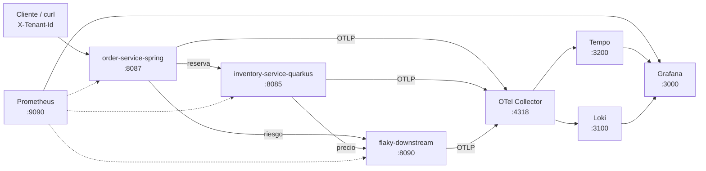

# Módulo 9 – Observabilidad: OpenTelemetry, Prometheus, Grafana, Tempo y Loki

> Curso: **Arquitectura de Microservicios Pro: Spring Boot + Quarkus en AWS y Azure**
> JoeDayz.pe · Java 21 / Spring Boot 4 / Quarkus 3 / OpenTelemetry / Grafana LGTM

Es la misma plataforma de todo el curso. El checkout del módulo 1
(`tienda-deportes` coloca un pedido) pasa por el `order-service` del módulo 8,
que reserva stock en inventory y consulta precio y riesgo al downstream caótico.
Este módulo no cambia ese contrato: lo hace explicable. Cada orden sale con un
`traceId` que atraviesa los tres servicios, con el `tenant.id` en la traza y en
el log, y con las métricas de Resilience4j que ya conoces.

## Objetivos de aprendizaje

Al terminar este módulo serás capaz de:

1. Separar métricas, trazas y logs, y decir qué pregunta responde cada uno en el checkout.
2. Propagar el contexto W3C (`traceparent`) y el baggage `tenant.id` entre Spring Boot 4 y Quarkus 3.
3. Exportar trazas y logs por OTLP a un collector, y dejar las métricas en scrape de Prometheus.
4. Leer en Tempo la traza de una orden sana y la de una orden degradada por el circuit breaker.
5. Saltar de una métrica a la traza y de la traza al log en Grafana.
6. Decidir qué va en un label de Prometheus y qué se queda como atributo del span.

## Proyectos del módulo

| Proyecto | Rol | Stack | Puerto |
|----------|-----|-------|--------|
| [order-service-spring](order-service-spring/) | Orquesta la orden. Resilience4j + OTLP + Prometheus. | Spring Boot 4 | **8087** |
| [inventory-service-quarkus](inventory-service-quarkus/) | Reserva stock y pide el precio. SmallRye FT + OTel. | Quarkus 3 | **8085** |
| [flaky-downstream-service](flaky-downstream-service/) | Pricing y risk, el mismo chaos del módulo 8, ahora dentro de la traza. | Spring Boot 4 | **8090** |
| [docker-compose/](docker-compose/) | Collector, Prometheus, Grafana, Tempo y Loki. | Docker Compose | ver abajo |
| [k8s/](k8s/) | Los Deployments del módulo 8 con el endpoint del collector. | Kubernetes | — |
| [scripts/](scripts/) | Coloca una orden y muestra el `traceId`. | Bash + PowerShell | — |

## Mapa del módulo



## Infraestructura local

| OS | Motor | Compose | Script |
|----|-------|---------|--------|
| Windows + Docker Desktop | Docker | `docker compose up -d` | `.\scripts\smoke-observability.ps1` |
| Windows + Git Bash | Docker | `docker compose up -d` | `./scripts/smoke-observability.sh` |
| macOS + Docker Desktop | Docker | `docker compose up -d` | `./scripts/smoke-observability.sh` |
| macOS / Linux + Podman | Podman | `podman compose up -d` | `./scripts/smoke-observability.sh` |

Los `.sh` necesitan `curl` y `jq`. Los `.ps1` necesitan PowerShell 7+.

Prometheus scrapea order e inventory en el host mediante `host.docker.internal`.
En Podman, si ese nombre no resuelve, edita `prometheus.yml` y usa
`host.containers.internal`.

### 1) Collector, Grafana y el downstream

```bash
cd modulo-09-observabilidad/docker-compose
docker compose up -d
```

| Servicio | URL | Notas |
|----------|-----|-------|
| flaky-downstream | http://localhost:8090 | pricing y risk |
| OTel Collector | `localhost:4317` (gRPC) y `:4318` (HTTP) | los servicios del host exportan aquí |
| Prometheus | http://localhost:9090 | scrape + remote write de Tempo |
| Tempo | http://localhost:3200 | API; la UI está en Grafana |
| Loki | http://localhost:3100 | recibe OTLP del collector |
| Grafana | http://localhost:3000 | admin / admin |

### 2) Inventory (Quarkus)

```bash
cd modulo-09-observabilidad/inventory-service-quarkus
mvn quarkus:dev
```

### 3) Order (Spring Boot 4)

```bash
cd modulo-09-observabilidad/order-service-spring
mvn spring-boot:run
```

## Endpoints

### order-service-spring (`:8087`)

- `POST /api/v1/orders` — la misma orden del módulo 8. Responde `traceId` y `tenantId`.
- Header de entrada: `X-Tenant-Id` (si falta, `tienda-deportes`).
- Header de salida: `X-Trace-Id`.
- `GET /actuator/prometheus`, `/actuator/circuitbreakers`, `/actuator/health/readiness`.

### inventory-service-quarkus (`:8085`)

- `POST /api/v1/inventory/reserve`
- `GET /q/metrics`, `/q/health/live`, `/q/health/ready`

### flaky-downstream (`:8090`)

- `GET /flaky/price/{sku}` y `GET /flaky/risk/{orderId}`
- `POST /flaky/config` — el mismo body del módulo 8 (`failRate`, `latencyMs`, `mode`).

## Smoke test

```bash
curl -s -X POST http://localhost:8087/api/v1/orders \
  -H 'Content-Type: application/json' \
  -H 'X-Tenant-Id: tienda-deportes' \
  -d '{"orderId":"O-obs-1","sku":"ZAP-RUN-42","qty":1}' | jq
```

El JSON trae `status: CONFIRMED`, `degradation: NONE` y un `traceId`.
En Grafana: Explore → Tempo → pega ese id. Tienes que ver order, inventory y flaky
en la misma traza. El log correspondiente en Loki:

```logql
{service_name="order-service-spring"} | trace_id="<traceId>"
```

```bash
./scripts/smoke-observability.sh
```

```powershell
.\scripts\smoke-observability.ps1
```

Para ver el fallback en la traza, sube el fail rate como en el módulo 8 y vuelve
a colocar una orden. El detalle está en
[08-grafana-correlacion-tenant.md](docs/08-grafana-correlacion-tenant.md).

## Documentación

- [01 · Los tres pilares, sobre el mismo checkout](docs/01-tres-pilares-observabilidad.md)
- [02 · OpenTelemetry: modelo y propagación](docs/02-opentelemetry-modelo-y-propagacion.md)
- [03 · Spring Boot 4: Micrometer, OTLP y el fan-out](docs/03-spring-boot-4-micrometer-otlp.md)
- [04 · Quarkus 3: OpenTelemetry en inventory](docs/04-quarkus-opentelemetry.md)
- [05 · Prometheus: métricas y exemplars](docs/05-prometheus-metricas-y-exemplars.md)
- [06 · Tempo: una traza para toda la orden](docs/06-tempo-trazas-distribuidas.md)
- [07 · Loki: el log de esa orden](docs/07-loki-logs-correlacionados.md)
- [08 · Grafana: de la métrica a la traza y al log](docs/08-grafana-correlacion-tenant.md)

## Qué se reutiliza

- Bounded contexts Order, Inventory y Pricing del caso del módulo 1.
- Contrato `POST /api/v1/orders` con `orderId`, `sku`, `qty` y el SKU `ZAP-RUN-42`.
- Resilience4j y SmallRye Fault Tolerance, probes y el servicio caótico del módulo 8.
- El tenant viaja en claro en este módulo. En la plataforma completa sale del claim
  del JWT que ya validan el gateway (módulos 6 y 7).
