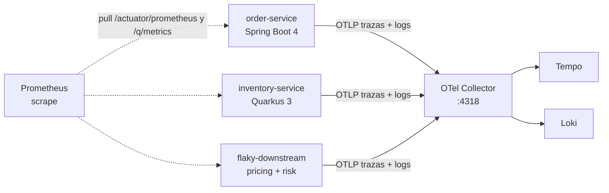

# 02 · OpenTelemetry: modelo y propagación

OpenTelemetry (OTel) es el idioma común. Los servicios no hablan con Tempo ni con Loki:
hablan OTLP con un **collector**, y el collector reparte.



Las métricas **no** pasan por el collector. Siguen el camino del módulo 8: Prometheus
las scrapea. Resilience4j y SmallRye ya las publican en Micrometer; moverlas a OTLP
no aporta nada en clase y esconde los nombres que ya conoces.

## Trace, span, contexto

- Una **traza** es el checkout completo. La identifica un `traceId` de 32 hex.
- Un **span** es un tramo: el POST de order, la reserva, el GET de precio, el GET de riesgo.
- El **contexto** es lo que viaja entre procesos para que el span hijo apunte al padre.

Ese contexto va en el header W3C `traceparent`:

```text
traceparent: 00-<traceId>-<spanId>-01
```

Si el cliente HTTP se construye a mano y no propaga ese header, Tempo muestra tres
trazas sueltas y parece que el sistema "no se observa". El fallo no es de Tempo:
es que el contexto se cortó.

## Baggage: el tenant que cruza la red

`traceparent` no tiene campos de negocio. Para eso está el header `baggage`:

```text
baggage: tenant.id=tienda-deportes
```

Order lo crea al leer `X-Tenant-Id`. Inventory y flaky lo leen, lo copian al span
como atributo `tenant.id` y al MDC para el log. Además reenviamos `X-Tenant-Id`
porque es visible en un `curl -v` y no hay que decodificar el baggage.

## Sampling

En producción se muestrea (1% o 10%). En clase `sampling.probability=1.0` y
`parentbased_always_on`: si el padre se muestreó, el hijo también. Si no, una orden
aparece en order y desaparece en inventory.

## Qué no va en un atributo

- El body del pedido, el precio, el token, el email.
- Cualquier cosa que identifique a una persona.
- El `orderId` como **label** de Prometheus. En el span sí: es alta cardinalidad y
  la traza ya es un registro por request.

## El collector

`docker-compose/otel-collector.yaml` tiene dos pipelines:

| Pipeline | Entra | Sale |
|----------|-------|------|
| traces | OTLP :4317 / :4318 | Tempo :4317 |
| logs | OTLP | Loki `/otlp` |

No hay pipeline de métricas a propósito.

## Siguiente lectura

[03 · Spring Boot 4](03-spring-boot-4-micrometer-otlp.md)
